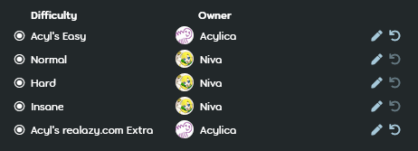

---
tags:
  - GD
  - guest beatmap
  - guest difficulties
  - guest map
---

# Guest difficulty

*For regulations surrounding guest difficulties, see: [Ranking Criteria](/wiki/Ranking_Criteria)*

A **guest difficulty** (or *GD* for short) is a [difficulty](/wiki/Beatmap/Difficulty) of a [beatmap](/wiki/Beatmap) that is not created by the [beatmap host](/wiki/Beatmap/Beatmap_host). They can usually be identified by their difficulty name containing the guest creator's username.

Although not mandatory, having guest difficulties can be beneficial in many occasions. Guest difficulties are often requested by private messages between creators, although GDs can also be requested through other means such as the in-game `#mapping` channel or [modding queues](https://osu.ppy.sh/community/forums/60)<!-- TODO: should link to an article about queues, not the forum -->.

Guest difficulties are not to be confused with difficulties that feature multiple creators, which are instead known as a [collaborative difficulty](/wiki/Beatmap/Beatmap_collaborations).

## Guest difficulty ownership

. This allows for the guest difficulty owners to resolve pending issues in their respective difficulties on their own.

Ownership of a guest difficulty may no longer be changed once the map is either [Ranked](wiki/Beatmap/Category#ranked) or [Loved](wiki/Beatmap/Category#loved).
