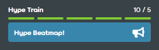

---
tags:
  - train
---

# Hype

::: Infobox

:::

In beatmapping terms, a **hype** is a unit that roughly represents how many people are interested in seeing a beatmap [ranked](/wiki/Beatmap/Category#ranked). Hypes are given by posting and contribute to the beatmap's **hype train**.

Every [pending](/wiki/Beatmap/Category#wip-and-pending) [beatmap](/wiki/Beatmap) has a **hype train** that roughly represents how many people are interested in seeing a particular beatmap to be [ranked](/wiki/Beatmap/Category#ranked). Users can post special [beatmap discussions](/wiki/Beatmap_discussion) in the `General (All difficulties)` tab with the `Hype!` option to contribute to a map's hype train.

## Ranking requirement

In order to be eligible for [nomination](/wiki/Beatmap_ranking_procedure#nominations), beatmaps need to accumulate at least **5 hypes** (or one complete bar of the hype train) from other users. Additional hypes do not contribute 

## Limit

Users start with 10 hypes, and they are consumed when used on beatmaps. Each hype takes a week to become available again.