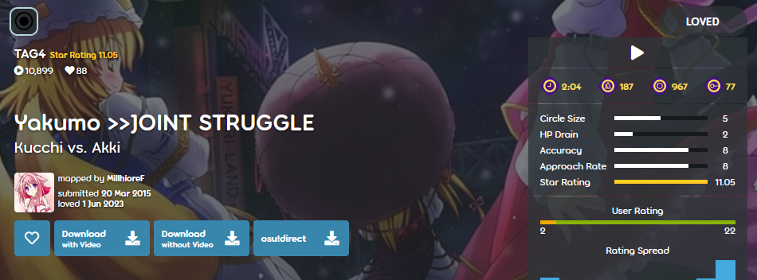

---
tags:
  - multiplayer
  - co-op
---

# TAG beatmaps

*Not to be confused with Tags, which is a [part of a beatmap's metadata](/wiki/Client/Beatmap_editor/Song_setup).*

**TAG beatmaps** (or just *TAG*) are beatmaps that are specifically made for [Tag co-op or Tag-team VS](/wiki/Client/Interface/Multiplayer#tag-co-op-/-tag-team-vs) multiplayer mode. As such, these beatmaps often require cooperative play between two or more players in [multiplayer lobbies]((/wiki/Client/Interface/Multiplayer)) in order to be completed.

In these modes, each player is responsible for one [combo chain](/wiki/Beatmapping/Combo), and throughout the song, players switch between combosets. For this reason, TAG beatmaps are often designed in such a way that their combo chains are placed much farther apart and more complex than usually, making it nearly impossible for the beatmap to be played by a single player.

TAG [difficulties](/wiki/Beatmap/Difficulty) are usually denoted by the use of the term "TAG" in the beatmap difficulty name. Most often "TAG" will be followed by a number, which typically denotes how many players the difficulty is meant for (e.g. "TAG2" for two players or "TAG4" for four players).

Due to their nature, TAG difficulties are either unranked or [Loved](/wiki/Beatmap/Category#loved), because they are intentionally designed to be near-impossible for a single player.
