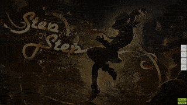
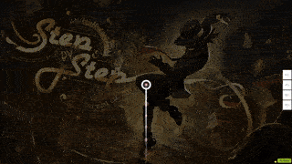

# Overmapping

In beatmapping, **overmapping** is a mapping technique where [hit objects](/wiki/Gameplay/Hit_object) are deliberately placed with a much higher contrast compared to what the song (or the ) the [difficulty](/wiki/Beatmap/Difficulty) normally calls for.

This is usually done by adding unnecessarily large [jumps](/wiki/Beatmap/Pattern/osu!/Jump), [slider velocity](/wiki/Gameplay/Hit_object/Slider/Slider_velocity) changes, or by mapping to inaudible or non-existant sounds (i.e. adding notes on blue ticks when the song uses red ticks).

## Examples

Please note that while overmapping is generally discouraged, this technique remains perfectly acceptable to use when applied under an appropriate context.