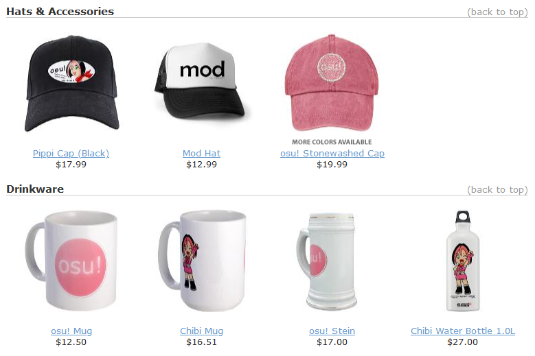

---
tags:
  - store
  - merchandise
---

# Legacy osu!store items

This article lists various items that were once available at the [osu!store](https://osu.ppy.sh/store/listing) but are no longer in production or for sale.

## osu! goods

The **osu! goods** were a collection of official osu!-branded merchandise sold through the online retailer [CafePress](https://en.wikipedia.org/wiki/CafePress) from 2009 – 2012. All items were printed and produced by CafePress, with a portion of the sales being used to [support the development of the game](https://osu.ppy.sh/store/listing).

The collection featured a range of products such as:

### Shirts

- [osu! Mod Shirt](https://web.archive.org/web/20120702093250/http://www.cafepress.com/osume.289786473)
- [osu! Lite T-Shirt](https://web.archive.org/web/20120702093250/http://www.cafepress.com/osume.288837174)
- [Cookie Munch T-Shirt](https://web.archive.org/web/20120702093250/http://www.cafepress.com/osume.288838261)
- [osu! Girly T-Shirt](https://web.archive.org/web/20120702093250/http://www.cafepress.com/osume.288831390)
- [Organic Men's Fitted T-Shirt](https://web.archive.org/web/20120702093250/http://www.cafepress.com/osume.439576382)
- [Organic Women's Fitted T-Shirt](https://web.archive.org/web/20120702093250/http://www.cafepress.com/osume.439576381)
- [osu! Hoodie](https://web.archive.org/web/20120702093250/http://www.cafepress.com/osume.295758604)
- [osu! Cookie Jacket](https://web.archive.org/web/20120702093250/http://www.cafepress.com/osume.394638201)

### Hats and accessories

- [Mod Hat](https://web.archive.org/web/20120702093250/http://www.cafepress.com/osume.394644859)
- [Pippi Cap](https://web.archive.org/web/20120702093250/http://www.cafepress.com/osume.394644101)
- [osu! Stonewashed Cap](https://web.archive.org/web/20120702093250/http://www.cafepress.com/osume.394643336)

### Drinkware

- [osu! Mug](https://web.archive.org/web/20120702093250/http://www.cafepress.com/osume.288419419)
- [Chibi Mug](https://web.archive.org/web/20120702093250/http://www.cafepress.com/osume.288434609)
- [osu! Stein](https://web.archive.org/web/20120702093250/http://www.cafepress.com/osume.288717098)
- [Chibi Water Bottle 1.0 L](https://web.archive.org/web/20120702093250/http://www.cafepress.com/osume.394641818)

### Home and office appliances

- [osu! Teddy Bear](https://web.archive.org/web/20120702093250/http://www.cafepress.com/osume.288839612)
- [osu! Clock](https://web.archive.org/web/20120702093250/http://www.cafepress.com/osume.288700999)
- [osu! Postcards 8-Pack](https://web.archive.org/web/20120702093250/http://www.cafepress.com/osume.288843371)

### Buttons and magnets

- [osu! Cookie Pin](https://web.archive.org/web/20120702093250/http://www.cafepress.com/osume.288416528)
- [osu! Cookie Magnet](https://web.archive.org/web/20120702093250/http://www.cafepress.com/osume.288429391)
- [osu! Promo Pin 10-Pack](https://web.archive.org/web/20120702093250/http://www.cafepress.com/osume.288439599)
- [2.25" Magnet 10-Pack](https://web.archive.org/web/20120702093250/http://www.cafepress.com/osume.470631859)
- [Chibi Munch Magnet](https://web.archive.org/web/20120702093250/http://www.cafepress.com/osume.394642312)
- [osu! Cookie Mini Pin](https://web.archive.org/web/20120702093250/http://www.cafepress.com/osume.288416527)
- [Mini Button 10-Pack](https://web.archive.org/web/20120702093250/http://www.cafepress.com/osume.470631599)
- [Mini Button 100-Pack](https://web.archive.org/web/20120702093250/http://www.cafepress.com/osume.510679895)
- [Jumbo osu! Cookie Pin](https://web.archive.org/web/20120702093250/http://www.cafepress.com/osume.288429392)

### Stickers and signs

- [Pippi Sticker](https://web.archive.org/web/20120702093250/http://www.cafepress.com/osume.394644102)
- [osu! Large Stickers 40-Pack](https://web.archive.org/web/20120702093250/http://www.cafepress.com/osume.288841446)