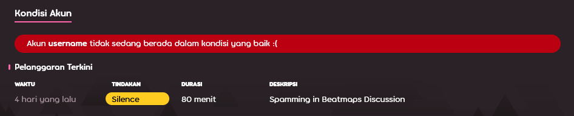

# Silence

***Silence*** merupakan bentuk hukuman di osu! yang membatasi kemampuan seorang pengguna untuk dapat berkomunikasi dengan anggota-anggota komunitas lainnya. Hukuman ini dijatuhkan oleh anggota [Global Moderation Team](/wiki/People/The_Team/Global_Moderation_Team) dan [Nomination Assessment Team](/wiki/People/The_Team/Nomination_Assessment_Team) kepada para pengguna yang telah terbukti melanggar [peraturan komunitas](/wiki/Rules) yang berlaku.

## Pembatasan aktivitas

::: Infobox

:::

Para pengguna yang sedang di-*silence* oleh moderator tidak akan dapat melakukan hal-hal berikut:

- Menggunakan fitur [*chat*](/wiki/Chat_Console) (publik dan privat) baik di dalam permainan maupun pada situs web osu!
- Membuat post pada forum osu!
- Berkomentar pada situs web osu! (baik itu pada laman berita, riwayat perubahan, maupun info beatmap)
- Berpartisipasi dalam [laman diskusi beatmap](/wiki/Beatmap_Discussion)
- Menyunting rincian profilnya masing-masing (semisal mengganti avatar atau mengubah isi bagian "me!")
- Mengunggah beatmap baru atau memperbarui beatmap yang sudah ada
- Berpartisipasi dalam [pertandingan multiplayer](/wiki/Multi)

Di samping itu, seluruh pesan yang telah dikirim oleh user yang ter-*silence* akan dihapus dari seluruh kanal *chat* dan *private message* yang ada [[1]](https://blog.ppy.sh/post/38114063519/this-week-in-osu-5 "ppy blog").

::: Infobox

:::

Setelah seorang pengguna di-*silence*, sebuah pesan yang menyatakan durasi *silence* yang berlaku akan muncul pada layar *chat* pengguna yang bersangkutan. Adapun riwayat pelanggaran yang dilakukan oleh tiap-tiap pengguna dapat dilihat pada bagian bawah laman profil mereka masing-masing di situs web osu!, yang akan hilang dengan sendirinya setelah 28 hari.

## Mengajukan banding akan *silence* yang diterima

Apabila kamu yakin bahwa kamu telah di-*silence* secara sewenang-wenang, harap hubungi [account support team](/wiki/People/The_Team/Account_support_team#accounts@ppy.sh) kami pada alamat email [accounts@ppy.sh](mailto:accounts@ppy.sh). Pastikan email yang kamu kirim berasal dari alamat email yang terhubung dengan akun osu! milikmu; sebutkan username osu! kamu, dan sertakan tanggal dan waktu ketika silence dijatuhkan.

## Alasan umum terkena silence

*Perhatian: Terlibat dalam "perilaku yang tidak pantas" dalam pesan pribadi tidak melanggar aturan, kecuali perilaku yang tidak pantas tersebut dikirimkan ke penerima lain yang tidak mau atau tidak setuju dalam pesan pribadi tersebut. Jika tindakan ini dilaporkan, maka hukuman yang sesuai akan dijatuhkan.*

- Perilaku yang tidak pantas dalam chat atau forum publik (misalnya, `#multiplayer`, atau diskusi beatmap, komentar, dll.), termasuk —tetapi tidak terbatas pada— melakukan spam, chat yang tidak masuk akal, rasisme, dll.
- Mengunggah atau memposting konten yang tidak pantas. (Misalnya, dalam avatar profil, pengiriman beatmap, rincian profil, bio dalam userpage, berbentuk banner, dll.).

Lamanya silence dapat bervariasi berdasarkan seberapa keras aturan yang dilanggar. Durasi silence bisa bertumpuk satu sama lain, saling menambahkan durasi silence. Sebagai catatan bahwa jika sebuah pelanggaran yang cukup berat terjadi, atau pemain merupakan pelanggar yang berulangkali melakukan pelanggaran yang sama, maka [restriction akun](/wiki/Help_Centre/Account_Restrictions) dapat dijatuhkan sebagai ganti silence.
