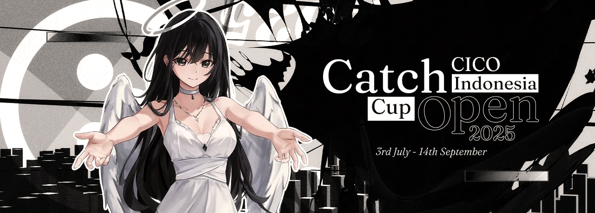

---
tags:
  - CICO
  - CICO 2025
---

# Catch the Beat Indonesia Cup Open 2025

The **Catch the Beat Indonesia Cup Open 2025** (***CICO 2025***) was a double-elimination 1v1 osu!catch tournament hosted by ::{ flag=ID }:: [Zvenx](https://osu.ppy.sh/users/14613788) and ::{ flag=SG }:: [Ekseff](https://osu.ppy.sh/users/13966422). Despite its name, the tournament was open to all osu!catch players from the Asia-Pacific region. It was the thirteenth iteration of the Catch the Beat Indonesia Cup, as well as the third one to be held under the "Open" format.

## Tournament schedule

| Event | Timestamp |
| --: | :-- |
| Registration phase | 2025-07-03/2025-07-16 |
| Screening phase | 2025-07-17/2025-07-27 |
| Qualifiers | 2025-07-28/2025-08-03 |
| Round of 32 | 2025-08-04/2025-08-10 |
| Round of 16 | 2025-08-11/2025-08-17 |
| Quarterfinals | 2025-08-18/2025-08-24 |
| Semifinals | 2025-08-25/2025-08-31 |
| Finals (week 1) | 2025-09-01/2025-09-07 |
| Finals (week 2) | 2025-09-08/2025-09-14 |

## Prizes

| Placing | Prize(s) |
| :-: | :-- |
|  | $40 USD or 18 months of osu! supporter, unique profile badge |
|  | $20 USD or 8 months of osu! supporter |
|  | $10 USD or 2 months of osu! supporter |

## Organisation

The Catch the Beat Indonesia Cup Open 2025 was run by various osu! community members from Indonesia and beyond.

| Position | Member(s) |
| :-- | :-- |
| Host | ::{ flag=ID }:: [Zvenx](https://osu.ppy.sh/users/14613788), ::{ flag=SG }:: [Ekseff](https://osu.ppy.sh/users/13966422) |
| Organiser | ::{ flag=ID }:: [Haruka Akane](https://osu.ppy.sh/users/1272422), ::{ flag=ID }:: [Madoka Ayukawa](https://osu.ppy.sh/users/1595221), ::{ flag=ID }:: [Constantine](https://osu.ppy.sh/users/3221898) |
| Mappool selector | ::{ flag=ID }:: [Zvenx](https://osu.ppy.sh/users/14613788), ::{ flag=ID }:: [Dika312](https://osu.ppy.sh/users/741613), ::{ flag=CL }:: [Pekorrat](https://osu.ppy.sh/users/1250096) |
| Custom mapper | ::{ flag=ID }:: [Zvenx](https://osu.ppy.sh/users/14613788), ::{ flag=SG }:: [Ekseff](https://osu.ppy.sh/users/13966422), ::{ flag=ID }:: [Haruka Akane](https://osu.ppy.sh/users/1272422), ::{ flag=ID }:: [Madoka Ayukawa](https://osu.ppy.sh/users/1595221), ::{ flag=ID }:: [Dika312](https://osu.ppy.sh/users/741613), ::{ flag=CL }:: [Pekorrat](https://osu.ppy.sh/users/1250096), ::{ flag=ID }:: [Dedot](https://osu.ppy.sh/users/8805157), ::{ flag=ID }:: [Sololiquy](https://osu.ppy.sh/users/4350087), ::{ flag=ID }:: [EpanPan](https://osu.ppy.sh/users/13194580), ::{ flag=ID }:: [-Hex-](https://osu.ppy.sh/users/8630988), ::{ flag=ID }:: [Fisicia](https://osu.ppy.sh/users/6556054), ::{ flag=ID }:: [Dapulezatos](https://osu.ppy.sh/users/8140944), ::{ flag=VN }:: [-Miya](https://osu.ppy.sh/users/1942877), ::{ flag=PH }:: [midorijeon](https://osu.ppy.sh/users/10969875), ::{ flag=KR }:: [Spectator](https://osu.ppy.sh/users/702598), ::{ flag=JP }:: [hiroshiki](https://osu.ppy.sh/users/2667256), ::{ flag=KR }:: [ExGon](https://osu.ppy.sh/users/214187), ::{ flag=KR }:: [CLSW](https://osu.ppy.sh/users/531253), ::, ::{ flag=AU }:: [mochi-](https://osu.ppy.sh/users/12819153), ::{ flag=PL }:: [BoberOfDarkness](https://osu.ppy.sh/users/3427748), ::{ flag=DE }:: [rinkiha](https://osu.ppy.sh/users/10786819), ::{ flag=FR }:: [Oasix](https://osu.ppy.sh/users/6183012), ::{ flag=AT }:: [Daletto](https://osu.ppy.sh/users/7592136), ::{ flag=DE }:: [Du5t](https://osu.ppy.sh/users/6053071), ::{ flag=PL }:: [Mniam](https://osu.ppy.sh/users/6050530), ::{ flag=AT }:: [Pepti](https://osu.ppy.sh/users/8408065), ::{ flag=RU }:: [Mazuki](https://osu.ppy.sh/users/15208771), ::{ flag=RU }:: [cosilgam](https://osu.ppy.sh/users/15960747), ::{ flag=CA }:: [Katsuragi](https://osu.ppy.sh/users/3616480), ::{ flag=CA }:: [mieldeprairie](https://osu.ppy.sh/users/19290397), ::{ flag=MX }:: [MILK\_16](https://osu.ppy.sh/users/9137627), ::{ flag=CA }:: [Unlucky\_w](https://osu.ppy.sh/users/4820793),  ::{ flag=US }:: [wwwww](https://osu.ppy.sh/users/8434466), ::{ flag=CA }:: [Yoshi_green](https://osu.ppy.sh/users/1035891), ::{ flag=US }:: [Vaqu](https://osu.ppy.sh/users/14714724), ::{ flag=US }:: [Zileni](https://osu.ppy.sh/users/23525574), { flag=CO }:: [[ Azu- ]](https://osu.ppy.sh/users/8290364), ::{ flag=CL }:: [Des9](https://osu.ppy.sh/users/5404711), ::{ flag=CO }:: [Juansy-](https://osu.ppy.sh/users/12588215) |
| Playtester | ::{ flag=ID }:: [EpanPan](https://osu.ppy.sh/users/13194580), ::{ flag=KR }:: [Spectator](https://osu.ppy.sh/users/702598), ::{ flag=CA }:: [Katsuragi](https://osu.ppy.sh/users/3616480), ::{ flag=US }:: [Elux](https://osu.ppy.sh/users/12004983), ::{ flag=US }:: [yeeeter](https://osu.ppy.sh/users/15274666), ::{ flag=US }:: [Lexii](https://osu.ppy.sh/users/7226149), ::{ flag=PE }:: [Boltico](https://osu.ppy.sh/users/5297904) |
| Streamer | ::{ flag=PH }:: [Kyonkichi](https://osu.ppy.sh/users/7585544), ::{ flag=JP }:: [hiroshiki](https://osu.ppy.sh/users/2667256), ::{ flag=DE }:: [Gomen Yuuka](https://osu.ppy.sh/users/14050018), ::{ flag=US }:: [bvyans](https://osu.ppy.sh/users/7789926) |
| Commentator | ::{ flag=SG }:: [\[Eun\]](https://osu.ppy.sh/users/3788536), ::{ flag=IN }:: [Pilot\_BFFRI](https://osu.ppy.sh/users/27266540), ::{ flag=TW }:: [Minato Yukina](https://osu.ppy.sh/users/4133477), ::{ flag=AU }:: [Maitoo](https://osu.ppy.sh/users/16899553), ::{ flag=SE }:: [-Anchor-](https://osu.ppy.sh/users/1352257), ::{ flag=PR }:: [SuprRooster](https://osu.ppy.sh/users/20905205) |
| Referee | ::{ flag=PH }:: [Kyonkichi](https://osu.ppy.sh/users/7585544), ::{ flag=TH }:: [-TANAKITO-](https://osu.ppy.sh/users/6037121), ::{ flag=JP }:: [hiroshiki](https://osu.ppy.sh/users/2667256), ::{ flag=IN }:: [Pilot\_BFFRI](https://osu.ppy.sh/users/27266540), ::{ flag=US }:: [Senkon](https://osu.ppy.sh/users/23313862) |
| Design coordinator | ::{ flag=SG }:: [Ekseff](https://osu.ppy.sh/users/13966422), ::{ flag=SG }:: [TheFunk](https://osu.ppy.sh/users/13981991) |
| GFX/video editor | ::{ flag=SG }:: [Ekseff](https://osu.ppy.sh/users/13966422), ::{ flag=SG }:: [TheFunk](https://osu.ppy.sh/users/13981991), ::{ flag=ID }:: [CubeixID200](https://osu.ppy.sh/users/10678919), ::{ flag=PH }:: [OsuMe65](https://osu.ppy.sh/users/852867), ::{ flag=MY }:: [Iyouka](https://osu.ppy.sh/users/7138499), ::{ flag=IN }:: [rrex](https://osu.ppy.sh/users/16827064), ::{ flag=IN }:: [Raybean](https://osu.ppy.sh/users/16676388), ::{ flag=AR }:: [Zeth](https://osu.ppy.sh/users/4219488) |
| Illustrator | ::{ flag=ID }:: [Dreamxiety](https://osu.ppy.sh/users/13103233), ::{ flag=ID }:: [RemcoN](https://osu.ppy.sh/users/9823378), ::{ flag=SG }:: [Hecatia](https://osu.ppy.sh/users/8244635), ::{ flag=ID }:: kyansatan [(↗)](https://twitter.com/kyansatan), ::{ flag=ID }:: Reminisensi [(↗)](https://twitter.com/Reminisensi_), ::{ flag=ID }:: 7s [(↗)](https://twitter.com/7sdesu), ::{ flag=ID }:: rezukita [(↗)](https://twitter.com/rezukita) |
| Statisician | ::{ flag=SG }:: [lovemathboy](https://osu.ppy.sh/users/4220829), ::{ flag=IN }:: [rrex](https://osu.ppy.sh/users/16827064) |
| Wiki editor | ::{ flag=ID }:: [Niva](https://osu.ppy.sh/users/197805) |

## Links

- **[Official website](https://wybin.xyz/cico2025)**
- [Forum thread](https://osu.ppy.sh/community/forums/topics/2098930)
- [Discord server](https://discord.gg/YwAYbPa)
- [Challonge brackets](https://challonge.com/CICO2025)
- [Livestream channel](https://www.twitch.tv/osucatchid)

## Participants

Listed below are the players who managed to qualify into the Round of 32 (along with their respective seed number and `%MAX` sum across all nine Qualifier beatmaps) out of 59 participating players in total.

The complete list of player registrations can be found [here](https://wybin.xyz/cico2025/players).

| Seed no. | Player | `%MAX` sum |
| :-- | :-- | :-- |
| 1 | ::{ flag=PH }:: [Roido](https://osu.ppy.sh/users/6829103) | 8.867 |
| 2 | ::{ flag=CN }:: [- N a g i -](https://osu.ppy.sh/users/2956936) | 8.709 |
| 3 | ::{ flag=TW }:: [eauikk](https://osu.ppy.sh/users/1177233) | 8.632 |
| 4 | ::{ flag=ID }:: [Chroneko](https://osu.ppy.sh/users/5472877) | 8.546 |
| 5 | ::{ flag=KR }:: [\[Amazing\]](https://osu.ppy.sh/users/1391036) | 8.541 |
| 6 | ::{ flag=RU }:: [Nelly](https://osu.ppy.sh/users/4741164) | 8.495 |
| 7 | ::{ flag=ID }:: [Taskmaster](https://osu.ppy.sh/users/3027065) | 8.389 |
| 8 | ::{ flag=KR }:: [Rells](https://osu.ppy.sh/users/7937519) | 8.337 |
| 9 | ::{ flag=CN }:: [dazzulay](https://osu.ppy.sh/users/1948043) | 8.275 |
| 10 | ::{ flag=PH }:: [-Rustyy](https://osu.ppy.sh/users/16355636) | 8.250 |
| 11 | ::{ flag=ID }:: [Keita](https://osu.ppy.sh/users/3355617) | 8.123 |
| 12 | ::{ flag=RU }:: [Nerris](https://osu.ppy.sh/users/11202866) | 8.098 |
| 13 | ::{ flag=TW }:: [Sanami](https://osu.ppy.sh/users/1629471) | 8.092 |
| 14 | ::{ flag=AU }:: [KWYJIBO](https://osu.ppy.sh/users/7178386) | 8.065 |
| 15 | ::{ flag=VN }:: [Stardust Prism](https://osu.ppy.sh/users/8525921) | 8.021 |
| 16 | ::{ flag=TW }:: [Minato Yukina](https://osu.ppy.sh/users/4133477) | 8.006 |
| 17 | ::{ flag=NZ }:: [Cipse](https://osu.ppy.sh/users/7928880) | 7.966 |
| 18 | ::{ flag=CN }:: [-Yui](https://osu.ppy.sh/users/6649605) | 7.942 |
| 19 | ::{ flag=CN }:: [Shiina Minatsu](https://osu.ppy.sh/users/3515458) | 7.930 |
| 20 | ::{ flag=MY }:: [Zakrusta](https://osu.ppy.sh/users/5034270) | 7.833 |
| 21 | ::{ flag=TH }:: [G1ilbert](https://osu.ppy.sh/users/7408055) | 7.829 |
| 22 | ::{ flag=SG }:: [McButt](https://osu.ppy.sh/users/18018708) | 7.774 |
| 23 | ::{ flag=ID }:: [Nomiru](https://osu.ppy.sh/users/17514687) | 7.668 |
| 24 | ::{ flag=TR }:: [shimu](https://osu.ppy.sh/users/14318796) | 7.661 |
| 25 | ::{ flag=KR }:: [log out side](https://osu.ppy.sh/users/11535744) | 7.598 |
| 26 | ::{ flag=SA }:: [WOAH0](https://osu.ppy.sh/users/18336339) | 7.402 |
| 27 | ::{ flag=KR }:: [Kuzino](https://osu.ppy.sh/users/158552) | 7.242 |
| 28 | ::{ flag=MY }:: [Yeury](https://osu.ppy.sh/users/9434933) | 7.067 |
| 29 | ::{ flag=JP }:: [giru HD](https://osu.ppy.sh/users/707456) | 7.005 |
| 30 | ::{ flag=ID }:: [Barry Chopstick](https://osu.ppy.sh/users/9573836) | 6.978 |
| 31 | ::{ flag=MY }:: [HyPerNekoChan](https://osu.ppy.sh/users/9626549) | 6.941 |
| 32 | ::{ flag=NZ }:: [Kasumizawa-Miyu](https://osu.ppy.sh/users/24345309) | 6.731 |

## Podium

## Mappools

### Finals (week 2)

**[Download the mappack here! (121 MB)](https://www.mediafire.com/file/zcbdn933f65x3p0/CICO2025_-_Grand_Finals.rar/file)**

- No Mod
  1. [XADA - Oblimoria (-Ken) \[Unlucken's Final Verdict\]](https://osu.ppy.sh/beatmapsets/2432425#fruits/5299836)
  2. [t+pazolite vs. Kaneko Chiharu - CHUTEN (Sololiquy) \[RE:MASTER\]](https://osu.ppy.sh/beatmapsets/2432409#fruits/5299662)
  3. [Coconami - e\_5: guitar, gabber, and rbg waltz (Mniam) \[Whimsical Collaboration\]](https://osu.ppy.sh/beatmapsets/2432422#fruits/5299793)
  4. [DJ-Orca - Fourth Impact (Vaqu) \[Vaqu & Zileni's Slam Dunk\]](https://osu.ppy.sh/beatmapsets/2432502#fruits/5300050)
  5. [paraoka feat. haru\*nya - Tyranny (toybot) \[melon's KACHOW\]](https://osu.ppy.sh/beatmapsets/2255589#fruits/4798382)
- Hidden
  1. [Sampling Masters MEGA - Kattobi KEIKYU Rider (INO) \[MASTER\]](https://osu.ppy.sh/beatmapsets/722359#fruits/1525066)
  2. [Hyadain - CHOCOBO!! (Spectator) \[Deluge\]](https://osu.ppy.sh/beatmapsets/2432675#fruits/5300464)
  3. [Good Kid - Atlas (whalermelon) \[ethan's this is a humanly reference\]](https://osu.ppy.sh/beatmapsets/2354913#fruits/5070290)
- Hard Rock
  1. [Imperial Circus Dead Decadence - Shinbatsu o Tadori Kyoukotsu ni Itaru (Daletto) \[Daletto & Mochi's Rat Wife\]](https://osu.ppy.sh/beatmapsets/2338848#fruits/5299790)
  2. [Yuma Mizonokuchi feat. Ai Ohsera - Princess Lily (Haruka Akane) \[Nyktos\]](https://osu.ppy.sh/beatmapsets/2432437#fruits/5299904)
  3. [Toromaru - Deorbit (Wispy) \[Retrograde\]](https://osu.ppy.sh/beatmapsets/2268007#fruits/4829864)
- Double Time
  1. [ShinRa-Bansho - Tsuki ni Murakumo Hana ni Kaze ShinRa-Bansho Ver (Spectator) \[Greaper's Overdose\]](https://osu.ppy.sh/beatmapsets/1267528#fruits/2635612)
  2. [Anegasaki Nene - ZENITHALIZE (hiroshiki) \[LUMINOUS\]](https://osu.ppy.sh/beatmapsets/2432430#fruits/5299842)
  3. [Ricky Martin - Maria (Pablo Flores Spanglish Radio Edit) (Zvenx) \[Ayukawa & Zvenx's Fuego (CICO vers)\]](https://osu.ppy.sh/beatmapsets/2432446#fruits/5299922)
  4. [Red Velvet - Day 1 (mrow) \[kiss kiss kiss\]](https://osu.ppy.sh/beatmapsets/2415752#fruits/5250464)
- Free Mod
  1. [Umeboshi Chazuke - Midnight Trickster (Mrbinking) \[Joker\]](https://osu.ppy.sh/beatmapsets/2282116#fruits/4865933)
  2. [Grand Thaw - SOLROS (Katsuragi) \[Katsuragi and Yoshi's Fantasia\]](https://osu.ppy.sh/beatmapsets/2432549#fruits/5300141)
- Tiebreaker
  1. **[5KiLOBYTE vs. takehirotei - Aurenox : Order//Chaos (Zvenx) \[Fallen Angel Shimmering in the Dark\]](https://osu.ppy.sh/beatmapsets/2432971#fruits/5301315)**

### Finals (week 1)

**[Download the mappack here! (133 MB)](https://www.mediafire.com/file/u9rsusocp6arut1/CICO2025_-_Finals.rar/file)**

- No Mod
  1. [Demetori - Natsukashiki Touhou no Chi \~ Sic World (Madoka Ayukawa) \[Extra Stage\]](https://osu.ppy.sh/beatmapsets/2429034#fruits/5289290)
  2. [DJ-Orca - BLUE RAINBOW (EpanPan) \[ROAD AWAY TO SKY\]](https://osu.ppy.sh/beatmapsets/2429019#fruits/5289259)
  3. [Iyowa - Golden Number (Mniam) \[1.61803398874989484820458683436563811772030917980576286213544862270526046281...\]](https://osu.ppy.sh/beatmapsets/2429021#fruits/5289261)
  4. [Noah - Hurt me plenty (Pepti) \[Eternal Suffering\]](https://osu.ppy.sh/beatmapsets/2429053#fruits/5289328)
  5. [N\_dog feat. Kyoyama Sail - daybreak (Arushii) \[Even if you exist only within a dream\]](https://osu.ppy.sh/beatmapsets/2370829#fruits/5116498)
- Hidden
  1. [Kabocha feat. Nanahira - maison de joie (Dika312) \[pleurer seul\]](https://osu.ppy.sh/beatmapsets/2429046#fruits/5289311)
  2. [P-MODEL - Logic Airforce (Spectator) \[Overdose\]](https://osu.ppy.sh/beatmapsets/2429188#fruits/5289681)
  3. [himmel - Wings of Liberty (Saki) \[Echo\]](https://osu.ppy.sh/beatmapsets/2217823#fruits/4793617)
- Hard Rock
  1. [Sasaki Sayaka - FEEL x ALIVE (Zvenx) \[Alive\]](https://osu.ppy.sh/beatmapsets/1683728#fruits/5289327)
  2. [Lime - Campanella (Zileni) \[Beyond\]](https://osu.ppy.sh/beatmapsets/2429033#fruits/5289289)
  3. [Mitsukiyo - Operation\*DOTABATA (Kyuuchie) \[Ayesha's Extra\]](https://osu.ppy.sh/beatmapsets/1985193#fruits/4432365)
- Double Time
  1. [Annabel - Signal Graph (-Miya) \[CICO F DT1\]](https://osu.ppy.sh/beatmapsets/2429035#fruits/5289291)
  2. [t+pazolite - seedy try (Juansy-) \[CICO 2025 FINALS DT2\]](https://osu.ppy.sh/beatmapsets/2375443#fruits/5289304)
  3. [Kitadani Hiroshi - We Are! (Des9) \[Romance Dawn\]](https://osu.ppy.sh/beatmapsets/2429238#fruits/5289809)
  4. [Nyong Franco - Gemu Fa Mi Re (Nakazawa) \[Maumere (CICO edit)\]](https://osu.ppy.sh/beatmapsets/2429041#fruits/5289300)
- Free Mod
  1. [Attoclef - OVERCLOCK-360 (Spectator) \[ExSpec's Boost\]](https://osu.ppy.sh/beatmapsets/2429186#fruits/5289678)
  2. [NANAOAKARI - Ashita no Watashi ni Sachi Are (Dika312) \[Workday\]](https://osu.ppy.sh/beatmapsets/2429048#fruits/5289316)
- Tiebreaker
  1. **[trailmix37 - Pneuma (CLSW) \[Crystal Spec's Spiritual Encounter\]](https://osu.ppy.sh/beatmapsets/2429054#fruits/5289329)**

### Semifinals

**[Download the mappack here! (109 MB)](https://www.mediafire.com/file/05ul7kuitnnzxmg/CICO2025_-_Semi_Finals.rar/file)**

- No Mod
  1. [S.S.H. - The Decisive Battle with the Fugitives (hiroshiki) \[Decisive Battle\]](https://osu.ppy.sh/beatmapsets/2425286#fruits/5279240)
  2. [tn-shi - Heart Factorisation (Spectator) \[Prime Love\]](https://osu.ppy.sh/beatmapsets/2425289#fruits/5279259)
  3. [Tipper - Mason (ExGon) \[Normal\]](https://osu.ppy.sh/beatmapsets/2425892#fruits/5280776)
  4. [WhiteSakata - R(eiterat)e: (Wispy) \[Basherman's E(xtrem)e:\]](https://osu.ppy.sh/beatmapsets/2407278#fruits/5230097)
- Hidden
  1. [Various Artists - Bokura no Blue Bird Days (Dapulezatos) \[Together With You\]](https://osu.ppy.sh/beatmapsets/2425304#fruits/5279293)
  2. [Bebe Rexha ft. Travis Barker - Break My Heart Myself (Madoka Ayukawa) \[Guilty\]](https://osu.ppy.sh/beatmapsets/2425297#fruits/5279274)
  3. [Kabocha - Draw me a map, Let me feel the tap (toybot) \[gazimal's Extra\]](https://osu.ppy.sh/beatmapsets/2051856#fruits/4608517)
- Hard Rock
  1. [The Black Dahlia Murder - Deathmask Divine (mieldeprairie) \[Miel & Zileni's Deluge\]](https://osu.ppy.sh/beatmapsets/2425401#fruits/5279542)
  2. [DECO\*27 - Telepathy feat. Hatsune Miku ([ Azu- ]) \[Des9 & Azu's XDose (CICO Ver)\]](https://osu.ppy.sh/beatmapsets/2425332#fruits/5279397)
  3. [MIOYAMAZAKI - Noise (Aspheria) \[Death\]](https://osu.ppy.sh/beatmapsets/2204253#fruits/4665887)
- Double Time
  1. [FROZEN QUALIA - Image Liner (\[ Azu- \]) \[Juansy & Azu's Take of Memories Around this World\]](https://osu.ppy.sh/beatmapsets/2425321#fruits/5279380)
  2. [LukHash - Destroy (hiroshiki) \[Ghost\]](https://osu.ppy.sh/beatmapsets/2425320#fruits/5279375)
  3. [Diskoria, Laleilmanino, Bunga Citra Lestari - Badai Telah Berlalu (Nakazawa) \[Serenity (CICO edit)\]](https://osu.ppy.sh/beatmapsets/2425325#fruits/5279389)
- Free Mod
  1. [Nunununununununununununununununu - Mimukauwa Nice Try (Sololiquy) \[UNO\]](https://osu.ppy.sh/beatmapsets/2425353#fruits/5279445)
- Tiebreaker
  1. **[Ave Mujica - Symbol I : Fire (Pepti) \[Azu, Du5t & Pepti : Blooming Red Sorrowful Sky\]](https://osu.ppy.sh/beatmapsets/2425340#fruits/5279408)**

### Quarterfinals

**[Download the mappack here! (99 MB)](https://www.mediafire.com/file/3agzoj9rz209u3f/CICO2025_-_Quarter_Finals.rar/file)**

- No Mod
  1. [Krasper2 - In Sight (Zileni) \[Zileni & Des9’s Sightread\]](https://osu.ppy.sh/beatmapsets/2421608#fruits/5268339)
  2. [Frateloz - Suffocating Memory (Dika312) \[Chained Heavens\]](https://osu.ppy.sh/beatmapsets/2421612#fruits/5268354)
  3. [sakuraburst - forest of the spirits (Spectator) \[overdose\]](https://osu.ppy.sh/beatmapsets/2421618#fruits/5268384)
  4. [Camellia feat. Nanahira - HARDBASS FESTA (Slaked) \[AKIBA-STYLE\]](https://osu.ppy.sh/beatmapsets/995139#fruits/2081564)
- Hidden
  1. [Phadung Songsang (Jazz) - Luang Phee 4G (Zvenx) \[Maa ten kan thue thuk khon\]](https://osu.ppy.sh/beatmapsets/2421645#fruits/5268449)
  2. [Grand Thaw - Aventyr (Kyuare) \[Fiore (CICO edit)\]](https://osu.ppy.sh/beatmapsets/2422903#fruits/5272329)
  3. [Satono Diamond (CV. Tachibana Hina) - winning the soul (Game Size) (Gaia) \[Makitoshi's Diachan\]](https://osu.ppy.sh/beatmapsets/2232316#fruits/4739188)
- Hard Rock
  1. [Kanami (CV: Uchida Maaya) - Beautiful World (Dapulezatos) \[Look How Beautiful the World Is\]](https://osu.ppy.sh/beatmapsets/2421630#fruits/5268419)
  2. [HeavenEGHD - Re:waked from Abyss (Sololiquy) \[Overdose (HR-ver)\]](https://osu.ppy.sh/beatmapsets/2421671#fruits/5268529)
  3. [Kobaryo - FLUFFY FLASH (Syarika) \[MASTER\]](https://osu.ppy.sh/beatmapsets/1984199#fruits/4132857)
- Double Time
  1. [Chihara Minori - Kyoukai no Kanata (Zvenx) \[Zvenx & -Miya's Beyond the Boundaries\]](https://osu.ppy.sh/beatmapsets/2421648#fruits/5268454)
  2. [IOSYS - Chanteikku Sanyousei no Itazura Daisensou (Spectator) \[Rocma's Rain\]](https://osu.ppy.sh/beatmapsets/2281583#fruits/4879141)
  3. [Tamura Yukari feat. motsu from m.o.v.e - You & Me (Beomsan) \[Check it out, check it out yo\]](https://osu.ppy.sh/beatmapsets/2268678#fruits/4831578)
- Free Mod
  1. [Hoshimachi Suisei - Je t'aime (Katsuragi) \[Comet\]](https://osu.ppy.sh/beatmapsets/2421987#fruits/5269559)
- Tiebreaker
  1. **[Rabbit House - Divine Ordeal (Dedot) \[Final Affliction\]](https://osu.ppy.sh/beatmapsets/2421643#fruits/5268446)**

### Round of 16

**[Download the mappack here! (92 MB)](https://www.mediafire.com/file/vkx3swkjq5u5y73/CICO2025_-_RO16.rar/file)**

- No Mod
  1. [Utsu-P - Imperfect Animals (Mazuki) \[Gumi's screams\]](https://osu.ppy.sh/beatmapsets/2418159#osu/5257897)
  2. [maras k - Play Time!! (MILK\_16) \[Let's Play!! A Tribute to Cxlucha.\]](https://osu.ppy.sh/beatmapsets/2418216#osu/5258034)
  3. [nakinyko - Tactical Execution/Intergalactic (Madoka Ayukawa) \[Planetary\]](https://osu.ppy.sh/beatmapsets/2418131#osu/5257842)
  4. [MYUKKE. - ViViTAL MONO (Laquarius) \[ExTRA\]](https://osu.ppy.sh/beatmapsets/1753391#osu/3588248)
- Hidden
  1. [Lotus Juice feat. Mayumi Fujita - Pull the Trigger (Madoka Ayukawa) \[Mass Destruction\]](https://osu.ppy.sh/beatmapsets/2418135#osu/5257853)
  2. [Rin - Chireiden set 05 \~ Kyuu Jigoku Kaidou o Yuku (BoberOfDarkness) \[Path of Overflowing Dismay\]](https://osu.ppy.sh/beatmapsets/2418130#osu/5257839)
  3. [Kaminose Tsukasa - ruin of opals (Acylica) \[Decaying Memories\]](https://osu.ppy.sh/beatmapsets/1301374#osu/4385366)
- Hard Rock
  1. [THE ORAL CIGARETTES - ReI (Fisicia) \[Epancia's Ephemerality\]](https://osu.ppy.sh/beatmapsets/2418140#osu/5257859)
  2. [Mili - Vulnerability (Benita) \[Jeir's Rain\]](https://osu.ppy.sh/beatmapsets/706599#osu/1494075)
  3. [Rise Against - The Eco-Terrorist In Me (Nymphe) \[Kujinn's Insane\]](https://osu.ppy.sh/beatmapsets/2078778#osu/4812656)
- Double Time
  1. [Various Artists - Umapyoi Densetsu (Zvenx) \[Umazing!!!\]](https://osu.ppy.sh/beatmapsets/2418204#osu/5257998)
  2. [Suzuki Konomi - ALKATALE (-Miya) \[Vestiges of Summer\]](https://osu.ppy.sh/beatmapsets/2418207#osu/5267879)
  3. [inabakumori - Float Play (-Stocking) \[Kard's Insane\]](https://osu.ppy.sh/beatmapsets/1921679#osu/4335310)
- Free Mod
  1. [Alice Schach and the Magic Orchestra - Give Me a Nightmare (cosilgam) \[Awful dream\]](https://osu.ppy.sh/beatmapsets/2418155#osu/5257893)
- Tiebreaker
  1. **[Erio o Kamattechan - Os-Uchuujin (Asterisk Makina Remix) (Katsuragi) \[Destiny\]](https://osu.ppy.sh/beatmapsets/2418162#osu/5257909)**

### Round of 32

**[Download the mappack here! (86 MB)](https://www.mediafire.com/file/be2wwi4m8w5fk7p/CICO2025_-_RO32.rar/file)**

- No Mod
  1. [Tayori - Wonder (Fisicia) \[mesmerizing\]](https://osu.ppy.sh/beatmapsets/2414531#osu/5246534)
  2. [Se-U-Ra - Qlifact -another- (EpanPan) \[RO 32 NM2\]](https://osu.ppy.sh/beatmapsets/2414534#osu/5246539)
  3. [HOYO-MiX - Soothing of Soul and Sand (Dika312) \[Raden Mbah Ayu Kanjeng Citlali\]](https://osu.ppy.sh/beatmapsets/2414547#osu/5246566)
  4. [YOASOBI - UNDEAD (My Angel Watame) \[AME'S EXTRA\]](https://osu.ppy.sh/beatmapsets/2207521#osu/4719384)
- Hidden
  1. [nakotanmaru - Muddy Midnight (Sololiquy) \[Loneliness\]](https://osu.ppy.sh/beatmapsets/2414529#osu/5246532)
  2. [movies (moimoi  Xceon  Dai.) - Too Late Snow (Oasix) \[Echo of warmth\]](https://osu.ppy.sh/beatmapsets/2414751#osu/5246997)
  3. [LOL feat. Kasane Teto SV - Leviteto (MeAqua tete) \[Temporarily Banned\]](https://osu.ppy.sh/beatmapsets/2353458#osu/5130339)
- Hard Rock
  1. [rinkiha - reminiscence (rinkiha) \[rinkiya's past memories\]](https://osu.ppy.sh/beatmapsets/2414536#osu/5246543)
  2. [Junk - elegante (hiroshiki) \[Rain\]](https://osu.ppy.sh/beatmapsets/2414542#osu/5246556)
  3. [Nightcore - Solo Tu (Only You) (SakiK) \[Collab\]](https://osu.ppy.sh/beatmapsets/46910#osu/145850)
- Double Time
  1. [Tamura Yukari - Fantastic future (-Hex-) \[Mirai\]](https://osu.ppy.sh/beatmapsets/2414562#osu/5246597)
  2. [Titi Kamal - Jablai (Jarang Dibelai) (Madoka Ayukawa) \[Bapak jipeng dimana?\]](https://osu.ppy.sh/beatmapsets/2414553#osu/5246579)
  3. [IOSYS - star river (PUNK IT VER) (ent) \[Delis' Lunatic\]](https://osu.ppy.sh/beatmapsets/1726109#osu/4457827)
- Free Mod
  1. [BotchIBoromaru - TSUYOGARU GIRL feat. Mossa (NECRY TALKIE) (Ekseff) \[Duo Benched Host\]](https://osu.ppy.sh/beatmapsets/2414573#osu/5246612)
- Tiebreaker
  1. **[RD-Sounds feat. Meramipop - Shoot the shrine maiden! (\[ Azu- \]) \["Instant Shot Journalist"!\]](https://osu.ppy.sh/beatmapsets/2414619#osu/5246699)**

### Qualifiers

**[Download the mappack here! (75 MB)](https://www.mediafire.com/file/973f5s0jj2jcjt0/CICO2025_-_Qualifier.rar/file)**

- No Mod
  1. [TOGENASHI TOGEARI - Bleeding Hearts (Fisicia) \[It's so obvious, it's painful.\]](https://osu.ppy.sh/beatmapsets/2410057#osu/5232748)
  2. [Jakarta Funk Brothers - INSOMNIA (Yoshi\_green) \[INDOMIE AT 3 A.M.\]](https://osu.ppy.sh/beatmapsets/2410100#osu/5232868)
  3. [ASA - Assault TAXI (Farore) \[kevincela's Extra\]](https://osu.ppy.sh/beatmapsets/2301619#osu/4922768)
- Hidden
  1. [Vickeblanka - Black Catcher (Mochi -) \[We can catch the game!\]](https://osu.ppy.sh/beatmapsets/2410047#osu/5232715)
  2. [muship - Teddy THE Teddy (Herazu) \[Hidden Extra\]](https://osu.ppy.sh/beatmapsets/2251125#osu/4788639)
- Hard Rock
  1. [Yousei Teikoku - Paradiso=Inferno (EpanPan) \[HR 1 Qual\]](https://osu.ppy.sh/beatmapsets/2410059#osu/5232750)
  2. [Aoi a.k.a. ALFOU - Fluctuate (2020 Remaster) (Realazy) \[Oscillation\]](https://osu.ppy.sh/beatmapsets/1248102#osu/2594030)
- Double Time
  1. [CLIFF EDGE - Sayonara I Love You feat. jyA-Me (Madoka Ayukawa) \[Memories\]](https://osu.ppy.sh/beatmapsets/2410058#osu/5232749)
  2. [ShinRa-Bansho - Administrator's Logic (Kurashina Asuka) \[Phantasm\]](https://osu.ppy.sh/beatmapsets/2380793#osu/5146555)

## Match results

### Finals (week 2)

Saturday, 31 August 2024:

| Bracket | Player 1 |  |  | Player 2 | Match link |
| :-: | --: | :-: | :-: | :-- | :-- |
| Lower | **[Nekuro](https://osu.ppy.sh/users/3222638)** ::{ flag=ID }:: | **7** | 0 | ::{ flag=RU }:: [Kimitakari](https://osu.ppy.sh/users/4741164) | [#1](https://osu.ppy.sh/community/matches/115309494) |

Sunday, 1 September 2024:

| Bracket | Player 1 |  |  | Player 2 | Match link |
| :-: | --: | :-: | :-: | :-- | :-- |
| Grand Final | [DoDoEbi](https://osu.ppy.sh/users/1177233) ::{ flag=TW }:: | 4 | **7** | ::{ flag=ID }:: **[Nekuro](https://osu.ppy.sh/users/3222638)** | [#1](https://osu.ppy.sh/community/matches/115324254) |
| Grand Final (bracket reset) | **[Nekuro](https://osu.ppy.sh/users/4741164)** ::{ flag=ID }:: | **7** | 1 | ::{ flag=TW }:: [DoDoEbi](https://osu.ppy.sh/users/1391036) | [#1](https://osu.ppy.sh/community/matches/115325088) |

### Finals (week 1)

Sunday, 18 August 2024:

| Bracket | Player 1 |  |  | Player 2 | Match link |
| :-: | --: | :-: | :-: | :-- | :-- |
| Lower | **[Kimitakari](https://osu.ppy.sh/users/4741164)** ::{ flag=RU }:: | **7** | 3 | ::{ flag=KR }:: [\[Amazing\]](https://osu.ppy.sh/users/1391036) | [#1](https://osu.ppy.sh/community/matches/115131157) |
| Lower | [Shimoe Koharu](https://osu.ppy.sh/users/2145160) ::{ flag=TW }:: | 0 | **7** | ::{ flag=CN }:: **[Nene Sakura](https://osu.ppy.sh/users/6701104)** | *win by default* |

Monday, 19 August 2024:

| Bracket | Player 1 |  |  | Player 2 | Match link |
| :-: | --: | :-: | :-: | :-- | :-- |
| Lower | [Nene Sakura](https://osu.ppy.sh/users/6701104) ::{ flag=CN }:: | 4 | **7** | ::{ flag=RU }:: **[Kimitakari](https://osu.ppy.sh/users/4741164)** | [#1](https://osu.ppy.sh/community/matches/115143422) |

Sunday, 25 August 2024:

| Bracket | Player 1 |  |  | Player 2 | Match link |
| :-: | --: | :-: | :-: | :-- | :-- |
| Upper | **[DoDoEbi](https://osu.ppy.sh/users/1177233)** ::{ flag=TW }:: | **7** | 0 | ::{ flag=ID }:: [Nekuro](https://osu.ppy.sh/users/3222638) | *win by default* |

### Semifinals

Saturday, 10 August 2024:

| Bracket | Player 1 |  |  | Player 2 | Match link |
| :-: | --: | :-: | :-: | :-- | :-- |
| Lower | **[Chroneko](https://osu.ppy.sh/users/5472877)** ::{ flag=ID }:: | **6** | 3 | ::{ flag=SG }:: [Ekseff](https://osu.ppy.sh/users/13966422) | [#1](https://osu.ppy.sh/community/matches/115023306) |
| Lower | [Happiness Fish](https://osu.ppy.sh/users/4586766) ::{ flag=TW }:: | 4 | **6** | ::{ flag=KR }:: **[\[Amazing\]](https://osu.ppy.sh/users/1391036)** | [#1](https://osu.ppy.sh/community/matches/115022049) |
| Lower | **[Nene Sakura](https://osu.ppy.sh/users/6701104)** ::{ flag=CN }:: | **6** | 3 | ::{ flag=ID }:: [Taskmaster](https://osu.ppy.sh/users/3027065) | [#1](https://osu.ppy.sh/community/matches/115021542) |
| Lower | [my angel auto](https://osu.ppy.sh/users/29503627) ::{ flag=HK }:: | 3 | **6** | ::{ flag=RU }:: **[Cold Fusion](https://osu.ppy.sh/users/15389158)** | [#1](https://osu.ppy.sh/community/matches/115022848) |

Sunday, 11 August 2024:

| Bracket | Player 1 |  |  | Player 2 | Match link |
| :-: | --: | :-: | :-: | :-- | :-- |
| Upper | **[Nekuro](https://osu.ppy.sh/users/3222638)** ::{ flag=ID }:: | **6** | 1 | ::{ flag=TW }:: [Shimoe Koharu](https://osu.ppy.sh/users/2145160) | [#1](https://osu.ppy.sh/community/matches/115037221) |
| Upper | **[DoDoEbi](https://osu.ppy.sh/users/1177233)** ::{ flag=TW }:: | **6** | 3 | ::{ flag=RU }:: [Kimitakari](https://osu.ppy.sh/users/4741164) | [#1](https://osu.ppy.sh/community/matches/115036426) |
| Lower | [Cold Fusion](https://osu.ppy.sh/users/15389158) ::{ flag=RU }:: | 2 | **6** | ::{ flag=KR }:: **[\[Amazing\]](https://osu.ppy.sh/users/1391036)** | [#1](https://osu.ppy.sh/community/matches/115037880) |

Monday, 12 August 2024:

| Bracket | Player 1 |  |  | Player 2 | Match link |
| :-: | --: | :-: | :-: | :-- | :-- |
| Lower | [Chroneko](https://osu.ppy.sh/users/5472877) ::{ flag=ID }:: | 5 | **6** | ::{ flag=CN }:: **[Nene Sakura](https://osu.ppy.sh/users/6701104)** | [#1](https://osu.ppy.sh/community/matches/115035156) |

### Quarterfinals

Saturday, 3 August 2024:

| Bracket | Player 1 |  |  | Player 2 | Match link |
| :-: | --: | :-: | :-: | :-- | :-- |
| Lower | **[\[Amazing\]](https://osu.ppy.sh/users/1391036)** ::{ flag=KR }:: | **6** | 0 | ::{ flag=TW }:: [Nazrin on osu](https://osu.ppy.sh/users/2512267) | [#1](https://osu.ppy.sh/community/matches/114925296) |
| Lower | **[Taskmaster](https://osu.ppy.sh/users/3027065)** ::{ flag=ID }:: | **6** | 5 | ::{ flag=TW }:: [Oktavia](https://osu.ppy.sh/users/1952803) | [#1](https://osu.ppy.sh/community/matches/114926967) |
| Lower | [TheTixTop](https://osu.ppy.sh/users/19236870) ::{ flag=AU }:: | 2 | **6** | ::{ flag=HK }:: **[littlepiggod](https://osu.ppy.sh/users/12331683)** | [#1](https://osu.ppy.sh/community/matches/114926468) |
| Lower | **[Minato Yukina](https://osu.ppy.sh/users/4133477)** ::{ flag=TW }:: | **6** | 3 | ::{ flag=ID }:: [EpanPan](https://osu.ppy.sh/users/13194580) | [#1](https://osu.ppy.sh/community/matches/114924853) |
| Lower | **[Flyer](https://osu.ppy.sh/users/9767342)** ::{ flag=TW }:: | **6** | 1 | ::{ flag=HK }:: [fua](https://osu.ppy.sh/users/21138904) | [#1](https://osu.ppy.sh/community/matches/114925281) |
| Lower | **[Cold Fusion](https://osu.ppy.sh/users/15389158)** ::{ flag=RU }:: | **6** | 3 | ::{ flag=SA }:: [WOAH0](https://osu.ppy.sh/users/18336339) | [#1](https://osu.ppy.sh/community/matches/114928946) |
| Lower | [Serestia](https://osu.ppy.sh/users/30511396) ::{ flag=ID }:: | 0 | **6** | ::{ flag=SG }:: **[Ekseff](https://osu.ppy.sh/users/13966422)** | *win by default* |

Sunday, 4 August 2024:

| Bracket | Player 1 |  |  | Player 2 | Match link |
| :-: | --: | :-: | :-: | :-- | :-- |
| Lower | **[\[Amazing\]](https://osu.ppy.sh/users/1391036)** ::{ flag=KR }:: | **6** | 2 | ::{ flag=HK }:: [littlepiggod](https://osu.ppy.sh/users/12331683) | [#1](https://osu.ppy.sh/community/matches/114938315) |
| Upper | **[Nekuro](https://osu.ppy.sh/users/3222638)** ::{ flag=ID }:: | **6** | 4 | ::{ flag=TW }:: [Happiness Fish](https://osu.ppy.sh/users/4586766) | [#1](https://osu.ppy.sh/community/matches/114939817) |
| Upper | [Nene Sakura](https://osu.ppy.sh/users/6701104) ::{ flag=CN }:: | 3 | **6** | ::{ flag=TW }:: **[DoDoEbi](https://osu.ppy.sh/users/1177233)** | [#1](https://osu.ppy.sh/community/matches/114940391) |
| Lower | **[Taskmaster](https://osu.ppy.sh/users/3027065)** ::{ flag=ID }:: | **6** | 2 | ::{ flag=TW }:: [Minato Yukina](https://osu.ppy.sh/users/4133477) | [#1](https://osu.ppy.sh/community/matches/114941737) |
| Upper | **[Kimitakari](https://osu.ppy.sh/users/4741164)** ::{ flag=RU }:: | **6** | 3 | ::{ flag=ID }:: [Chroneko](https://osu.ppy.sh/users/5472877) | [#1](https://osu.ppy.sh/community/matches/114940976) |
| Upper | **[Shimoe Koharu](https://osu.ppy.sh/users/2145160)** ::{ flag=TW }:: | **6** | 5 | ::{ flag=HK }:: [my angel auto](https://osu.ppy.sh/users/29503627) | [#1](https://osu.ppy.sh/community/matches/114941623) |
| Lower | **[KWYJIBO](https://osu.ppy.sh/users/7178386)** ::{ flag=AU }:: | **6** | 0 | ::{ flag=RU }:: [Rakety](https://osu.ppy.sh/users/11109479) | *win by default* |
| Lower | [Flyer](https://osu.ppy.sh/users/9767342) ::{ flag=TW }:: | 0 | **6** | ::{ flag=SG }:: **[Ekseff](https://osu.ppy.sh/users/13966422)** | *win by default* |

Monday, 5 August 2024:

| Bracket | Player 1 |  |  | Player 2 | Match link |
| :-: | --: | :-: | :-: | :-- | :-- |
| Lower | [KWYJIBO](https://osu.ppy.sh/users/7178386) ::{ flag=AU }:: | 2 | **6** | ::{ flag=RU }:: **[Cold Fusion](https://osu.ppy.sh/users/15389158)** | [#1](https://osu.ppy.sh/community/matches/114939539) |

### Round of 16

Friday, 15 August 2025:

| Bracket | Player 1 |  |  | Player 2 | Match link |
| :-: | --: | :-: | :-: | :-- | :-- |
| Lower | [Kazumisawa-Miyu](https://osu.ppy.sh/users/24345309) ::{ flag=NZ }:: | 0 | **5** | ::{ flag=NZ }:: **[Cipse](https://osu.ppy.sh/users/7928880)** | [#1](https://osu.ppy.sh/community/matches/118974166) |
| Upper | **[eauikk](https://osu.ppy.sh/users/1177233)** ::{ flag=TW }:: | **5** | 1 | ::{ flag=CN }:: [Shiina Minatsu](https://osu.ppy.sh/users/3515458) | [#1](https://osu.ppy.sh/community/matches/118976303) |

Saturday, 16 August 2025:

| Bracket | Player 1 |  |  | Player 2 | Match link |
| :-: | --: | :-: | :-: | :-- | :-- |
| Lower | **[Kuzino](https://osu.ppy.sh/users/158552)** ::{ flag=TW }:: | **5** | 4 | ::{ flag=CN }:: [McButt](https://osu.ppy.sh/users/18018708) | [#1](https://osu.ppy.sh/community/matches/118986196) |
| Lower | [giru HD](https://osu.ppy.sh/users/707456) ::{ flag=JP }:: | 1 | **5** | ::{ flag=TW }:: **[Sanami](https://osu.ppy.sh/users/1629471)** | [#1](https://osu.ppy.sh/community/matches/118985431) |
| Upper | **[Roido](https://osu.ppy.sh/users/6829103)** ::{ flag=PH }:: | **5** | 0 | ::{ flag=TW }:: [Minato Yukina](https://osu.ppy.sh/users/4133477) | [#1](https://osu.ppy.sh/community/matches/118985779) |
| Lower | [Barry Chopstick](https://osu.ppy.sh/users/9573836) ::{ flag=ID }:: | 4 | **5** | ::{ flag=AU }:: **[KWYJIBO](https://osu.ppy.sh/users/7178386)** | [#1](https://osu.ppy.sh/community/matches/118984774) |
| Lower | **[WOAH0](https://osu.ppy.sh/users/18336339)** ::{ flag=SA }:: | **5** | 3 | ::{ flag=ID }:: [Nomiru](https://osu.ppy.sh/users/17514687) | [#1](https://osu.ppy.sh/community/matches/118987339) |

Sunday, 28 July 2024:

| Bracket | Player 1 |  |  | Player 2 | Match link |
| :-: | --: | :-: | :-: | :-- | :-- |
| Lower | **[Ekseff](https://osu.ppy.sh/users/13966422)** ::{ flag=SG }:: | **5** | 4 | ::{ flag=RU }:: [Nerris](https://osu.ppy.sh/users/11202866) | [#1](https://osu.ppy.sh/community/matches/114835531) |
| Upper | [Flyer](https://osu.ppy.sh/users/9767342) ::{ flag=TW }:: | 1 | **5** | ::{ flag=HK }:: **[my angel auto](https://osu.ppy.sh/users/29503627)** | [#1](https://osu.ppy.sh/community/matches/114849265) |
| Upper | **[Chroneko](https://osu.ppy.sh/users/5472877)** ::{ flag=ID }:: | **5** | 1 | ::{ flag=AU }:: [KWYJIBO](https://osu.ppy.sh/users/7178386) | [#1](https://osu.ppy.sh/community/matches/114846300) |
| Upper | **[Nekuro](https://osu.ppy.sh/users/3222638)** ::{ flag=ID }:: | **5** | 2 | ::{ flag=TW }:: [Minato Yukina](https://osu.ppy.sh/users/4133477) | [#1](https://osu.ppy.sh/community/matches/114846301) |
| Upper | **[Happiness Fish](https://osu.ppy.sh/users/4586766)** ::{ flag=TW }:: | **5** | 0 | ::{ flag=ID }:: [Taskmaster](https://osu.ppy.sh/users/3027065) | [#1](https://osu.ppy.sh/community/matches/114847534) |
| Upper | **[Kimitakari](https://osu.ppy.sh/users/4741164)** ::{ flag=RU }:: | **5** | 0 | ::{ flag=RU }:: [Cold Fusion](https://osu.ppy.sh/users/15389158) | [#1](https://osu.ppy.sh/community/matches/114848031) |
| Lower | [\_Tsukiko](https://osu.ppy.sh/users/4787989) ::{ flag=TW }:: | 4 | **5** | ::{ flag=TW }:: **[Oktavia](https://osu.ppy.sh/users/1952803)** | [#1](https://osu.ppy.sh/community/matches/114850301) |
| Upper | **[Nene Sakura](https://osu.ppy.sh/users/6701104)** ::{ flag=CN }:: | **5** | 2 | ::{ flag=AU }:: [TheTixTop](https://osu.ppy.sh/users/19236870) | [#1](https://osu.ppy.sh/community/matches/114832648) |
| Lower | [\_Nanami](https://osu.ppy.sh/users/1929450) ::{ flag=TW }:: | 0 | **5** | ::{ flag=RU }:: **[Rakety](https://osu.ppy.sh/users/11109479)** | [#1](https://osu.ppy.sh/community/matches/114847543) |
| Lower | [OYG](https://osu.ppy.sh/users/7547506) ::{ flag=KR }:: | 0 | **5** | ::{ flag=HK }:: **[littlepiggod](https://osu.ppy.sh/users/12331683)** | *win by default* |

### Round of 32

Thursday, 7 August 2025:

| Bracket | Player 1 |  |  | Player 2 | Match link |
| :-: | --: | :-: | :-: | :-- | :-- |
| Upper | [KWYJIBO](https://osu.ppy.sh/users/7178386) ::{ flag=AU }:: | 2 | **5** | ::{ flag=CN }:: **[Shiina Minatsu](https://osu.ppy.sh/users/3515458)** | [#1](https://osu.ppy.sh/community/matches/118899502) |

Saturday, 9 August 2025:

| Bracket | Player 1 |  |  | Player 2 | Match link |
| :-: | --: | :-: | :-: | :-- | :-- |
| Upper | **[Taskmaster](https://osu.ppy.sh/users/3027065)** ::{ flag=ID }:: | **5** | 1 | ::{ flag=SA }:: [WOAH0](https://osu.ppy.sh/users/18336339) | [#1](https://osu.ppy.sh/community/matches/118920909) |
| Upper | **[dazzulay](https://osu.ppy.sh/users/1948043)** ::{ flag=CN }:: | **5** | 3 | ::{ flag=TR }:: [shimu](https://osu.ppy.sh/users/14318796) | [#1](https://osu.ppy.sh/community/matches/118919483) |
| Upper | **[Keita](https://osu.ppy.sh/users/3355617)** ::{ flag=ID }:: | **5** | 1 | ::{ flag=SG }:: [McButt](https://osu.ppy.sh/users/18018708) | [#1](https://osu.ppy.sh/community/matches/118920388) |
| Upper | **[Rells](https://osu.ppy.sh/users/7937519)** ::{ flag=KR }:: | **5** | 0 | ::{ flag=KR }:: [log out side](https://osu.ppy.sh/users/11535744) | [#1](https://osu.ppy.sh/community/matches/118920412) |
| Upper | **[eauikk](https://osu.ppy.sh/users/1177233)** ::{ flag=TW }:: | **5** | 1 | ::{ flag=ID }:: [Barry Chopstick](https://osu.ppy.sh/users/9573836) | [#1](https://osu.ppy.sh/community/matches/118919507) |
| Upper | **[Minato Yukina](https://osu.ppy.sh/users/4133477)** ::{ flag=TW }:: | **5** | 2 | ::{ flag=NZ }:: [Cipse](https://osu.ppy.sh/users/7928880) | [#1](https://osu.ppy.sh/community/matches/118918685) |

Sunday, 10 August 2025:

| Bracket | Player 1 |  |  | Player 2 | Match link |
| :-: | --: | :-: | :-: | :-- | :-- |
| Upper | **[Chroneko](https://osu.ppy.sh/users/5472877)** ::{ flag=ID }:: | **5** | 0 | ::{ flag=JP }:: [giru HD](https://osu.ppy.sh/users/707456) | [#1](https://osu.ppy.sh/community/matches/118928676) |
| Upper | [Sanami](https://osu.ppy.sh/users/1629471) ::{ flag=ID }:: | 3 | **5** | ::{ flag=AU }:: **[Zakrusta](https://osu.ppy.sh/users/5034270)** | [#1](https://osu.ppy.sh/community/matches/118928969) |
| Upper | **[- N a g i -](https://osu.ppy.sh/users/2956936)** ::{ flag=CN }:: | **5** | 0 | ::{ flag=MY }:: [HyPerNekoChan](https://osu.ppy.sh/users/9626549) | [#1](https://osu.ppy.sh/community/matches/118930742) |
| Upper | **[\[Amazing\]](https://osu.ppy.sh/users/1391036)** ::{ flag=KR }:: | **5** | 0 | ::{ flag=MY }:: [Yeury](https://osu.ppy.sh/users/9434933) | [#1](https://osu.ppy.sh/community/matches/118929763) |
| Upper | **[Roido](https://osu.ppy.sh/users/6829103)** ::{ flag=PH }:: | **5** | 0 | ::{ flag=NZ }:: [Kazumisawa-Miyu](https://osu.ppy.sh/users/24345309) | [#1](https://osu.ppy.sh/community/matches/118926880) |
| Upper | **[Nerris](https://osu.ppy.sh/users/11202866)** ::{ flag=RU }:: | **5** | 2 | ::{ flag=TH }:: [G1ilbert](https://osu.ppy.sh/users/7408055) | [#1](https://osu.ppy.sh/community/matches/118929771) |
| Upper | **[-Rustyy](https://osu.ppy.sh/users/16355636)** ::{ flag=PH }:: | **5** | 2 | ::{ flag=ID }:: [Nomiru](https://osu.ppy.sh/users/17514687) | [#1](https://osu.ppy.sh/community/matches/118930208) |
| Upper | **[Nelly](https://osu.ppy.sh/users/4741164)** ::{ flag=RU }:: | **5** | 0 | ::{ flag=KR }:: [Kuzino](https://osu.ppy.sh/users/158552) | [#1](https://osu.ppy.sh/community/matches/118927854) |
| Upper | **[Stardust Prism](https://osu.ppy.sh/users/8525921)** ::{ flag=VN }:: | **5** | 1 | ::{ flag=CN }:: [-Yui](https://osu.ppy.sh/users/6649605) | [#1](https://osu.ppy.sh/community/matches/118929755) |

## Ruleset

### General rules

1. Match lobbies across the tournament will adhere to the following room settings:
   - Team Mode: `Head-to-head`
   - Win Condition: [`ScoreV2`](/wiki/Gameplay/Score#scorev2)
2. The mappools for each round will be announced by the tournament management in advance before the actual matches take place.
3. Match schedules will be predetermined by the tournament management. If there are any players who are unable to attend the current schedule for any reason, all other affected players may apply and settle for a reschedule at the `#reschedule-request` channel in the tournament's Discord server.
4. A referee will create a multiplayer room 10 minutes in advance and will start to send out invites.
5. If a player does not show up within **10 minutes** of the scheduled start time, their opponent wins by default.
6. If no staff or referee is available, the match will be postponed.
7. **NoFail will be enforced in all beatmaps.** This is to ensure that the points are to be awarded more fairly towards players who perform better in general during the course of the beatmap regardless of their remaining health at the end.
8. If a player disconnects, it will be treated as if they had failed the beatmap.
   - A beatmap can be replayed for disconnects that occur within 30 seconds after it has been started or prior to 25% of its completion.
9. Lag is not a valid reason to nullify a beatmap.
10. If any problems during the match occur, the tournament management will make a decision based on the referee's report.
11. It is expected that all players be polite and respectful to each other. Penalties will be given upon violation.
    - If a player is found to be engaging in an act that is deemed to be distasteful or provocative, the corresponding player may be disqualified right away from the tournament and/or blacklisted from future iterations of the tournament by the tournament management.
    - Usage of any tools or programs that are against the [osu! community rules](/wiki/Rules#community-rules) is strictly prohibited and will be straight up reported to the osu! team at will.

### Tournament registration

1. In order to participate, players are required to register into the tournament through [the tournament's website](https://wybin.xyz/tournaments/catch-indonesia-cup-open-2024/home).
   - Each player is required to be geographically based in or around the regions of [Asia](https://en.wikipedia.org/wiki/Asia) or [Oceania](https://en.wikipedia.org/wiki/Oceania).
   - For the sake of simplification, regions of certain transcontinental countries such as ::{ flag=AZ }:: Azerbaijan or ::{ flag=RU }:: Russia that extend to the Asian continent are considered as a part of Asia.
2. To ensure that all incoming registrations are serious and valid, every registered player will be checked in detail by the tournament management.
3. The list of players who are deemed to be eligible to compete in the tournament will be published by the tournament management after the registration phase has ended.
4. Testplayers, referees, and mappool selectors may not participate as players in this tournament.

### Round-specific rules

#### Qualifier rules

1. Each player will have to sign up to one of the Qualifier lobbies that have been scheduled and prepared by the tournament management in advance.
2. In the lobby, all players will have to consecutively play all of the ten Qualifier beatmaps in the order of NM1 -> NM2 -> NM3 -> HD1 -> HD2 -> HR1 -> HR2 -> DT1 -> DT2 -> EZ1.
3. Players **are not allowed** to ban any beatmaps in the Qualifiers.
4. Players **are not allowed** to join (or register for) more than one Qualifier lobby.
5. Based on their performance in the Qualifier, players will be ranked based on their average rank combined from each individual Qualifier beatmap.
6. The 32 players with the **highest average rank** according to the above criteria will advance to the knock-out stages.
   - If there are two (or more) teams that share the same average rank, the teams will be ordered based on their average score across all ten Qualifier beatmaps.
7. Failure to attend in any of the predetermined Qualifier lobbies will result in an instant elimination from the tournament.

#### Knock-out stage rules

1. Players who qualified to the knock-out will be matched against each other based on their Qualifier seeding (e.g. Seed #1 vs. Seed #32, Seed #2 vs. Seed #31, and so on).
2. Players will compete against each other using the double-elimination system.
3. The double-elimination system works as follows:
   - Players who lose in the upper bracket can still play again in the lower bracket.
   - Players who lose in the lower bracket will be eliminated from the tournament.
   - In the Grand Final, the winner of the the upper bracket will only need to win a single match in order to claim the championship title. The winner of the lower bracket, however, will need to win two matches and enforce a *bracket reset* in order to clinch the championship title.
4. Players who can compete in the next round are determined by:
   - In the Round of 32 and the Round of 16, each player needs to win 5 points in order to win a match. (Best of 9)
   - In the Quarterfinals and the Semifinals, each player needs to win 6 points in order to win a match. (Best of 11)
   - In both of the Finals weeks, each player needs to win 7 points in order to win a match. (Best of 13)
   - Whether there are players who are declared to win the match by default.
   - Whether there are players who are disqualified from the tournament.

### Match regulations

1. Prior to starting the match, representatives from each player must run the `!roll` command in order to determine the banning and picking order.
   - The winner of the `!roll` gets to determine who gets the first pick and the second ban.
   - The loser of the `!roll` gets the opposite by default.
   - This rule does not apply in the Qualifier lobbies.
2. Each player has to ban **one beatmap** from the corresponding mappool. These beatmaps will not be allowed to be picked by any player during the entire match.
   - Barring the tiebreaker, there are no restrictions as to which maps may and may not be banned in a match.
3. Each player will be given a chance to pick **one warm-up beatmap** to be played in the lobby.
   - Playing a warm-up beatmap is not mandatory, and players may elect to skip their warm-up pick should they wish to.
4. Maps from the same mod pool **may not be picked twice in a row**.
   - For example, following a NM1 pick, the next player picking may not pick another map from the No Mod pool.
5. When playing a map from the Hard Rock or Double Time pool, the Hidden mod may be optionally used by any player.
6. In the case of a tiebreaker, the tiebreaker map will be played with the FreeMod option enabled. Players are free to play the tiebreaker map with the Hidden mod should they wish to.
   - Playing the tiebreaker map with a mod is *not* mandatory.
7. The results of each match and any other relevant information regarding the match will be noted by the referee after the match has been concluded.
