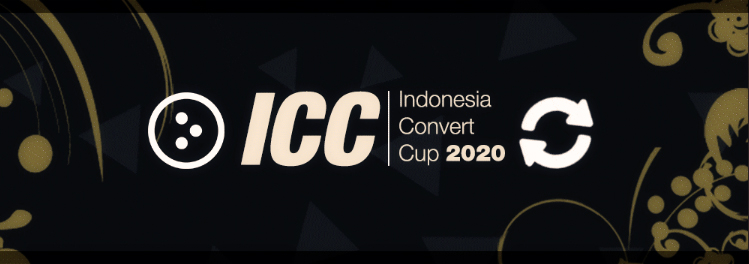
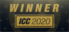
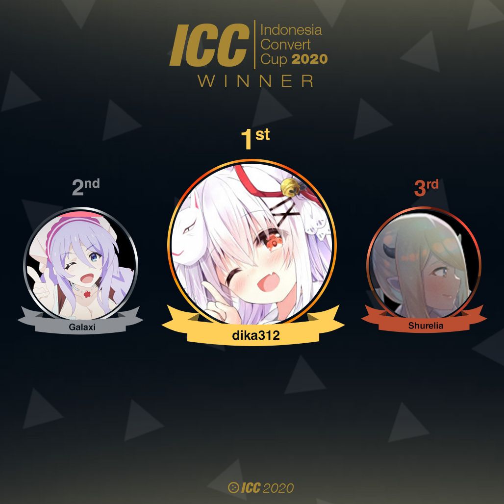

---
tags:
  - ICC2020
  - ICC 2020
---

# Indonesia Convert Cup 2020

The **Indonesia Convert Cup 2020** (***ICC 2020***) is a double-elimination 1v1 osu!catch tournament hosted by ![][flag_ID] [Eum](https://osu.ppy.sh/users/16552751), ![][flag_ID] [Kazuyo](https://osu.ppy.sh/users/5604201), and ![][flag_ID] [Dapuluous](https://osu.ppy.sh/users/8140944) in where all maps in the tournament are converted osu!standard maps. The tournament is open to all osu!catch players from Indonesia with over 5,000 osu!catch playcounts regardless of rank. It is the first iteration of the tournament series.

## Tournament schedule

| Event | Timestamp |
| --: | :-- |
| Registration phase | 2020-07-10/2020-07-20 |
| Screening phase | 2020-07-21/2020-07-27 |
| Group Stage | 2020-07-28/2020-08-02 |
| Round of 16 | 2020-08-03/2020-08-09 |
| Quarterfinals | 2020-08-10/2020-08-16 |
| Semifinals | 2020-08-17/2020-08-23 |
| Finals - Week 1 | 2020-08-24/2020-08-30 |
| Finals - Week 2 | 2020-08-31/2020-09-06 |

## Prizes

| Placing | Prize(s) |
| :-: | :-- |
|  | IDR 1.000.000,- + 50% of the raised prize pool, unique profile badge |
|  | IDR 600.000,- + 30% of the raised prize pool |
|  | IDR 450.000,- + 20% of the raised prize pool |

## Organization

ICC 2020 was run by various osu! community members predominantly hailing from Indonesia.

| Position | Member(s) |
| :-- | :-- |
| Host | ![][flag_ID] [Eum](https://osu.ppy.sh/users/16552751), ![][flag_ID] [Kazuyo](https://osu.ppy.sh/users/5604201), ![][flag_ID] [Dapuluous](https://osu.ppy.sh/users/8140944) |
| Map selector | ![][flag_ID] [Constantine](https://osu.ppy.sh/users/3221898), ![][flag_ID] [Yuri-](https://osu.ppy.sh/users/4983719), ![][flag_ID] [Toka](https://osu.ppy.sh/users/1595221) |
| Streamer | ![][flag_TW] [XzCraftP](https://osu.ppy.sh/users/1593180), ![][flag_ID] [xHirayuki](https://osu.ppy.sh/users/3245206), ![][flag_ID] [sumippe](https://osu.ppy.sh/users/1929336), ![][flag_ID] [Netamaru](https://osu.ppy.sh/users/1830361), ![][flag_ID] [Victim\_Crasher](https://osu.ppy.sh/users/2084869) |
| Commentator | ![][flag_ID] [Eum](https://osu.ppy.sh/users/16552751), ![][flag_ID] [Dapuluous](https://osu.ppy.sh/users/8140944), ![][flag_ID] [Niva](https://osu.ppy.sh/users/197805), ![][flag_ID] [CamXDanna](https://osu.ppy.sh/users/3243148), ![][flag_ID] [THS](https://osu.ppy.sh/users/1218514), ![][flag_ID] [Snow_flower](https://osu.ppy.sh/users/618064), ![][flag_ID] [Juragan_Piscok1](https://osu.ppy.sh/users/15507280) |
| Referee | ![][flag_ID] [mina-](https://osu.ppy.sh/users/4670692), ![][flag_ID] [Avoya](https://osu.ppy.sh/users/3136817), ![][flag_ID] [CamXDanna](https://osu.ppy.sh/users/3243148), ![][flag_ID] [Yuina Hotaru](https://osu.ppy.sh/users/1104256),  ![][flag_ID] [- Ruu -](https://osu.ppy.sh/users/3811821), ![][flag_ID] [Intention](https://osu.ppy.sh/users/3416858) |
| Graphic designer | ![][flag_ID] [mina-](https://osu.ppy.sh/users/4670692), ![][flag_ID] [Avoya](https://osu.ppy.sh/users/3136817) |
| Spreadsheet manager | ![][flag_ID] [Dapuluous](https://osu.ppy.sh/users/8140944) |
| Wiki editor | ![][flag_ID] [Niva](https://osu.ppy.sh/users/197805) |

## Links

- **[Main spreadsheet](http://docs.google.com/spreadsheets/d/e/2PACX-1vTjldrvfwKxuc3x8QyhVAcccvGm6z2FDR-BZuxyX68GkQkdXoWwkcUlD0gaNA__aKJRlX3WSMfW5Pkj/pubhtml#)**
- [Discussion thread](http://osu.ppy.sh/community/forums/topics/1141903)
- [Discord server](http://discord.gg/7g6TAj2)
- [Livestream](https://www.twitch.tv/osuIndonesia/)

## Podium

## Participants

| Group |  |  |  |  |
| :-: | :-- | :-- | :-- | :-- |
| **A** | ![][flag_ID] [Fyl](https://osu.ppy.sh/users/10069307) | ![][flag_ID] [Shurelia](https://osu.ppy.sh/users/3807986) | ![][flag_ID] [yogafm](https://osu.ppy.sh/users/3247173) | ![][flag_ID] [Rossi](https://osu.ppy.sh/users/5569341) |
| **B** | ![][flag_ID] [Chroneko](https://osu.ppy.sh/users/5472877) | ![][flag_ID] [ilhamuharam](https://osu.ppy.sh/users/7657968) | ![][flag_ID] [-Nana -](https://osu.ppy.sh/users/8738085) | ![][flag_ID] [sumippe](https://osu.ppy.sh/users/1929336) |
| **C** | ![][flag_ID] [dika312](https://osu.ppy.sh/users/741613) | ![][flag_ID] [BitDust](https://osu.ppy.sh/users/9573836) | ![][flag_ID] [Sololiquy](https://osu.ppy.sh/users/4350087) | *N/A* |
| **D** | ![][flag_ID] [Minalinsky-](https://osu.ppy.sh/users/2823883) | ![][flag_ID] [dedotikea](https://osu.ppy.sh/users/8805157) | ![][flag_ID] [Funtastic](https://osu.ppy.sh/users/3555626) | *N/A* |
| **E** | ![][flag_ID] [LeWind](https://osu.ppy.sh/users/9718235) | ![][flag_ID] [Zylin](https://osu.ppy.sh/users/6692990) | ![][flag_ID] [Galaxi](https://osu.ppy.sh/users/2552435) | *N/A* |
| **F** | ![][flag_ID] [Reen](https://osu.ppy.sh/users/3285139) | ![][flag_ID] [Yui\_](https://osu.ppy.sh/users/8264181) | ![][flag_ID] [Riria Rakira](https://osu.ppy.sh/users/6310025) | *N/A* |
| **G** | ![][flag_ID] [Valskiel](https://osu.ppy.sh/users/1254639) | ![][flag_ID] [moncar321](https://osu.ppy.sh/users/1400073) | ![][flag_ID] [Koimeji](https://osu.ppy.sh/users/4137039) | *N/A* |
| **H** | ![][flag_ID] [Intel21](https://osu.ppy.sh/users/1272422) | ![][flag_ID] [MrGulla](https://osu.ppy.sh/users/4540721) | ![][flag_ID] [INFormal](https://osu.ppy.sh/users/6525565) | *N/A* |

## Mappools

### Finals

**[Download the mappack here! (180 MB)](https://drive.google.com/file/d/1mEUgYsLfoGQgrWgC32-f9JeRRZYhclwx/view?usp=sharing)**

- NoMod
  - 
  - 
  - 
  - 
  - 
  - 
- Hidden
  - 
  - 
  - 
  - 
- HardRock
  - 
  -
  -
  -
- DoubleTime
  - 
  -
  -
  -
- Tiebreaker
  -

### Semifinals

**[Download the mappack here! (195 MB)](https://drive.google.com/file/d/1AYXaifWvEWfC4G5mZJ1kNK-V90ATvY-I/view?usp=sharing)**

- NoMod
  - 
  - 
  - 
  - 
  - 
  - 
- Hidden
  - 
  - 
  - 
  - 
- HardRock
  - 
  -
  -
  -
- DoubleTime
  - 
  -
  -
  -
- Tiebreaker
  -

### Quarterfinals

**[Download the mappack here! (140 MB)](https://drive.google.com/file/d/1F8KQhR3aCEcMuMOyq6AKX3E-95Bul51F/view?usp=sharing)**

- NoMod
  - 
  - 
  - 
  - 
  - 
  - 
- Hidden
  - 
  - 
  - 
- HardRock
  - 
  -
  -
- DoubleTime
  - 
  -
  -
- Tiebreaker
  -

### Round of 16

**[Download the mappack here! (161 MB)](https://drive.google.com/file/d/1jrKZkbuDOEAkgkAZ8NpGCYRV3psqlb-W/view)**

- NoMod
  - [Pendulum - Witchcraft (Zarerion) \[Jenny\]](https://osu.ppy.sh/beatmapsets/55982#fruits/169993)  
  - [Magnetude - Signals (Firebool) \[adioni's 100 MHz\]](https://osu.ppy.sh/beatmapsets/850972#fruits/1834172)  
  - [Little Big - UNO (Gero) \[UNO, DOS, DOS, CUATRO\]](https://osu.ppy.sh/beatmapsets/1128448#fruits/2357612) 
  - [Poppin'Party - Time Lapse (browiec) \[Time Lapse\]](https://osu.ppy.sh/beatmapsets/1018483#fruits/2131344)  
- Hidden
  - [Sayaki Sasaka - Sakura, Reincarnation (Flower) \[Extra\]](https://osu.ppy.sh/beatmapsets/884081#fruits/1863992)  
  - [Major Lazer - Lean On (feat. MO \& DJ Snake) (Beige) \[Expert\]](https://osu.ppy.sh/beatmapsets/487544#fruits/1067625)  
  - [Kawada Mami - JOINT (Mariko Sakuragi) \[Extra\]](https://osu.ppy.sh/beatmapsets/1051651#fruits/2197734)  
- HardRock
  - [Daisy x Daisy - Aoi Tsuki (Asuka\_-) \[Insane\]](https://osu.ppy.sh/beatmapsets/968777#fruits/2027056)  
  - [Eguchi Takahiro - silver temple (LKs) \[Insane\]](https://osu.ppy.sh/beatmapsets/59345#fruits/177916)  
  - [KOTOKO - Agony (SOGASOGAMO) \[Miko\]](https://osu.ppy.sh/beatmapsets/13510#fruits/49952)  
- DoubleTime
  - [Rita - Alea jacta est! (DELiS) \[Insane\]](https://osu.ppy.sh/beatmapsets/112150#fruits/291402)  
  - [Feryquitous feat. Aitsuki Nakuru - Ether (Acyl) \[\_todestrieb's Light Insane\]](https://osu.ppy.sh/beatmapsets/902425#fruits/1947616)  
  - [Marika - quantum jump (Shurelia) \[Insane\]](https://osu.ppy.sh/beatmapsets/183467#fruits/1618565)  
- Tiebreaker
  - **[Nhato - Delay Order (Shizuku-) \[Time Manipulation\]](https://osu.ppy.sh/beatmapsets/580214#fruits/1228509)**

### Group Stage

**[Download the mappack here! (117 MB)](https://drive.google.com/file/d/1E8h7BBl3Bz-woN4Bw4rjUomWapceTeWU/view)**

- NoMod
  - [Ichinose Shiki (CV: Aihara Kotomi) - Himitsu no Toilette (domSaur) \[MASTER+\]](https://osu.ppy.sh/beatmapsets/734093#fruits/1549043)  
  - [void - Sun Goes Down (BMS edit) (Frey) \[Insane\]](https://osu.ppy.sh/beatmapsets/382413#fruits/836269)  
  - [HyuN - Infinity Heaven (Niva) \[Ad Infinitum\]](https://osu.ppy.sh/beatmapsets/891345#fruits/1863246) 
  - [Yellow Zebra - Koi no Flame (m3gb3g) \[Lunatic\]](https://osu.ppy.sh/beatmapsets/908831#fruits/2205008)  
- Hidden
  - [Dio ft. Sef - Tijdmachine (GladiOol) \[Lesjuh! '11\]](https://osu.ppy.sh/beatmapsets/6997#fruits/129875)
  - [Rise Against - State of the Union (pishifat) \[Milan-'s Baby Insane\]](https://osu.ppy.sh/beatmapsets/387185#fruits/849438)  
  - [An - Xhroria (Cherry Blossom) \[Another\]](https://osu.ppy.sh/beatmapsets/82258#fruits/227772)
- HardRock
  - [yuzen - Ouka Ryouran (tsuka) \[Another\]](https://osu.ppy.sh/beatmapsets/37647#fruits/133383)  
  - [Rita - Aka no Sora (NatsumeRin) \[Rin\]](https://osu.ppy.sh/beatmapsets/17746#fruits/63188)  
  - [KOTOKO - Shichiten Hakki, Shijou Shugi! (kiddly) \[Challenging\]](https://osu.ppy.sh/beatmapsets/13042#fruits/48498)  
- DoubleTime
  - [Ray - lull \~Soshite Bokura wa\~ (Delis) \[Insane\]](https://osu.ppy.sh/beatmapsets/172450#fruits/438061)  
  - [07th Expansion - the executioner (Natteke) \[Hard\]](https://osu.ppy.sh/beatmapsets/27146#fruits/91198)  
  - [yuikonnu - Shinkai Shoujo (Kibbleru) \[Insane\]](https://osu.ppy.sh/beatmapsets/165752#fruits/403180)  
- Tiebreaker
  - **[HIELO - La Posesion Du Mimi - ILLUMINATEK Rmx - HIELO Refuck! (Euny) \[Natsu's Insane\]](https://osu.ppy.sh/beatmapsets/358353#fruits/806625)**

## Match results

### Finals

### Semifinals

### Quarterfinals

### Round of 16

### Group Stage

Friday, 9 October 2020:

| Group | Player 1 | Player 2 | Player 3 | Player 4 | Match link |
| :-: | :-: | :-: | :-: | :-: | :-- |
| **A** | ![][flag_ID] **[Shurelia](https://osu.ppy.sh/users/3807986) (12 pts)** | ![][flag_ID] **[yogafm](https://osu.ppy.sh/users/3247173) (4 pts)** | ![][flag_ID] [Fyl](https://osu.ppy.sh/users/10069307) (3 pt) | ![][flag_ID] [Rossi](https://osu.ppy.sh/users/5569341) (0 pts) | [#1](https://osu.ppy.sh/community/matches/68039823) |
| **B** | ![][flag_ID] [ilhamuharam](https://osu.ppy.sh/users/7657968) (8 pts) | ![][flag_ID] [-Nana -](https://osu.ppy.sh/users/8738085) (0 pts) | ![][flag_ID] **[Chroneko](https://osu.ppy.sh/users/5472877) (15 pts)** | ![][flag_ID] **[sumippe](https://osu.ppy.sh/users/1929336) (9 pts)** | [#1](https://osu.ppy.sh/community/matches/68042564) |
| **E** | ![][flag_ID] **[LeWind](https://osu.ppy.sh/users/9718235) (8 pts)** | ![][flag_ID] [Zylin](https://osu.ppy.sh/users/6692990) (0 pts) | ![][flag_ID] **[Galaxi](https://osu.ppy.sh/users/2552435) (8 pts)** | *N/A* | [#1](https://osu.ppy.sh/community/matches/68043608) |

Saturday, 10 October 2020:

| Group | Player 1 | Player 2 | Player 3 | Player 4 | Match link |
| :-: | :-: | :-: | :-: | :-: | :-- |
| **C** | ![][flag_ID] **[dika312](https://osu.ppy.sh/users/741613) (8 pts)** | ![][flag_ID] **[BitDust](https://osu.ppy.sh/users/9573836) (5 pts)** | ![][flag_ID] [Sololiquy](https://osu.ppy.sh/users/4350087) (3 pts) | *N/A* | [#1](https://osu.ppy.sh/community/matches/68088933) |
| **D** | ![][flag_ID] **[Minalinsky-](https://osu.ppy.sh/users/2823883) (6 pts)** | ![][flag_ID] [dedotikea](https://osu.ppy.sh/users/8805157) (2 pts) | ![][flag_ID] **[Funtastic](https://osu.ppy.sh/users/3555626) (8 pts)** | *N/A* | [#1](https://osu.ppy.sh/community/matches/68090808) |

Sunday, 11 August 2020:

| Group |  |  |  |  | Match link |
| :-: | :-: | :-: | :-: | :-: | :-- |
| **F** | ![][flag_ID] **[Reen](https://osu.ppy.sh/users/3285139) (5 pts)** | ![][flag_ID] [Yui\_](https://osu.ppy.sh/users/8264181) (4 pts) | ![][flag_ID] **[Riria Rakira](https://osu.ppy.sh/users/6310025) (8 pts)** | *N/A* | [#1](https://osu.ppy.sh/community/matches/64886373) |
| **G** | ![][flag_ID] **[Valskiel](https://osu.ppy.sh/users/1254639) (8 pts)** | ![][flag_ID] [moncar321](https://osu.ppy.sh/users/1400073) (0 pts) | ![][flag_ID] **[Koimeji](https://osu.ppy.sh/users/4137039) (8 pts)** | *N/A* | [#1](https://osu.ppy.sh/community/matches/68138601) |
| **H** | ![][flag_ID] **[Intel21](https://osu.ppy.sh/users/1272422) (8 pts)** | ![][flag_ID] [MrGulla](https://osu.ppy.sh/users/4540721) (2 pts) | ![][flag_ID] **[INFormal](https://osu.ppy.sh/users/6525565) (6 pts)** | *N/A* | [#1](https://osu.ppy.sh/community/matches/68140401) |

## Ruleset

### General rules

1. Map scoring is based on **Score V2.**
2. The mapsets for each round will be announced by the Tournament Management in advance before the actual matches take place.
3. Match schedules will be predetermined by the Tournament Management. Had there been any player(s) who were unable to attend the current schedule for any reason, affected player(s) may apply and settle for a reschedule at the #reschedule channel in the tournament's Discord server.
4. A referee will create a multiplayer room 10 minutes in advance and will start to send out invites.
5. If a player does not show up within **10 minutes** of the start time, their opponent wins by default.
6. If no staff or referee is available, the match will be postponed.
7. If a player disconnects, it will be treated as if they failed the map.
   - Disconnects that occur within a few seconds after map is started by the referee can be rematched.
8. If a player disconnects between the beatmaps, the match can be delayed up to 15 minutes max.
   - In case the disconnected player failed to report back or to be replaced with another player after the maximum allowance of 15 minutes has passed, the opposing player may be declared to be winning the match by default.
9. Lag is not a valid reason to nullify a map.
10. If there are any problems during the match occurence, the Tournament Management will make a decision based on referee's report.
11. It is expected to be polite and respectful to each other. Penalties will be given if participants violate.
    - If there are participant(s) who are engaging in an offensive provocation towards other participant(s), the participant(s) who are deemed responsible for the provocation  will be reported to the Tournament Management and may be considered to be blacklisted in the future installment(s) of CIC.
    - Usage of any illegal programs will be reported to the osu!staff and will be blacklisted in the next installment(s) of CIC.
    - If there is anyone other than the said participant who is trying to play as a participant, both the participant and the helper will be blacklisted in the next installment(s) of CIC.

### Tournament registration

1. All interested participants are required to register into the tournament individually.
   - In order to be eligible to play in the tournament, a participant must have the Indonesian flag displayed on their profile and at least 3000 playcounts under their profile.
2. To ensure valid and serious registrations, every registered participant will be checked by the Tournament Management and screened by osu!'s Tournament Staff.
3. The list of participants who have passed the screening and are able to compete in the tournament will be published after the Registration Phase has ended.
4. The Tournament Management will only account for a maximum of 32 participants to take part in the tournament.
   - In the case where the number of concerned registrants exceeds 32, the Tournament Management will only enlist 32 registrants with the highest osu!catch pp under their account to participate as players in the tournament.
5. Referees and map selectors may not participate as players in this tournament.

### Group Stage Rules

1. In the Group Stage, all participants will be divided into 8 different groups.
2. All participants in each group will compete against each other in a single multiplayer lobby using the Battle Royale system. In this system, all participants will each in turn pick out two maps from the mappool to be played with the following turnout after each map:
   - 1st place: **+2 points**
   - 2nd place: **+1 point**
   - 3rd place: **+1 point**
   - 4th place: **0 point**
3. If there is a tie at the end of the map, the points will instead be distributed as follows:
   - **+2/+2/+1/0** in the case where the 1st place and the 2nd place players are tied.
   - **+2/+1/+1/+1** in the case where the 2st place and the 3nd place players are tied.
   - **+2/+2/+2/0** in the case where the 1st place, the 2st place, and the 3nd place players are tied.
   - **+2/+2/+2/+2** in the case where all four players are tied.
4. Participants are **not allowed** to ban maps in the Group Stage.
5. There is no Lower Bracket in the Group Stage.
6. Rankings of each group are determined by sorting the results of each individual player's performance in the following priority:
   - Most points obtained.
   - Winner of the Tiebreaker.
   - Player(s) who Win By Default.
   - Whether there are player(s) who got disqualified during the match.
7. Two players who placed on top of their respective groups' rankings based on the criteria listed above will advance to the knock-out stage.

### Knock-Out Stage Rules 

1. The 16 players who managed to get through from the Group Stage will be matched to each other based on a randomized result.
2. Players will compete against each other using the Double Elimination system.
3. The Double Elimination System works as following:
   - Players who lose in the Upper Bracket can still play again on the Lower Bracket.
   - Players who lose in the Lower Bracket will be eliminated from the tournament.
   - In the Grand Finals, the winner of the the Upper Bracket only needs to win a single match against their opponent in order to claim the championship title. The winner of the Lower Bracket, however, needs to win two matches and enforce a Bracket Reset against their opponent in order to claim the championship title.
4. Players who can compete in the next round are determined by:
   - In the Round of 16 and the Quarterfinals, each player needs to win 5 points in order to win a match. (Best-of-9)
   - In the Semifinals onwards except for the Grand Final, each player needs to win 6 points in order to win a match. (Best-of-11)
   - In the Grand Final, each player needs to win 7 points in order to win the match. (Best-of-13)
   - Player(s) who Win By Default.
   - Whether there are player(s) who got disqualified during the match.

### Match Regulations

1. Each player must use the `!roll` command once in #multiplayer in order to determine the banning and picking order.
   - The winner of the `!roll` gets to decide which player gets to pick and ban first.
   - This rule does not apply in the Group Stage lobbies.
2. Each player has to ban **one beatmap** from the mappool. These beatmaps are not allowed to be picked by any player during the entire match.
   - This rule does not apply in the Group Stage lobbies.
3. Each player is free to select one warm-up beatmap. Using beatmaps with questionable content is prohibited.
   - Warm-ups do not apply in the Group Stage lobbies.
4. The results of each match and any other relevant information regarding the match will be posted on the Discord server after the match has concluded by the responsible referees.

[flag_ID]: /wiki/shared/flag/ID.gif "Indonesia"
[flag_TW]: /wiki/shared/flag/TW.gif "Taiwan"
