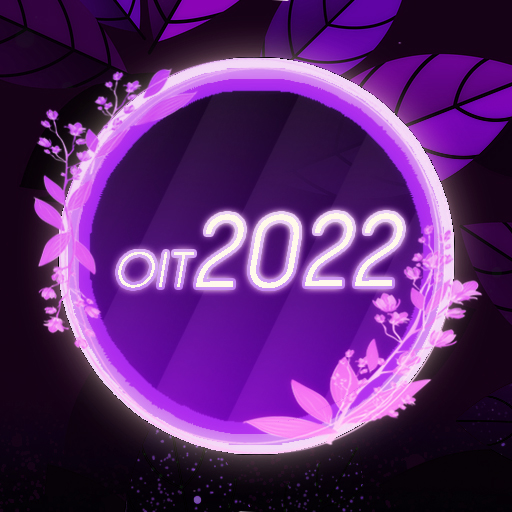

---
tags:
  - OIT2022
  - OIT 2022
---

# osu! Indonesia Tournament #12 (2022)

The **osu! Indonesia Tournament #12 (2022)** (***OIT 2022***) is an Indonesian double-elimination 1v1 osu! tournament hosted by ![][flag_ID] [Arca 9](https://osu.ppy.sh/users/14042319) and ![][flag_ID] [Raids](https://osu.ppy.sh/users/15640966). The tournament is open to all osu! players from Indonesia with 4,000 pp or above to their name. It is the twelfth iteration of the osu! Indonesia Tournament.

## Tournament schedule

| Event | Timestamp |
| --: | :-- |
| Registration phase | 2022-01-08/2022-01-30 |
| Screening phase | 2022-01-31/2022-02-14 |
| Qualifiers | 2022-02-15/2021-02-20 |
| Round of 32 | 2022-02-21/2022-02-27 |
| Round of 16 | 2022-02-28/2022-03-06 |
| Quarterfinals | 2022-03-07/2022-03-13 |
| Semifinals | 2022-03-14/2022-03-20 |
| Finals (week 1) | 2022-03-21/2022-03-27 |
| Finals (week 2) | 2022-03-28/2022-04-03 |

## Prizes

| Placing | Prize(s) |
| :-: | :-- |
|  | 50% of the raised prize pool, 6 months of osu!supporter, unique profile badge |
|  | 30% of the raised prize pool, 4 months of osu!supporter |
|  | 20% of the raised prize pool, 2 months of osu!supporter |

## Organisation

OIT 2022 is run by various osu! community members predominantly hailing from Indonesia.

| Position | Member(s) |
| :-- | :-- |
| Host | ![][flag_ID] [Arca 9](https://osu.ppy.sh/users/14042319), ![][flag_ID] [Raids](https://osu.ppy.sh/users/15640966) |
| Co-host | ![][flag_ID] [Niva](https://osu.ppy.sh/users/197805), ![][flag_ID] [Millie](https://osu.ppy.sh/users/3484548), ![][flag_ID] [Senritsu](https://osu.ppy.sh/users/1165368), ![][flag_ID] [Tama-desu](https://osu.ppy.sh/users/3813174) |
| Mappool selector | ![][flag_ID] [Raids](https://osu.ppy.sh/users/15640966), ![][flag_ID] [Niva](https://osu.ppy.sh/users/197805), ![][flag_ID] [Millie](https://osu.ppy.sh/users/3484548), ![][flag_ID] [Tama-desu](https://osu.ppy.sh/users/3813174), ![][flag_ID] [phizh](https://osu.ppy.sh/users/4569302), ![][flag_ID] [Kuro Fuyusaki](https://osu.ppy.sh/users/2667496) |
| Playtester | ![][flag_ID] [Pancoz](https://osu.ppy.sh/users/13156137), ![][flag_ID] [honeymint](https://osu.ppy.sh/users/4796773), ![][flag_ID] [MasterfulNote5](https://osu.ppy.sh/users/7247988), ![][flag_ID] [Ascaveth](https://osu.ppy.sh/users/3245206) |
| Streamer | ![][flag_ID] [Raids](https://osu.ppy.sh/users/15640966), ![][flag_ID] [Millie](https://osu.ppy.sh/users/3484548), ![][flag_ID] [Victim_Crasher](https://osu.ppy.sh/users/2084869), ![][flag_ID] [wiam103](https://osu.ppy.sh/users/4109839), ![][flag_MY] [Laphii](https://osu.ppy.sh/users/9364594), ![][flag_MY] [Rumah](https://osu.ppy.sh/users/12086495), ![][flag_MY] [Its not Marvin](https://osu.ppy.sh/users/13600612), ![][flag_HK] [ShadeCegLgMn](https://osu.ppy.sh/users/12086495) |
| Commentator | ![][flag_ID] [Raids](https://osu.ppy.sh/users/15640966), ![][flag_ID] [Niva](https://osu.ppy.sh/users/197805), ![][flag_ID] [Millie](https://osu.ppy.sh/users/3484548), ![][flag_ID] [Victim_Crasher](https://osu.ppy.sh/users/2084869), ![][flag_ID] [Vvn](https://osu.ppy.sh/users/3204677), ![][flag_ID] [Deorum](https://osu.ppy.sh/users/5933031), ![][flag_ID] [Fuma](https://osu.ppy.sh/users/1501956), ![][flag_ID] [My Angel Eimi](https://osu.ppy.sh/users/3793938), ![][flag_ID] [Remuru](https://osu.ppy.sh/users/3654220), ![][flag_ID] [Kirinagi](https://osu.ppy.sh/users/5937545) |
| Referee | ![][flag_ID] [NoVaLian](https://osu.ppy.sh/users/6459827), ![][flag_ID] [-Foxee-](https://osu.ppy.sh/users/14989473), ![][flag_ID] [lucidators](https://osu.ppy.sh/users/10154981), ![][flag_ID] [YaeMyMommy](https://osu.ppy.sh/users/17278897), ![][flag_ID] [Aerotracker](https://osu.ppy.sh/users/24396418), ![][flag_ID] [NotDens](https://osu.ppy.sh/users/17311355), ![][flag_ID] [Fyl](https://osu.ppy.sh/users/10069307), ![][flag_PH] [-Pekora-](https://osu.ppy.sh/users/17959882), ![][flag_VN] [rock-on](https://osu.ppy.sh/users/9676089), ![][flag_HK] [Smato](https://osu.ppy.sh/users/5616307) |
| Graphic designer | ![][flag_ID] [Niva](https://osu.ppy.sh/users/197805), ![][flag_ID] [Felter](https://osu.ppy.sh/users/5865319/) |
| Spreadsheet manager | ![][flag_ID] [Arca 9](https://osu.ppy.sh/users/14042319) |
| Wiki editor | ![][flag_ID] [Niva](https://osu.ppy.sh/users/197805) |

## Links

- **[Master spreadsheet](https://docs.google.com/spreadsheets/d/1ldhLP4DDZ-eSVKZ9sQOuBdh2NEJBKJW7Jpbv2HcrI94/edit#gid=1052632133)**
- [Forum thread](https://osu.ppy.sh/community/forums/topics/1497888)
- [Discord server](https://discordapp.com/invite/CHRFffH)
- [Livestream channel](https://www.twitch.tv/osuindonesia)
- [Challonge brackets](https://challonge.com/OIT2022)

## Participants

Listed below are players who qualified into the Round of 32 (along with their respective seed number and average map rank combined from each individual Qualifier beatmaps) out of 106 registered players in total.

| Seed No. | Player | Z-Sum |
| :-- | :-- | :-- |
| 1 | ![][flag_ID] [Skydiver](https://osu.ppy.sh/users/4750008) | 8.2 |
| 2 | ![][flag_ID] [rho](https://osu.ppy.sh/users/1629553) | 8.5 |
| 3 | ![][flag_ID] [Vinno](https://osu.ppy.sh/users/10717635) | 8.6 |
| 4 | ![][flag_ID] [Deeto](https://osu.ppy.sh/users/10069909) | 9.0 |
| 5 | ![][flag_ID] [MineFrostID](https://osu.ppy.sh/users/12159899) | 9.1 |
| 6 | ![][flag_ID] [Walfrid](https://osu.ppy.sh/users/6600809) | 10.4 |
| 7 | ![][flag_ID] [Rexeez](https://osu.ppy.sh/users/1987591) | 10.6 |
| 8 | ![][flag_ID] [Lifeline](https://osu.ppy.sh/users/11367222) | 11.1 |
| 9 | ![][flag_ID] [Crezz](https://osu.ppy.sh/users/7108275) | 12.2 |
| 10 | ![][flag_ID] [LoidKun](https://osu.ppy.sh/users/6437601) | 14.0 |
| 11 | ![][flag_ID] [Fuma](https://osu.ppy.sh/users/1501956) | 15.2 |
| 12 | ![][flag_ID] [- Rosemary -](https://osu.ppy.sh/users/2526649) | 17.7¹ |
| 13 | ![][flag_ID] [Thatnoobguy](https://osu.ppy.sh/users/11091594) | 18.4 |
| 14 | ![][flag_ID] [Skitzor](https://osu.ppy.sh/users/3353314) | 18.5 |
| 15 | ![][flag_ID] [Herbayse](https://osu.ppy.sh/users/4924094) | 18.9 |
| 16 | ![][flag_ID] [Takaichi](https://osu.ppy.sh/users/909745) | 21.2 |
| 17 | ![][flag_ID] [cfood](https://osu.ppy.sh/users/8626190) | 21.3 |
| 18 | ![][flag_ID] [Vvn](https://osu.ppy.sh/users/3204677) | 22.4 |
| 19 | ![][flag_ID] [fry](https://osu.ppy.sh/users/4917604) | 22.7 |
| 20 | ![][flag_ID] [Daffy](https://osu.ppy.sh/users/5968633) | 24.0 |
| 21 | ![][flag_ID] [Venta](https://osu.ppy.sh/users/11320627) | 24.6 |
| 22 | ![][flag_ID] [Fayn](https://osu.ppy.sh/users/5390495) | 26.9 |
| 23 | ![][flag_ID] [Caruma](https://osu.ppy.sh/users/13187450) | 27.0 |
| 24 | ![][flag_ID] [Eliz](https://osu.ppy.sh/users/11759284) | 27.2 |
| 25 | ![][flag_ID] [Firia](https://osu.ppy.sh/users/9730262) | 27.3 |
| 26 | ![][flag_ID] [Suikami](https://osu.ppy.sh/users/1929336) | 27.6 |
| 27 | ![][flag_ID] [Clayweg](https://osu.ppy.sh/users/11374005) | 28.2 |
| 28 | ![][flag_ID] [ngonk](https://osu.ppy.sh/users/4750008) | 28.7 |
| 29 | ![][flag_ID] [Contra](https://osu.ppy.sh/users/12011863) | 29.4 |
| 30 | ![][flag_ID] [Somay 287](https://osu.ppy.sh/users/4314559) | 29.5 |
| 31 | ![][flag_ID] [xHirayuki](https://osu.ppy.sh/users/3245206) | 31.5 |
| 32 | ![][flag_ID] [Xicyte](https://osu.ppy.sh/users/10212581) | 31.7 |

## Mappools

### Round of 32

**[Download the mappack here! (114 MB)](https://drive.google.com/file/d/1bpPhDewj_pXvKkB45Iwzu8JXvcqCJKpT/view)**

- NoMod
  1. coming soon
  2. [xi - Pandemonium (Doomsday) \[Extra\]](https://osu.ppy.sh/beatmapsets/519285#osu/1103215)
  3. [Camellia - Routing (Mir) \[Amateurre's Redirection\]](https://osu.ppy.sh/beatmapsets/1639727#osu/3373369)
  4. [Pendulum x Hybrid Minds - Louder Than Words (Cut Ver.) (Mir) \[Whisper\]](https://osu.ppy.sh/beatmapsets/1496831#osu/3068257)
  5. [Lime - Luminaria (Saika0k1) \[Anemoia\]](https://osu.ppy.sh/beatmapsets/1687561#osu/3448872)  
- Hidden
  1. [Yorushika - Matasaburo (Rosiie) \[Summer Wind\]](https://osu.ppy.sh/beatmapsets/1485959#osu/3047001)
  2. [S.S.H. - Hard Wire (fartownik) \[Insane\]](https://osu.ppy.sh/beatmapsets/963692#osu/2017628)
- HardRock
  1. [SAKANAMON - Fumeikakuna Seika (AirinCat) \[Extra\]](https://osu.ppy.sh/beatmapsets/1552743#osu/3172606)
  2. [Arizona Zervas - ROXANNE (Remix) (feat. Swae Lee) (wafer) \[ROCK SAND (Remix)\]](https://osu.ppy.sh/beatmapsets/1607645#osu/3282876)
- DoubleTime
  1. [sky_delta feat. Aitsuki Nakuru - Othello syndrome (lushifer) \[Transpain (edit.)\]](https://osu.ppy.sh/beatmapsets/1683218#osu/3439136)
  2. [Mami Kawada - sense (Giralda) \[LC's Insane\]](https://osu.ppy.sh/beatmapsets/325638#osu/723285)
  3. [yanaginagi - Vidro Moyou (rosario wknd) \[Visit from a Fallen Star\]](https://osu.ppy.sh/beatmapsets/1202515#osu/2504335)
- FreeMod
  1. [Yooh - LegenD. (HelloSCV) \[EXHAUST\]](https://osu.ppy.sh/beatmapsets/497891#osu/1059853)
  2. [Yorushika - Hitchcock (akinothm) \[OIT 2022 Edit\]](https://osu.ppy.sh/beatmapsets/1698752#osu/3471128)  
- Tiebreaker
  1. **[Emiru no Aishita Tsukiyo ni Dai San Gensou Kyoku wo - Gengaku Opera House (gazimal) \[Give it all.\]](https://osu.ppy.sh/beatmapsets/1347917#osu/2791350)**

### Qualifiers

**[Download the mappack here! (94 MB)](http://drive.google.com/u/0/uc?id=1fQnhr4IUPDbS1e2MNupM61S89Y3MB2dy&export=download)**

- NoMod
  1. [Ayalis - Ai o Chikaishi Hime Kazari (handsome) \[captin's Extra\]](https://osu.ppy.sh/beatmapsets/506155#osu/1082145)
  2. [celas- Azul (Remix) (IOException) \[Expert\]](https://osu.ppy.sh/beatmapsets/1416065#osu/2918272)
  3. [Tsukuyomi - Moonlight at midday (Seros) \[Extra\]](https://osu.ppy.sh/beatmapsets/1537310#osu/3143258)
  4. [ginkiha - Paved Garden (Smug Nanachi) \[fiore\]](https://osu.ppy.sh/beatmapsets/1131098#osu/2362655)
- Hidden
  1. [kurubukkochan - Rain (Reincarnation) \[Rein\]](https://osu.ppy.sh/beatmapsets/886147#osu/1852501)
  2. [Various Artists - Netsuretsu Kangei Wonderland (Mirash) \[PandaHero's Extra\]](https://osu.ppy.sh/beatmapsets/1604477#osu/3333126)
- HardRock
  1. [Kanzaki Elza starring ReoNa - Independence (Maot) \[Masquerade CS4\]](https://osu.ppy.sh/beatmapsets/1557099#osu/3448344)
  2. [SWAN K feat. Asuka M - LOVE B.B.B (Nakagawa-Kanon) \[Another\]](https://osu.ppy.sh/beatmapsets/48537#osu/150488)
- DoubleTime
  1. [sakanaction - Shin Takarajima (Fixxis) \[Insane\]](https://osu.ppy.sh/beatmapsets/1188206#osu/2476090)
  2. [rerulili feat. Dancing Dolls - Kami no Manima Ni (Sephira) \[RLC's Insane\]](https://osu.ppy.sh/beatmapsets/1182518#osu/2465404)

## Ruleset

### General rules

1. Beatmap scoring is based on **[ScoreV2](/wiki/Gameplay/Score#scorev2).**
2. The mappools for each round will be announced by the Tournament Management in advance before the actual matches take place.
3. Match schedules will be predetermined by the Tournament Management. If there are any player(s) who are unable to attend the current schedule for any reason, all other affected players may apply and settle for a reschedule at the `#reschedule` channel in the tournament's Discord server.
4. A referee will create a multiplayer room 10 minutes in advance and will start to send out invites.
5. If a player does not show up within **10 minutes** of the start time, their opponent wins by default.
6. If no staff or referee is available, the match will be postponed.
7. **NoFail will be enforced in all beatmaps.** This is to ensure that the points are to be awarded more fairly towards players who perform better in general during the course of the beatmap regardless of their remaining health at the end.
8. If a player disconnects, it will be treated as if they had failed the beatmap. 
   - A match can be rematched for disconnects that occur within a few seconds after the beatmap has been started by the referee.
9. If a player disconnects between beatmaps, the match can be delayed up to 15 minutes at most. 
   - In case the disconnected player fails to report back after the maximum allowance of 15 minutes had passed, the opposing player may be declared to win the match by default.
10. Lag is not a valid reason to nullify a beatmap.
11. If any problems during the match occur, the Tournament Management will make a decision based on the referee's report.
12. It is expected that all players be polite and respectful to each other. Penalties will be given upon violation.
    - If a player is found to be engaging in an act that is deemed to be distasteful or provocative, the corresponding player may be disqualified right away from the tournament and/or blacklisted from the future iterations of the tournament by the Tournament Management.
    - Usage of any tools and programs that are against [osu!'s community rules](/wiki/Rules#community-rules) is strictly prohibited and will be straight up reported to the osu! team at will.

### Tournament registration

1. All interested players are required to register into the tournament individually.
   - In order to be eligible to play in the tournament, a player must either:
     - Have the flag of any of the ten [ASEAN member states](https://asean.org/about-asean/member-states/) (![][flag_BN] Brunei Darussalam, ![][flag_KH] Cambodia, ![][flag_ID] Indonesia, ![][flag_LA] Laos, ![][flag_MY] Malaysia, ![][flag_MM] Myanmar, ![][flag_PH] The Philippines, ![][flag_SG] Singapore, ![][flag_TH] Thailand, or ![][flag_VN] Vietnam) displayed on their profile, ***or***
     - Be in possession of a valid primary national identity document (i.e. passport or ID card) issued by one of the aforementioned countries.
2. To ensure that all incoming registrations are serious and valid, every registered player will be checked in detail by the Tournament Management.
3. The list of players who are deemed to be eligible to compete in the tournament will be published by the Tournament Management after the Registration phase has ended.
4. Testplayers, referees, and mappool selectors may not participate as players in this tournament.

### Round-specific rules

#### Qualifier rules

1. Each player will have to sign up to one of the twenty Qualifier lobbies that have been scheduled and prepared by the Tournament Management in advance.
2. In the lobby, players will have to consecutively play all of the ten Qualifier beatmaps in the order of NM1 → NM2 → NM3 → NM4 → HD1 → HD2 → HR1 → HR2 → DT1 → DT2.
3. Players **are not allowed** to ban any beatmaps in the Qualifiers.
4. Players **are not allowed** to join in (or register for) more than one Qualifier lobbies.
5. 32 players with the **highest average rank combined from each individual Qualifier beatmaps** will advance to the knock-out stages.
   - If there are two (or more) players who share the same average rank, the player that holds the higher total score combined from all ten Qualifier beatmaps will be placed in the higher seed.
6. Failure to attend in any of the twenty Qualifier lobbies will result in an instant elimination from the tournament.

#### Knock-out stage rules

1. The 32 players who managed to get through from the Qualifiers will be matched to each other based on their Qualifiers seeding.
2. Players will compete against each other using the Double Elimination system.
3. The Double Elimination System works as follows:
   - Players who lose in the Upper Bracket can still play again on the Lower Bracket.
   - Players who lose in the Lower Bracket will be eliminated from the tournament.
   - In the Grand Finals, the winner of the the Upper Bracket will only need to win a single match against their opponent in order to claim the championship title. The winner of the Lower Bracket, however, will need to win two matches and enforce a Bracket Reset against their opponent in order to claim the championship title.
4. Players who can compete in the next round are determined by:
   - In the Round of 32 and the Round of 16, each player needs to win 5 points in order to win a match. (Best-of-9)
   - In the Quarterfinals and the Semifinals, each player needs to win 6 points in order to win a match. (Best-of-11)
   - In both of the Finals Weeks, each player needs to win 7 points in order to to win a match. (Best-of-13)
   - Players who win by default.
   - Whether there are players who are disqualified from the tournament.

### Match regulations

1. Each player must use the `!roll` command once in the multiplayer lobby in order to determine the banning and picking order.
   - The winner of the `!roll` gets to determine who gets the first pick and the second ban.
   - The loser of the `!roll` gets the opposite by default.
   - This rule does not apply in the Qualifier lobbies.
2. Each player has to ban **two beatmaps** from the corresponding mappool. These beatmaps will not be allowed to be picked by any player during the entire match.
   - Each player may not ban two beatmaps from the same mod pool, except from the NoMod pool. For example, banning NM1 and NM2 is allowed; banning NM1 and HD1 is allowed; banning HD1 and HD2, however, is *not* allowed.
   - Banning does not apply in the Qualifier lobbies.
3. Each player is free to select one warm-up beatmap. Using beatmaps with questionable content is prohibited.
   - Warm-ups do not apply in the Qualifier lobbies.
4. In a FreeMod pick, each player has to apply at least one mod to play the beatmap with. Allowed mods are EZ, HR, HD, or any possible combinations of the three mods.
   - Playing a FreeMod pick without any mods applied is not allowed.
5. The results of each match and any other relevant information regarding the match will be posted on the Discord server after the match has been concluded by the responsible referees.

[flag_HK]: /wiki/shared/flag/HK.gif "Hong Kong"
[flag_ID]: /wiki/shared/flag/ID.gif "Indonesia"
[flag_MY]: /wiki/shared/flag/MY.gif "Malaysia"
[flag_PH]: /wiki/shared/flag/PH.gif "Phillipines"
[flag_VN]: /wiki/shared/flag/VN.gif "Vietnam"
