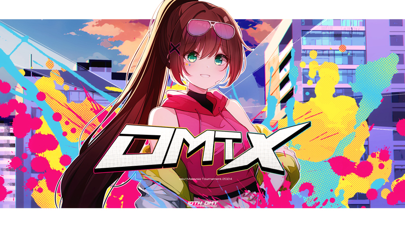

---
tags:
  - OMT X
  - OMT 10
---

# osu! Malaysia Tournament X

The **osu! Malaysia Tournament X** (OMT X) is a double-elimination 1v1 osu! tournament hosted by ::{ flag=MY }:: [Sagisawa Arisu](https://osu.ppy.sh/users/9364594). The tournament was open to all players from Malaysia with a global rank of #99,999 or higher in the osu! game mode. It is the tenth iteration of the osu! Malaysia Tournament..

## Tournament schedule

| Event | Timestamp |
| --: | :-- |
| Registration phase | 2024-08-01/2024-08-16 |
| Screening phase | 2024-08-17/2024-08-25 |
| Qualifiers | 2024-08-26/2024-09-01 |
| Runoff bracket | 2024-09-02/2024-09-08 |
| Round of 16 | 2024-09-09/2024-09-15 |
| Quarterfinals | 2024-09-16/2024-09-22 |
| Semifinals | 2024-09-23/2024-09-29 |
| Finals (week 1) | 2024-09-30/2024-10-06 |
| Finals (week 2) | 2024-10-07/2024-10-13 |

## Prizes

| Placing | Prize(s) |
| :-: | :-- |
|  | 200 MYR, exclusive one-off merchandise package, unique profile badge |
|  | 150 MYR |
|  | 100 MYR |

## Organisation

The osu! Malaysia Tournament X is run by various osu! community members from Malaysia and beyond.

| Position | Member(s) |
| :-- | :-- |
| Host | ::{ flag=MY }:: [Sagisawa Arisu](https://osu.ppy.sh/users/9364594) |
| Co-host | ::{ flag=MY }:: [Iyouka](https://osu.ppy.sh/users/7138499), ::{ flag=MY }:: [Amamiya Kokoro](https://osu.ppy.sh/users/9534110) |
| Mappool selector | ::{ flag=MY }:: [Sagisawa Arisu](https://osu.ppy.sh/users/9364594), ::{ flag=VN }:: [realshin](https://osu.ppy.sh/users/8006029), ::{ flag=HK }:: [maxbireo](https://osu.ppy.sh/users/4682646) |
| Custom mapper | ::{ flag=MY }:: [Mahiru Shiina](https://osu.ppy.sh/users/13866023), ::{ flag=MY }:: [\[ -Elaina- \]](https://osu.ppy.sh/users/13893348), ::{ flag=MY }:: [Banner](https://osu.ppy.sh/users/14290988), ::{ flag=MY }:: [Agagak](https://osu.ppy.sh/users/3645490), ::{ flag=MY }:: [anjay](https://osu.ppy.sh/users/15553329), ::{ flag=MY }:: [Stick2Glue](https://osu.ppy.sh/users/6928574), ::{ flag=MY }:: [Kardshark](https://osu.ppy.sh/users/4724315), ::{ flag=MY }:: [\[ Fiz \]](https://osu.ppy.sh/users/6928574) |
| Custom map quality assurance | ::{ flag=MY }:: [Tzero](https://osu.ppy.sh/users/6088976) |
| Playtester | *to be announced* |
| Streamer | ::{ flag=MY }:: [Sagisawa Arisu](https://osu.ppy.sh/users/9364594), ::{ flag=MY }:: [Iyouka](https://osu.ppy.sh/users/7138499), ::{ flag=NZ }:: [Hand Sanitiser](https://osu.ppy.sh/users/5091293), ::{ flag=AU }:: [dGeist](https://osu.ppy.sh/users/7262064) |
| Commentator | ::{ flag=MY }:: [Tzero](https://osu.ppy.sh/users/6088976), ::{ flag=MY }:: [Racers03](https://osu.ppy.sh/users/11621976), ::{ flag=MY }:: [Fancyyy](https://osu.ppy.sh/users/12616268), ::{ flag=MY }:: [VenDService](https://osu.ppy.sh/users/15107940), ::{ flag=ID }:: [BlankTap](https://osu.ppy.sh/users/10137131) |
| Referee | ::{ flag=MY }:: [Rumah](https://osu.ppy.sh/users/12086495), ::{ flag=MY }:: [dragonlemmy](https://osu.ppy.sh/users/14053835), ::{ flag=SG }:: [Quickeryes](https://osu.ppy.sh/users/18227681), ::{ flag=NZ }:: [Hand Sanitiser](https://osu.ppy.sh/users/5091293) |
| Graphic designer | ::{ flag=MY }:: [Iyouka](https://osu.ppy.sh/users/7138499) |
| Spreadsheet manager | ::{ flag=HK }:: [ShadeCegLgMn](https://osu.ppy.sh/users/12609866) |
| Character illustrator | ::{ flag=MY }:: th_nore [(↗)](https://twitter.com/th_nore) |
| Wiki editor | ::{ flag=ID }:: [Niva](https://osu.ppy.sh/users/197805) |

## Links

- **[Master spreadsheet](https://docs.google.com/spreadsheets/d/1tJIry9tAr7wfQGvh071pdKB6QrLIPep8hd444j0UWik/edit?gid=0#gid=0)**
- [Forum thread](https://osu.ppy.sh/community/forums/topics/1956725)
- [Discord server](https://discord.gg/nKthrPUahJ)
- [Challonge brackets](https://challonge.com/omtX)
- [Livestream channel](https://www.twitch.tv/osumalaysia)

## Participants

## Mappools

### Qualifiers

- No Mod
  1. [MY FIRST STORY - Shuuen Requiem (SkyFlame) \[Expressionless\]](https://osu.ppy.sh/beatmapsets/1296338#osu/2689633)
  2. [Xi - Youyoumu ~ Run or Dash (OldEclipse) \[CS4\]](https://osu.ppy.sh/beatmapsets/1918615#osu/4005731)
  3. [NewJeans - ETA (Nidasimno) \[T24:00:00.000Z\]](https://osu.ppy.sh/beatmapsets/2120186#osu/4454352)
  4. [YOASOBI - Idol (Cocoyu) \[Deception\]](https://osu.ppy.sh/beatmapsets/1975074#osu/4099092)
- Hidden
  1. [Power Of Nature - QuoN (Down) \[Extra\]](https://osu.ppy.sh/beatmapsets/1587936#osu/3243179)
  2. [Hige Driver - ukigumo (Lude) \[ddm & Lude's Extra\]](https://osu.ppy.sh/beatmapsets/1827928#osu/3928631)
- Hard Rock
  1. [Reku Mochizuki - VEZZELiX (Chaoslitz) \[MARCOBROLO'S EXTRA\]](https://osu.ppy.sh/beatmapsets/1871929#osu/3868452)
  2. [School Food Punishment - fiction nonfiction (Garden) \[Expert\]](https://osu.ppy.sh/beatmapsets/1829347#osu/3754547)
- DoubleTime
  1. [Uzuki Shimamura (CV: Ayaka Ohashi) - Hanikami days (Setz) \[M\@STER\]](https://osu.ppy.sh/beatmapsets/1585091#osu/3237674)
  2. [Touno Sakura - PRIZM/CIRCUiT (Muchin) \[Summer, Memories, Love Story!\]](https://osu.ppy.sh/beatmapsets/2142220#osu/4509159)
  3. [Tsukuyomi - Moonlight at midday (Seros) \[Setu's Insane\]](https://osu.ppy.sh/beatmapsets/1537310#osu/3185210)

## Match results

### Grand Finals[^stage-note-2]

Detailed statistics for this round in [this spreadsheet](https://docs.google.com/spreadsheets/d/1q6CsZ5b3WHUTXUXfCpVdsJxgTDvz_Q2hRPdDbswgJFQ/edit).

Friday, 12 July 2024:

| Bracket | Team 1 |  |  | Team 2 | Match link |
| :-: | --: | :-: | :-: | :-- | :-- |
| Lower | No title | 1 | **7** | **crying right now** | [#1](https://osu.ppy.sh/community/matches/114644017) |

Sunday, 14 July 2024, Grand Final:

| Bracket | Team 1 |  |  | Team 2 | Match link |
| :-: | --: | :-: | :-: | :-- | :-- |
| Grand Final | YOSHIMOBIL | 6 | **7** | **crying right now** | [#1](https://osu.ppy.sh/community/matches/114669424) |
| Grand Final (bracket reset) | **crying right now** | **7** | 3 | YOSHIMOBIL | [#1](https://osu.ppy.sh/community/matches/114670678) |

### Finals[^stage-note-1]

Detailed statistics for this round in [this spreadsheet](https://docs.google.com/spreadsheets/d/1ryloSFoN2jOLlYQP9HH5IY5yyhDid9ppPaD3JZ0gWGI/edit?gid=1237373495#gid=1237373495).

Saturday, 6 July 2024:

| Bracket | Team 1 |  |  | Team 2 | Match link |
| :-: | --: | :-: | :-: | :-- | :-- |
| Lower | **crying right now** | **7** | 4 | foreign talent | [#1](https://osu.ppy.sh/community/matches/114568757) |
| Lower | **JustForFun** | **7** | 5 | gwk's team | [#1](https://osu.ppy.sh/community/matches/114570048) |

Sunday, 7 July 2024:

| Bracket | Team 1 |  |  | Team 2 | Match link |
| :-: | --: | :-: | :-: | :-- | :-- |
| Lower | **crying right now** | **7** | 3 | JustForFun | [#1](https://osu.ppy.sh/community/matches/114582115) |
| Upper | No title | 3 | **7** | **YOSHIMOBIL** | [#1](https://osu.ppy.sh/community/matches/114584234) |

### Semifinals

Detailed statistics for this round in [this spreadsheet](https://docs.google.com/spreadsheets/d/1lmZEZ5WxtXXi3F-cHqmo5wmc0LbbsJVKl7RY0y9HbRs/edit).

Friday, 28 June 2024:

| Bracket | Team 1 |  |  | Team 2 | Match link |
| :-: | --: | :-: | :-: | :-- | :-- |
| Lower | **foreign talent** | **6** | 0 | old goats | [#1](https://osu.ppy.sh/community/matches/114471897) |

Saturday, 29 June 2024:

| Bracket | Team 1 |  |  | Team 2 | Match link |
| :-: | --: | :-: | :-: | :-- | :-- |
| Lower | Paper Factory | 3 | **6** | **arujidonut** | [#1](https://osu.ppy.sh/community/matches/114485287) |
| Lower | **mooshu** | **6** | 1 | Beesechurger | [#1](https://osu.ppy.sh/community/matches/114484456) |
| Lower | Bakery | 0 | **6** | **gwk's team** | *win by default* |

Sunday, 30 June 2024:

| Bracket | Team 1 |  |  | Team 2 | Match link |
| :-: | --: | :-: | :-: | :-- | :-- |
| Upper | crying right now | 3 | **6** | **YOSHIMOBIL** | [#1](https://osu.ppy.sh/community/matches/114497785) |
| Lower | mooshu | 5 | **6** | **foreign talent** | [#1](https://osu.ppy.sh/community/matches/114497077) |
| Lower | arujidonut | 4 | **6** | **gwk's team** | [#1](https://osu.ppy.sh/community/matches/114497678) |
| Upper | **No title** | **6** | 5 | JustForFun | [#1](https://osu.ppy.sh/community/matches/114498352) |

### Quarterfinals

Detailed statistics for this round in [this spreadsheet](https://docs.google.com/spreadsheets/d/1wzJ_7ElO5HUS4dabqdgew8KBVf73teBZ3bUjjHFy14g/edit?usp=sharing).

Saturday, 22 June 2024:

| Bracket | Team 1 |  |  | Team 2 | Match link |
| :-: | --: | :-: | :-: | :-- | :-- |
| Upper | **Crying right now** | **6** | 1 | Bakery | [#1](https://osu.ppy.sh/community/matches/114394763) |
| Lower | groundhog fanclub | 5 | **6** | **gwk's team** | [#1](https://osu.ppy.sh/community/matches/114396164) |
| Lower | Wait I'm Floated | 4 | **6** | **Dough Getters** | [#1](https://osu.ppy.sh/community/matches/114398072) |
| Lower | Square Hector Berlioz | 3 | **6** | **water tribe** | [#1](https://osu.ppy.sh/community/matches/114399337) |
| Lower | Bagel | 4 | **6** | **crickhard housewife** | [#1](https://osu.ppy.sh/community/matches/114394590) |
| Lower | **arujidonut** | **6** | 1 | donut | [#1](https://osu.ppy.sh/community/matches/114395056) |
| Lower | wingstop | 4 | **6** | **我的哈基米观崩溃了** | [#1](https://osu.ppy.sh/community/matches/114394568) |
| Lower | **Beesechurger** | **6** | 1 | 5 goats and SakaIndy | [#1](https://osu.ppy.sh/community/matches/114396726) |
| Lower | **old goats** | **6** | 0 | Oregano State University | [#1](https://osu.ppy.sh/community/matches/114399273) |
| Upper | **YOSHIMOBIL** | **6** | 4 | Paper Factory | [#1](https://osu.ppy.sh/community/matches/114411158) |

Sunday, 23 June 2024:

| Bracket | Team 1 |  |  | Team 2 | Match link |
| :-: | --: | :-: | :-: | :-- | :-- |
| Upper | **No Title** | **6** | 5 | foreign talent | [#1](https://osu.ppy.sh/community/matches/114394762) |
| Lower | Dough Getters | 3 | **6** | **Beesechurger** | [#1](https://osu.ppy.sh/community/matches/114411194) |
| Lower | **gwk's team** | **6** | 1 | crickhard housewife | [#1](https://osu.ppy.sh/community/matches/114411177) |
| Lower | 我的哈基米观崩溃了 | 3 | **6** | **old goats** | [#1](https://osu.ppy.sh/community/matches/114409745) |
| Lower | **arujidonut** | **6** | 4 | water tribe | [#1](https://osu.ppy.sh/community/matches/114408891) |
| Upper | mooshu | 4 | **6** | **JustForFun** | [#1](https://osu.ppy.sh/community/matches/114408897) |

### Round of 16

Detailed statistics for this round in [this spreadsheet](https://docs.google.com/spreadsheets/d/1Akpbk4pf7DSJ9U5k4H1fAxfE7fXg5hY2JTNYSsp8GSI/edit).

Friday, 14 June 2024:

| Bracket | Team 1 |  |  | Team 2 | Match link |
| :-: | --: | :-: | :-: | :-- | :-- |
| Lower | Vivace Osu | 0 | **5** | **gwk's team** | [#1](https://osu.ppy.sh/community/matches/114292774) |
| Upper | **No title** | **5** | 4 | Bagel | [#1](https://osu.ppy.sh/community/matches/114288167) |
| Lower | G59 | 1 | **5** | **5 goats and SakaIndy** | [#1](https://osu.ppy.sh/community/matches/114288838) |

Saturday, 15 June 2024:

| Bracket | Team 1 |  |  | Team 2 | Match link |
| :-: | --: | :-: | :-: | :-- | :-- |
| Lower | **crickhard housewife** | **5** | 4 | miku couch | [#1](https://osu.ppy.sh/community/matches/114303887) |
| Upper | **Paper Factory** | **5** | 2 | Wait I'm Floated | [#1](https://osu.ppy.sh/community/matches/114303886) |
| Upper | **JustForFun** | **5** | 3 | arujidonut | [#1](https://osu.ppy.sh/community/matches/114297392) |
| Upper | **foreign talent** | **5** | 2 | groundhog fanclub | [#1](https://osu.ppy.sh/community/matches/114301591) |
| Upper | **crying right now** | **5** | 1 | old goats | [#1](https://osu.ppy.sh/community/matches/114302248) |
| Lower | **water tribe** | **5** | 1 | Super Team | [#1](https://osu.ppy.sh/community/matches/114300936) |

Sunday, 16 June 2024:

| Bracket | Team 1 |  |  | Team 2 | Match link |
| :-: | --: | :-: | :-: | :-- | :-- |
| Lower | Dönerbox A | 1 | **5** | **Dough Getters** | [#1](https://osu.ppy.sh/community/matches/114319520) |
| Upper | **mooshu** | **5** | 1 | Square Hector Berlioz | [#1](https://osu.ppy.sh/community/matches/114316818) |
| Lower | **我的哈基米观崩溃了** | **5** | 4 | 13UTCDFLT=KIL | [#1](https://osu.ppy.sh/community/matches/114317675) |
| Upper | **YOSHIMOBIL** | **5** | 4 | Beesechurgers | [#1](https://osu.ppy.sh/community/matches/114319561) |
| Upper | wingstop | 0 | **5** | **Bakery** | [#1](https://osu.ppy.sh/community/matches/114314063) |
| Lower | WolneMiasto Gdańsk | 0 | **5** | **Oregano State University** | *win by default* |

### Round of 32

Detailed statistics for this round in [this spreadsheet](https://docs.google.com/spreadsheets/d/1S-GSpDaCQiITVn0GrU8ygHDmA7YOr8aeIqh-X5xbgDI/edit?gid=1237373495#gid=1237373495).

Friday, June 7 2024:

| Bracket | Team 1 |  |  | Team 2 | Match link |
| :-: | --: | :-: | :-: | :-- | :-- |
| Upper | **Wait I'm Floated** | **5** | 4 | miku couch | [#1](https://osu.ppy.sh/community/matches/114198130) |
| Upper | **Bakery** | **5** | 0 | Super Team | [#1](https://osu.ppy.sh/community/matches/114194222) |

Saturday, 8 June 2024:

| Bracket | Team 1 |  |  | Team 2 | Match link |
| :-: | --: | :-: | :-: | :-- | :-- |
| Upper | water tribe | 4 | **5** | **wingstop** | [#1](https://osu.ppy.sh/community/matches/114209585) |
| Upper | **No title** | **5** | 0 | Dönerbox A | [#1](https://osu.ppy.sh/community/matches/114208680) |
| Upper | Dough Getters | 2 | **5** | **Bagel** | [#1](https://osu.ppy.sh/community/matches/114209207) |
| Upper | **groundhog fanclub** | **5** | 1 | 5 goats and SakaIndy | [#1](https://osu.ppy.sh/community/matches/114208697) |
| Upper | 13UTCDFLT=KIL | 0 | **5** | **Square Hector Berlioz** | [#1](https://osu.ppy.sh/community/matches/114210327) |
| Upper | **arujidonut** | **5** | 1 | Oregano State University | [#1](https://osu.ppy.sh/community/matches/114202854) |
| Upper | **JustForFun** | **5** | 2 | WolneMiasto Gdańsk | [#1](https://osu.ppy.sh/community/matches/114206302) |
| Upper | **YOSHIMOBIL** | **5** | 0 | Vivace Osu | [#1](https://osu.ppy.sh/community/matches/114212196) |

Sunday, 9 June 2024:

| Bracket | Team 1 |  |  | Team 2 | Match link |
| :-: | --: | :-: | :-: | :-- | :-- |
| Upper | **Paper Factory** | **5** | 4 | crickhard housewife | [#1](https://osu.ppy.sh/community/matches/114228288) |
| Upper | **foreign talent** | **5** | 0 | G59 | [#1](https://osu.ppy.sh/community/matches/114224052) |
| Upper | **mooshu** | **5** | 4 | 我的哈基米观崩溃了 | [#1](https://osu.ppy.sh/community/matches/114223160) |
| Upper | **old goats** | **5** | 3 | donut | [#1](https://osu.ppy.sh/community/matches/114227470) |
| Upper | **Beesechurger** | **5** | 2 | gwk's team | [#1](https://osu.ppy.sh/community/matches/114224862) |
| Upper | **crying right now** | **5** | 0 | i think we gaem | *win by default* |

### Qualifiers

Detailed information on the standings of the Qualifier stage can be found in [this spreadsheet](https://docs.google.com/spreadsheets/d/1lNW2V9w0c5-CmmlHpXKMJ7cpGd2A4skHFqIU2D9Ukgk/edit?usp=sharing).

| Seed | Team name | Avg. rank |
| :-: | :-- | --: |
| #1 | No title | 7.90 |
| #2 | crying right now | 9.60 |
| #3 | YOSHIMOBIL | 10.70 |
| #4 | mooshu | 10.80 |
| #5 | JustForFun | 11.00 |
| #6 | Paper Factory | 11.30 |
| #7 | water tribe | 12.30 |
| #8 | foreign talent | 13.10 |
| #9 | groundhog fanclub | 14.90 |
| #10 | Bakery | 17.00 |
| #11 | Wait I'm Floated | 17.80 |
| #12 | arujidonut | 18.60 |
| #13 | 13UTCDFLT=KIL | 19.00 |
| #14 | Beesechurger | 19.10 |
| #15 | old goats | 19.80 |
| #16 | Dough Getters | 20.30 |
| #17 | Bagel | 20.40 |
| #18 | donut | 21.30 |
| #19 | gwk's team | 21.70 |
| #20 | Square Hector Berlioz | 22.00[^qual-note-1] |
| #21 | Oregano State University | 22.00[^qual-note-1] |
| #22 | miku couch | 22.90 |
| #23 | Super Team | 23.10 |
| #24 | 5 goats and SakaIndy | 24.80 |
| #25 | G59 | 25.40 |
| #26 | wingstop | 28.50 |
| #27 | crickhard housewife | 29.00 |
| #28 | WolneMiasto Gdańsk | 29.40 |
| #29 | 我的哈基米观崩溃了 | 29.90 |
| #30 | Vivace Osu | 30.90 |
| #31 | I think we gaem | 31.60 |
| #32 | Dönerbox A | 31.90 |
| #33 | LAS GANAS DE COMER | 32.20 |
| #34 | Des gens sérieux | 32.90 |
| #35 | Ascaveth Airlines | 33.80 |
| #36 | first | 34.20 |
| #37 | L Farmers | 34.90 |
| #38 | LeJohn James | 35.10 |
| #39 | Ji Bool Son | 36.40 |
| #40 | skibidi mareto | 38.40 |
| #41 | Pudding | 38.50 |
| #42 | sprinkles on top | 38.70 |
| #43 | dough NUTT | 39.80 |
| #44 | casa sasoriosu | 40.30 |
| #45 | Secret Team | 42.00 |
| #46 | little munchkins | 42.70 |
| #47 | You Are My Sunshine | 43.40 |
| #48 | peepoHappy | 44.40 |
| #49 | Pink Eye Lovers | 45.90 |
| #50 | *\[redacted\]* | 46.10 |
| #51 | Sleepy Time | 46.70 |
| #52 | makaron my beloved | 47.50 |
| #53 | TEAM AS TURBY | 52.20 |
| #54 | play priconne | 52.30 |
| #55 | гойда | 53.30 |
| #56 | kk glazed donuts | 54.60 |
| #57 | catpiss | 55.90 |
| #58 | Thug Aim | 56.30 |
| #59 | cat band | 56.60 |
| #60 | Songinator | 57.60 |
| #61 | MAKCOH | 57.70 |
| #62 | chlpy na bradavkach | 57.90 |
| #63 | Gone Mad | 59.10 |
| #64 | Assalamualaikum | 59.30 |
| #65 | IIIAIIILb1C | 59.30 |
| #66 | Hallo? | 59.40 |
| #67 | whatever zebedee comes up with | 60.20 |
| #68 | Refugee Camp | 64.70 |
| #69 | TITANIC HUBERT | 65.70 |
| #70 | \#bolsonaro2026 | 67.30 |
| #71 | fanclub de martin | 69.50 |
| #72 | good luck have fumo | 69.70 |
| #73 | ochkovo91d0r | 70.50 |
| #74 | Goku Mondongo | 72.40 |
| #75 | BARRA BRAVA HUACHIPATO | 74.60 |

## Ruleset

### General rules

1. Match lobbies across the tournament will adhere to the following room settings:
   - Team Mode: `Team VS` (3v3)
   - Win Condition: [`ScoreV2`](/wiki/Gameplay/Score#scorev2)
2. The mappools for each round will be announced by the tournament management in advance before the actual matches take place.
3. Match schedules will be predetermined by the tournament management. If there are any teams who are unable to attend the current schedule for any reason, all other affected teams may apply and settle for a reschedule at the `#scheduling` channel in the tournament's Discord server.
   - Reschedules have to be done at least 24 hours before the scheduled match time in order to be considered valid.
4. A referee will create a multiplayer room 10 minutes in advance and will start to send out invites.
5. If a team does not show up or is unable to field in a sizeable 3v3 roster within **15 minutes** of the start time, their opponent wins by default.
6. If no staff or referee is available, the match will be postponed.
7. **NoFail will be enforced in all beatmaps.** This is to ensure that the points are to be awarded more fairly towards teams who perform better in general during the course of the beatmap regardless of their remaining health at the end.
8. If a player disconnects, it will be treated as if they had abandoned the beatmap.
   - In such cases, the beatmap result will be given to whichever team had a distinct advantage score-wise up to the disconnection.
   - Under more unfavorable conditions, the beatmap in question may be replayed under ::{ flag=CA }:: [KKipalt](https://osu.ppy.sh/users/6889573), ::{ flag=US }:: [Rentai](https://osu.ppy.sh/users/11033243), or the referee's discretion (on behalf of the hosts).
9. Lag is not a valid reason to nullify a beatmap.
10. If any problems during the match occur, the tournament management will make a decision based on the referee's report.
11. It is expected that all players be polite and respectful to each other. Penalties will be given upon violation.
    - If a player is found to be engaging in an act that is deemed to be distasteful or provocative, the corresponding player or their team may be disqualified right away from the tournament and/or blacklisted from future iterations of the tournament by the tournament management.
    - Usage of any tools or programs that are against the [osu! community rules](/wiki/Rules#community-rules) is strictly prohibited and will be straight up reported to the osu! team at will.

### Tournament registration

1. In order to participate, players are required to form a team of around 4–6 players and register into the tournament as a team through [this form](https://forms.gle/1EoZ7GF8mrSaQ7pG7).
   - Each player on the team have to be ranked #1,000 or lower globally after [badge-weighted seeding (BWS) calculations](/wiki/Tournaments/Badge-weighted_seeding) at the end of the registration period in order for the team to be eligible.
   - The tournament specifically employs a new, modified "badge decay system" that takes into account the age of each badge in its BWS calculations. Details on this system can be found [on this document](https://docs.google.com/document/d/1FWQdDcTbiCzijoE-cU0pj6r--gZzv0N3vD0_a49u6yA/edit#heading=h.fh2l58wew9t8).
2. Each team has to submit a designated team captain and a team name to the tournament management before the end of the screening phase.
   - Teams are encouraged to choose their names carefully. The tournament management is not responsible for any repercussions that may arise from team names.
3. Team captains are required to be present at the tournament's [Discord server](https://discord.gg/Tr9ZC97rwv) as long as their team are still playing in the tournament.
4. To ensure that all incoming registrations are serious and valid, every registered player will be checked in detail by the tournament management.
5. The list of players and teams who are deemed to be eligible to compete in the tournament will be published by the tournament management after the registration phase has ended.
6. Testplayers, referees, and mappool selectors may not participate as players in this tournament.
   - Eliminated players are free to enlist as replay providers for the later stages of the tournament in accordance to the [official tournament support guidelines](/wiki/Tournaments/Official_support#staff). 

### Round-specific rules

#### Qualifier rules

1. Each team will have to sign up to one of the Qualifier lobbies that have been scheduled and prepared by the tournament management in advance.
2. In the lobby, all teams will have to consecutively play all of the ten Qualifier beatmaps in the order of NM1 -> NM2 -> NM3 -> NM4 -> HD1 -> HD2 -> HR1 -> HR2 -> DT1 -> DT2.
3. Teams **are not allowed** to ban any beatmaps in the Qualifiers.
4. Teams **are not allowed** to join (or register for) more than one Qualifier lobby.
5. Based on their performance in the Qualifier, teams will be ranked based on their average rank combined from each individual Qualifier beatmap.
6. 32 teams with the **highest average rank** according to the above criteria will advance to the knock-out stages.
   - If there are two (or more) teams that share the same average rank, the teams will be ordered based on their average score across all ten Qualifier beatmaps.
   - If the teams are still tied on average score, teams will then be ordered based on the average ranking of their roster after BWS calculations.
7. Failure to attend in any of the predetermined Qualifier lobbies will result in an instant elimination from the tournament.

#### Knock-out stage rules

1. The 32 teams who got through from the Qualifiers will be matched against each other based on their Qualifier seeding (e.g. Seed #1 vs. Seed #32, Seed #2 vs. Seed #31, and so on).
2. Teams will compete against each other using the double-elimination system.
3. The double-elimination system works as follows:
   - Teams who lose in the upper bracket can still play again in the lower bracket.
   - Teams who lose in the lower bracket will be eliminated from the tournament.
   - In the Grand Final match, the winner of the the upper bracket will only need to win a single match in order to claim the championship title. The winner of the lower bracket, however, will need to win two matches and enforce a *bracket reset* in order to clinch the championship title.
4. Teams who can compete in the next round are determined by:
   - In the Round of 32 and the Round of 16, each team needs to win 5 points in order to win a match. (Best of 9)
   - In the Quarterfinals and the Semifinals, each team needs to win 6 points in order to win a match. (Best of 11)
   - In the Finals[^stage-note-1] onwards, each team needs to win 7 points in order to win a match. (Best of 13)
   - Whether there are teams who are declared to win the match by default.
   - Whether there are teams who are disqualified from the tournament.

### Match regulations

1. Prior to starting the match, representatives from each team must run the `!roll` command in order to determine the banning and picking order.
   - The winner of the `!roll` gets to determine who gets the first pick and the second ban.
   - The loser of the `!roll` gets the opposite by default.
   - This rule does not apply in the Qualifier lobbies.
2. Each team has to ban **two beatmaps** from the corresponding mappool. These beatmaps will not be allowed to be picked by any team during the entire match.
   - The bans will be done alternatingly (A–B–A–B) between the two teams.
   - Barring the tiebreaker, there are no restrictions as to which maps may or may not be banned in a match.
3. Each team will be given a chance to pick **one warm-up beatmap** (up to 4:30 max) to be played in the lobby.
   - Playing a warm-up beatmap is not mandatory, and teams may elect to skip their warm-up pick should they wish to.
4. Teams are expected to exercise common sense in pick time windows.
   - If a team is unable to come up with a pick within a 90-second time window of their picking turn, the pick will be given to the other team.
5. In a Free Mod pick, each team has to field **at least two different mod combinations** to play the beatmap with.
   - No Mod does not count as an unique mod combination.
   - Hard Rock and Hidden + Hard Rock counts as the same mod combination.
   - There are no bonus score multipliers for players who are playing with either Easy or Flashlight.
6. In the case of a tiebreaker, the tiebreaker map will be played with the Free Mod option enabled.
   - Playing the tiebreaker map with a mod is *not* mandatory.
7. The results of each match and any other relevant information regarding the match will be noted by the referee after the match has been concluded.

## Notes

[^hr3-note]: ::{ flag=US }:: [hr3](https://osu.ppy.sh/users/11962818) was brought in as a replayer after their team's elimination from the tournament.
[^stage-note-1]: Also referred to as the "Friend" stage throughout the tournament.
[^stage-note-2]: Also referred to as the "Girlfriend" stage throughout the tournament.
[^qual-note-1]: Average score across all ten Qualifier beatmaps: Square Hector Berlioz 1,655,815, Oregono State University 1,624,806.
