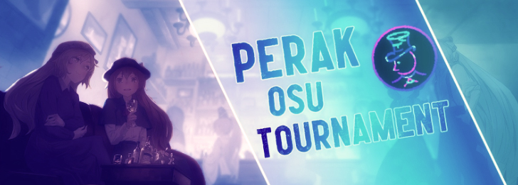

---
tags:
  - POT
  - POT 2022
---

# PERAK osu! Tournament 2022

The **PERAK osu! Tournament 2022** was a double-elimination 1v1 osu! tournament hosted by ![][flag_ID] [Splacten](https://osu.ppy.sh/users/10018405) as a part of the annual [PERAK Games League](https://perak.cs.ui.ac.id/) festival. The tournament was open to all players who were registered as a student at (or as an alumni of) [Universitas Indonesia's Faculty of Computer Science](https://cs.ui.id) regardless of rank. It was the second iteration of the PERAK osu! Tournament.

## Tournament schedule

| Event | Timestamp |
| --: | :-- |
| Registration phase | 2021-01-17/2021-02-05 |
| Technical meeting | 2021-02-12 |
| Qualifiers | 2021-02-14/2021-02-21 |
| Round of 12 | 2021-02-22/2021-02-28 |
| Quarterfinals | 2021-03-01/2021-03-07 |
| Semifinals | 2021-03-08/2021-03-14 |
| Finals (week 1) | 2021-03-15/2021-03-21 |
| Finals (week 2) | 2021-03-22/2021-04-04 |

## Prizes

| Placing | Prize(s) |
| :-: | :-- |
|  | Commemorative trophy, One-time voucher worth 250,000 IDR to be spent on [PERAK MART](http://perak.cs.ui.ac.id/mart/) |
|  | One-time voucher worth 150,000 IDR to be spent on [PERAK MART](http://perak.cs.ui.ac.id/mart/) |

## Organisation

The PERAK osu! Tournament 2022 was run by various Indonesian osu! community members.

| Position | Member(s) |
| :-- | :-- |
| Host | ![][flag_ID] [Splacten](https://osu.ppy.sh/users/10018405) |
| Co-host | ![][flag_ID] [Bisma404](https://osu.ppy.sh/users/10018405), ![][flag_ID] [Jevlyn](https://osu.ppy.sh/users/28585681) |
| Mappool selector | ![][flag_ID] [Splacten](https://osu.ppy.sh/users/10018405), ![][flag_ID] [Larzz](https://osu.ppy.sh/users/10483670) |
| Playtester | ![][flag_ID] [phizh](https://osu.ppy.sh/users/4569302), ![][flag_ID] [Kuro Fuyusaki](https://osu.ppy.sh/users/2667496) |
| Streamer | ![][flag_ID] [Victim\_Crasher](https://osu.ppy.sh/users/2084869), ![][flag_ID] [Tix](https://osu.ppy.sh/users/11421465) |
| Commentator | ![][flag_ID] [Victim\_Crasher](https://osu.ppy.sh/users/2084869), ![][flag_ID] [Tix](https://osu.ppy.sh/users/11421465), ![][flag_ID] [nasje](https://osu.ppy.sh/users/7579498), ![][flag_ID] [eucharistica](https://osu.ppy.sh/users/28736472) |
| Referee | ![][flag_ID] [kilgo](https://osu.ppy.sh/users/9692053), ![][flag_ID] [Romizzz](https://osu.ppy.sh/users/6154769) |
| Graphic designer | ![][flag_ID] [Kizito Hiro](https://osu.ppy.sh/users/2263272) |
| Wiki editor | ![][flag_ID] [Niva](https://osu.ppy.sh/users/197805) |

## Links

- **[Master spreadsheet](https://docs.google.com/spreadsheets/d/1QLDMAL1lbfSey2tOd7zoVE6dtvI3qPD8PRBFJQpJxYY/edit#gid=563925167)**
- [Official website](https://perak.cs.ui.ac.id/skor/osu)
- [Discord server](https://discordapp.com/invite/8vGTedxKmD)
- [Livestream channel](https://www.twitch.tv/perakgamesleague)
- [Challonge brackets](https://challonge.com/jon1xcd6)

## Participants

Listed below are the players who were participating in the tournament along with their respective seed number and average percentage summed up from all ten Qualifier beatmaps.

| Seed No. | Player | Avg. Percentage |
| :-- | :-- | :-- |
| 1 | ![][flag_ID] [DigiM](https://osu.ppy.sh/users/2659328) | 0.99 |
| 2 | ![][flag_ID] [Victim_Crasher](https://osu.ppy.sh/users/2084869) | 0.94 |
| 3 | ![][flag_ID] [Lindaine](https://osu.ppy.sh/users/4572717) | 0.80 |
| 4 | ![][flag_ID] [ReeyaDono](https://osu.ppy.sh/users/10969698) | 0.79 |
| 5 | ![][flag_ID] [-Keitaro](https://osu.ppy.sh/users/3378391) | 0.73 |
| 6 | ![][flag_ID] [NeoZap](https://osu.ppy.sh/users/10024869) | 0.72 |
| 7 | ![][flag_ID] [StingRay](https://osu.ppy.sh/users/2215822) | 0.67 |
| 8 | ![][flag_ID] [hamdanpapeng](https://osu.ppy.sh/users/10854143) | 0.60 |
| 9 | ![][flag_ID] [nasje](https://osu.ppy.sh/users/7579498) | 0.44 |
| 10 | ![][flag_ID] [larrypult](https://osu.ppy.sh/users/12255948) | 0.37 |
| 11 | ![][flag_ID] [DeltaE](https://osu.ppy.sh/users/8361921) | 0.24 |

## Podium

This competition has come to an end and resulted in the following podium:

| Placing | Player |
| :-: | :-- |
|  | ![][flag_ID] [Victim_Crasher](https://osu.ppy.sh/users/2084869) |
|  | ![][flag_ID] [ReeyaDono](https://osu.ppy.sh/users/10969698) |
|  | ![][flag_ID] [NeoZap](https://osu.ppy.sh/users/10024869) |

## Mappools

### Finals (week 2)

*(mappack not available)*

- NoMod
  1. [Camellia feat. Nanahira - Kansoku Eisei (jonathanlfj) \[Countless\]](https://osu.ppy.sh/beatmapsets/720294#osu/1520788)
  2. [technoplanet - Juvenile (Astronic) \[Extra\]](https://osu.ppy.sh/beatmapsets/1280204#osu/2659369)
  3. [POLKADOT STINGRAY - Telecaster Stripe (moph) \[Extra\]](https://osu.ppy.sh/beatmapsets/969845#osu/2028973)
  4. [PSYQUI - Be There (Livia) \[Future\]](https://osu.ppy.sh/beatmapsets/826236#osu/1731655)
  5. [FujuniseikouyuuP - FREEDMAN (val0108) \[FREEDOM\]](https://osu.ppy.sh/beatmapsets/108529#osu/283705) 
  6. [OSTER project - Piano x Forte (DeviousPanda) \[Fortissimo\]](https://osu.ppy.sh/beatmapsets/1296249#osu/2689460)
- Hidden
  1. [Wotamin - Gigantic O.T.N  (Star Stream) \[S.S\]](https://osu.ppy.sh/beatmapsets/80214#osu/223397)
  2. [BUTAOTOME - Towa no Maigo (Icekalt) \[Insane\]](https://osu.ppy.sh/beatmapsets/1069288#osu/2239337)
  3. [scop - Keppekishou (tutuhaha) \[Dance\]](https://osu.ppy.sh/beatmapsets/70115#osu/201731)
- HardRock
  1. [Chikuwa - Jinsei Matatabi (Kuse) \[Expert\]](https://osu.ppy.sh/beatmapsets/1123944#osu/2348578)
  2. [BUTAOTOME - Futari Dake no Kotoba (celerih) \[kiry's Insane\]](https://osu.ppy.sh/beatmapsets/962568#osu/2015481)
  3. [Feryquitous - Strahv (Rumia-) \[Another\]](https://osu.ppy.sh/beatmapsets/634143#osu/1345661)
- DoubleTime
  1. [Ito Kanako - Skyclad no Kansokusha (Linada) \[-Tochi's Insane\]](https://osu.ppy.sh/beatmapsets/416129#osu/972844)
  2. [capitaro - Yoiduki Maiuta (Amamiya Yuko) \[Hard\]](https://osu.ppy.sh/beatmapsets/70057#osu/205455)
  3. [Yooh - snow storm -euphoria- (-Chata-) \[ADVANCED\]](https://osu.ppy.sh/beatmapsets/156235#osu/382886)
  4. [TWICE - YES or YES (Toumei Dragon) \[Taeyang's Insane\]](https://osu.ppy.sh/beatmapsets/927769#osu/1950687) 
- Tiebreaker
  1. **[FELT - Lies in Reality (captin1) \[Deception\]](https://osu.ppy.sh/beatmapsets/412270#osu/894409)**

### Finals (week 1)

*(mappack not available)*

- NoMod
  1. [Akatsuki Records - Treasure Cirno (Apo11o) \[Adventure\]](https://osu.ppy.sh/beatmapsets/903876#osu/1972467)
  2. [Halozy ft. Nanahira - Monosugoi Ikioide Keine ga Monosugoi Uta (-Tynamo) \[I love Nanahira\]](https://osu.ppy.sh/beatmapsets/1388107#osu/2866773)
  3. [Katakiri Rekka - Tamayura - Open the "AKABEi JAZZ CONCERT" (Lasse) \[Expert\]](https://osu.ppy.sh/beatmapsets/1431401#osu/3003518)
  4. [sakuraburst - SELF DESTRUCT (fusionnqn) \[EXTRA\]](https://osu.ppy.sh/beatmapsets/1033562#osu/2161036)
  5. [Chroma - Sayonara Planet Wars (xidorn) \[01:59:931\]](https://osu.ppy.sh/beatmapsets/1345631#osu/2786752) 
  6. [android52 - anime no mizo 420 (pishifat) \[Extra\]](https://osu.ppy.sh/beatmapsets/734780#osu/1551262) 
- Hidden
  1. [Vierra - Seandainya (Cut Ver.) (hikimaruy) \[Gelas Cup Edit\]](https://osu.ppy.sh/beatmapsets/1578756#osu/3228286)
  2. [amazarashi - Sayonara Gokko (Kalibe) \[farewell\]](https://osu.ppy.sh/beatmapsets/932454#osu/1946856)
  3. [Ado - Odo (Beren) \[Lobelia's Expert\]](https://osu.ppy.sh/beatmapsets/1450065#osu/2988413)
  4. [ZUTOMAYO - Haze Haseru Hateru made (Petal) \[AyluscenathanMyMommy's Collab Extra\]](https://osu.ppy.sh/beatmapsets/1425901#osu/2937682)
- HardRock
  1. [DIALOGUE+ - Hajimete no Kakumei! (Sekai) \[No Dap's Extra!\]](https://osu.ppy.sh/beatmapsets/1603293#osu/3274114)
  2. [Fractal Dreamers - Module\_410 (Nao Tomori) \[Insane\]](https://osu.ppy.sh/beatmapsets/957328#osu/2005243)
  3. [ak+q & Redeilia - Enigma Helix (Icekalt) \[yaspo's Insane\]](https://osu.ppy.sh/beatmapsets/867825#osu/1826120)
  4. [Zekk - Re\_Construct (Acylica) \[Down's Insane\]](https://osu.ppy.sh/beatmapsets/1318329#osu/2778367)
- DoubleTime
  1. [a-ha - Take On Me (Myxo) \[StarCastler's Insane\]](https://osu.ppy.sh/beatmapsets/850597#osu/2436871)
  2. [FROZEN QUALIA - Watashi ni Kaeru Tabi (Mordred) \[Hard\]](https://osu.ppy.sh/beatmapsets/851853#osu/1900118)
  3. [Tsubaki - Aijou Pandemic (Nymph) \[Sumisola's Lunatic\]](https://osu.ppy.sh/beatmapsets/40166#osu/128406)
  4. [Two Door Cinema Club - Dirty Air (StarCastler) \[Hard\]](https://osu.ppy.sh/beatmapsets/1107855#osu/2315391)
- Tiebreaker
  1. **[taqumi - Pavimento dei Sospiri (neonat) \[Anima\]](https://osu.ppy.sh/beatmapsets/344998#osu/762025)**

### Semifinals

*(mappack not available)*

- NoMod
  1. [BAND-MAID - Choose me (Yukiyo) \[Choose Kowari's Extra\]](https://osu.ppy.sh/beatmapsets/871187#osu/1820338)
  2. [Zekk - Vespera (Miku Nakano) \[Extra\]](https://osu.ppy.sh/beatmapsets/1203530#osu/2506150)
  3. [yuikonnu - Uchouten Vivace (Guy) \[Vivace!\]](https://osu.ppy.sh/beatmapsets/107232#osu/281069)
  4. [M2U - Mare Maris (Minorsonek) \[Another\]](https://osu.ppy.sh/beatmapsets/908811#osu/1896582)
  5. [The Flashbulb - Chik Habit (Venrue) \[Another\]](https://osu.ppy.sh/beatmapsets/940470#osu/1964178)
  6. [Megurine Luka - Leia (Mafiamaster) \[gowww\]](https://osu.ppy.sh/beatmapsets/29064#osu/96587)
- Hidden
  1. [Shikata Akiko - TETHE'ALLA \~Tai no Kodomotachi\~ (ScubDomino) \[Impure's Expert\]](https://osu.ppy.sh/beatmapsets/956802#osu/2006725)
  2. [Rie Kugimiya, Yui Horie & Eri Kitamura - Flask Ration (Scorpiour) \[Insane\]](https://osu.ppy.sh/beatmapsets/44347#osu/138963)
  3. [LeaF - Arianrhod (GreenHue) \[Lunatic\]](https://osu.ppy.sh/beatmapsets/1156514#osu/2421233)
- HardRock
  1. [Soleily - Renatus (Multiple Creators) \[Insane\]](https://osu.ppy.sh/beatmapsets/241526#osu/557821)
  2. [IOSYS - Doutei Korose (Cut Ver.) (Appetible) \[Insane\]](https://osu.ppy.sh/beatmapsets/1283252#osu/2696002)
  3. [yuki. - Nadeshiko Sensation (Gero) \[Minorsonek's Sakura\]](https://osu.ppy.sh/beatmapsets/1003554#osu/2138390)
- DoubleTime
  1. [Perfume - Tenku (eiri-) \[Purity\]](https://osu.ppy.sh/beatmapsets/928320#osu/1939016)
  2. [USAO - FREEDOM (Extended Mix) (C00L) \[Hard\]](https://osu.ppy.sh/beatmapsets/749304#osu/1707909)
  3. [yuikonnu - Hatsukoi no Ehon (litoluna) \[Gazel's Hard\]](https://osu.ppy.sh/beatmapsets/110870#osu/300294)
- Tiebreaker
  1. **[Hoshimachi Suisei - GHOST (Amateurre) \[Asagi's Expert\]](https://osu.ppy.sh/beatmapsets/1432314#osu/2954960)**

### Quarterfinals

**[Download the mappack here! (76 MB)](https://drive.google.com/u/0/uc?id=1yH9CE2M3QZIx1cKfhvdAj99Z8agK8GAD&export=download)**

- NoMod
  1. [FELT - Closed Wings (Nanashima Asami) \[Farewell\]](https://osu.ppy.sh/beatmapsets/937213#osu/1957780)
  2. [Gentle Stick X M2U - Ineffabilis (Bakugo-) \[Frontier's Insane\]](https://osu.ppy.sh/beatmapsets/1334202#osu/2873261)
  3. [40mP feat. chano - Yuugure One Room (Zekk) \[Hero's Insane\]](https://osu.ppy.sh/beatmapsets/1576275#osu/3224750)
  4. [tokiwa - wasurena feat. Sennzai (Mocaotic) \[remembrance\]](https://osu.ppy.sh/beatmapsets/1496234#osu/3221246)
- Hidden
  1. [Kairiki Bear feat. Naruhana Mikoto - Neroism (Jazzieee) \[Reckless Phenomenon\]](https://osu.ppy.sh/beatmapsets/1281459#osu/3325019)
  2. [96neko - ELECT (Lasse) \[Insane\]](https://osu.ppy.sh/beatmapsets/716122#osu/1517345)
- HardRock
  1. [mary x jon-YAKITORY - Koko de Ikiteru (Amateurre) \[Yogurre's Insane\]](https://osu.ppy.sh/beatmapsets/1541131#osu/3152525)
  2. [Numtack05 - Ooki na Hane de! (Cut Ver.) (Mafumafu) \[Tsubasa\]](https://osu.ppy.sh/beatmapsets/1075635#osu/2250717)
- DoubleTime
  1. [senya - Sasayaku, Kiekaketa Kouishou ga. (Satellite) \[ponpokosatellin's Hard\]](https://osu.ppy.sh/beatmapsets/1053613#osu/2210782)
  2. [fiend - FEVER DREAM (feat. yzzyx) (Niva) \[HARD\]](https://osu.ppy.sh/beatmapsets/1405913#osu/2910768)  
- Tiebreaker
  1. **[Demetori - Warabe Matsuri ~ Innocent Treasures (Remapper) \[Lunatic\]](https://osu.ppy.sh/beatmapsets/1033730#osu/2163007)**

### Round of 12

**[Download the mappack here! (80 MB)](https://drive.google.com/u/0/uc?id=12kQfysAOzfkCxqfVi0teM4BqTLyGKtur&export=download)**

- NoMod
  1. [Foreground Eclipse - When Innocence Is Just A Mask (kakifly) \[Insane\]](https://osu.ppy.sh/beatmapsets/242316#osu/559372)
  2. [Rameses B - Children (Zer0-) \[CBH's Insane\]](https://osu.ppy.sh/beatmapsets/1214145#osu/2533647)
  3. [Gekidan Record feat. Nekomata Master - Houkou Orpheus (celerih) \[felys' White Hard\]](https://osu.ppy.sh/beatmapsets/879051#osu/1855074)
  4. [sakuraburst - Glacierfall (Park Remix) (ScubDomino) \[haruto x ancel's ins\*ne\]](https://osu.ppy.sh/beatmapsets/1329045#osu/2794904)
- Hidden
  1. [the peggies - Neverland (1 miss) \[My Angel Miss' Insane\]](https://osu.ppy.sh/beatmapsets/1314181#osu/3036139)
  2. [Good Charlotte - The Anthem (Silverboxer) \[Groovin'\]](https://osu.ppy.sh/beatmapsets/1360038#osu/2814386)
- HardRock
  1. [zakuro - Inochi ni Kirawarete Iru. (Delis) \[PandaHero's Light Insane\]](https://osu.ppy.sh/beatmapsets/693727#osu/1473795)
  2. [XXXTENTACION - MOONLIGHT (eiri-) \[R.I.P\]](https://osu.ppy.sh/beatmapsets/967467#osu/2024692)
- DoubleTime
  1. [senya - Theta de Tsukisashite (Serafeim) \[Hard\]](https://osu.ppy.sh/beatmapsets/1353531#osu/2802609)
  2. [zts - liberatedliberator (deetz) \[Light Hard\]](https://osu.ppy.sh/beatmapsets/907805#osu/1894749)  
- Tiebreaker
  1. **[Sakamoto Maaya - Okaerinasai (tomatomerde Remix) (Azer) \[Collab\]](https://osu.ppy.sh/beatmapsets/179323#osu/431147)**

### Qualifiers

**[Download the mappack here! (63 MB)](https://drive.google.com/u/0/uc?id=1DKGRxT7YU1EnTVpqTmHj4tD2ADqSmee_&export=download)**

- NoMod
  1. [yuikonnu - Hatsukoi no Ehon (litoluna) \[Gazel's Hard\]](https://osu.ppy.sh/beatmapsets/110870#osu/300294)
  2. [Elu, SisterCleaire - Sunday Sunday Fruit Fool (Yugu) \[Sweet\]](https://osu.ppy.sh/beatmapsets/1112138#osu/2323588)
  3. [I love you Orchestra - Tenshin -Trigger ver.- (Mirash) \[Hard\]](https://osu.ppy.sh/beatmapsets/1285271#osu/2668592)
  4. [HyuN - You'Re aRleAdY dEAd (J1\_) \[pishi's Hard\]](https://osu.ppy.sh/beatmapsets/891441#osu/1863466)
- Hidden
  1. [chano & 40mP - Kiritorisen (Li Syaoran) \[hhjkl's Hard\]](https://osu.ppy.sh/beatmapsets/1480477#osu/3037193)
  2. [Daisuke Achiwa - BASARA (100pa-) \[Chroche\]](https://osu.ppy.sh/beatmapsets/13019#osu/70491)
- HardRock
  1. [Kurosaki Maon - Setsuna no Kajitsu (jonathanlfj) \[Chris' Hard\]](https://osu.ppy.sh/beatmapsets/332112#osu/1900366)
  2. [Arizona Zervas - ROXANNE (wafer) \[Hard\]](https://osu.ppy.sh/beatmapsets/1076733#osu/2253014)
- DoubleTime
  1. [Yasuda Rei - Mirror (Modem) \[Advanced\]](https://osu.ppy.sh/beatmapsets/649225#osu/1384468)
  2. [Foreground Eclipse - Vermillion Halo (attendant) \[Normal\]](https://osu.ppy.sh/beatmapsets/1504033#osu/3081346)

## Match results

### Finals (week 2)

Sunday, 28 March 2021:

| Bracket | Player 1 |  |  | Player 2 | Match link |
| :-: | --: | :-: | :-: | :-- | :-- |
| Lower | [Victim\_Crasher](https://osu.ppy.sh/users/2084869) ![][flag_ID] | 4 | **7** | ![][flag_ID] **[ReeyaDono](https://osu.ppy.sh/users/10969698)** | [#1](https://osu.ppy.sh/community/matches/79301199) |

Sunday, 4 April 2021, Grand Final:

| Bracket | Player 1 |  |  | Player 2 | Match link |
| :-: | --: | :-: | :-: | :-- | :-- |
| Grand Final | [Lindaine](https://osu.ppy.sh/users/4572717) ![][flag_ID] | 4 | **7** | ![][flag_ID] **[ReeyaDono](https://osu.ppy.sh/users/10969698)** | [#1](https://osu.ppy.sh/community/matches/79843882) |
| Grand Final (Bracket Reset) | **[ReeyaDono](https://osu.ppy.sh/users/10969698)** ![][flag_ID] | **7** | 2 | ![][flag_ID] [Lindaine](https://osu.ppy.sh/users/4572717) | [#1](https://osu.ppy.sh/community/matches/79930736) |

### Finals (week 1)

Friday, 19 March 2021:

| Bracket | Player 1 |  |  | Player 2 | Match link |
| :-: | --: | :-: | :-: | :-- | :-- |
| Lower | [StingRay](https://osu.ppy.sh/users/2215822) ![][flag_ID] | 2 | **6** | ![][flag_ID] **[cuna](https://osu.ppy.sh/users/78462242)** | [#1](https://osu.ppy.sh/community/matches/78462242) |
| Lower | **[ReeyaDono](https://osu.ppy.sh/users/10969698)** ![][flag_ID] | **6** | 2 | ![][flag_ID] [DigiM](https://osu.ppy.sh/users/2659328) | [#1](https://osu.ppy.sh/community/matches/78458122) |

Saturday, 20 March 2021:

| Bracket | Player 1 |  |  | Player 2 | Match link |
| :-: | --: | :-: | :-: | :-- | :-- |
| Lower | [cuna](https://osu.ppy.sh/users/78462242) ![][flag_ID] | 0 | **6** | ![][flag_ID] **[ReeyaDono](https://osu.ppy.sh/users/10969698)** | [#1](https://osu.ppy.sh/community/matches/78462242) |

Sunday, 21 March 2021:

| Bracket | Player 1 |  |  | Player 2 | Match link |
| :-: | --: | :-: | :-: | :-- | :-- |
| Upper | [Victim\_Crasher](https://osu.ppy.sh/users/2084869) ![][flag_ID] | 3 | **6** | ![][flag_ID] **[Lindaine](https://osu.ppy.sh/users/4572717)** | [#1](https://osu.ppy.sh/community/matches/78646519) |

### Semifinals

Sunday, 14 March 2021:

| Bracket | Player 1 |  |  | Player 2 | Match link |
| :-: | --: | :-: | :-: | :-- | :-- |
| Upper | **[Lindaine](https://osu.ppy.sh/users/4572717)** ![][flag_ID] | **6** | 4 | ![][flag_ID] [ReeyaDono](https://osu.ppy.sh/users/10969698) | [#1](https://osu.ppy.sh/community/matches/78055535) |
| Upper | **[Victim\_Crasher](https://osu.ppy.sh/users/2084869)** ![][flag_ID] | **6** | 0 | ![][flag_ID] [StingRay](https://osu.ppy.sh/users/2215822) | [#1](https://osu.ppy.sh/community/matches/78047446) |
| Lower | **[cuna](https://osu.ppy.sh/users/14505580)** ![][flag_ID] | **6** | 0 | ![][flag_ID] [larrypult](https://osu.ppy.sh/users/12255948) | [#1](https://osu.ppy.sh/community/matches/78059749) |

Monday, 15 March 2021:

| Bracket | Player 1 |  |  | Player 2 | Match link |
| :-: | --: | :-: | :-: | :-- | :-- |
| Lower | **[DigiM](https://osu.ppy.sh/users/2659328)** ![][flag_ID] | **6** | 5 | ![][flag_ID] [nasje](https://osu.ppy.sh/users/7579498) | [#1](https://osu.ppy.sh/community/matches/78050310) |

### Quarterfinals

Friday, 5 March 2021:

| Bracket | Player 1 |  |  | Player 2 | Match link |
| :-: | --: | :-: | :-: | :-- | :-- |
| Upper | **[ReeyaDono](https://osu.ppy.sh/users/10969698)** ![][flag_ID] | **5** | 3 | ![][flag_ID] [cuna](https://osu.ppy.sh/users/14505580) | [#1](https://osu.ppy.sh/community/matches/77278333) |

Saturday, 6 March 2021:

| Bracket | Player 1 |  |  | Player 2 | Match link |
| :-: | --: | :-: | :-: | :-- | :-- |
| Upper | **[Lindaine](https://osu.ppy.sh/users/4572717)** ![][flag_ID] | **5** | 0 | ![][flag_ID] [larrypult](https://osu.ppy.sh/users/12255948) | [#1](https://osu.ppy.sh/community/matches/77368933) |

Sunday, 7 March 2021:

| Bracket | Player 1 |  |  | Player 2 | Match link |
| :-: | --: | :-: | :-: | :-- | :-- |
| Upper | [DigiM](https://osu.ppy.sh/users/2659328) ![][flag_ID] | 3 | **5** | ![][flag_ID] **[StingRay](https://osu.ppy.sh/users/2215822)** | [#1](https://osu.ppy.sh/community/matches/77455381) |
| Upper | **[Victim\_Crasher](https://osu.ppy.sh/users/2084869)** ![][flag_ID] | **5** | 0 | ![][flag_ID] [nasje](https://osu.ppy.sh/users/7579498) | [#1](https://osu.ppy.sh/community/matches/77451609) |

Wednesday, 10 March 2021:

| Bracket | Player 1 |  |  | Player 2 | Match link |
| :-: | --: | :-: | :-: | :-- | :-- |
| Lower | **[DigiM](https://osu.ppy.sh/users/2659328)** ![][flag_ID] | **5** | 0 | ![][flag_ID] [hamdanpapeng](https://osu.ppy.sh/users/10854143) | [#1](https://osu.ppy.sh/community/matches/77683525) |
| Lower | **[cuna](https://osu.ppy.sh/users/14505580)** ![][flag_ID] | **5** | 2 | ![][flag_ID] [naruto-sasuke](https://osu.ppy.sh/users/4072413) | [#1](https://osu.ppy.sh/community/matches/77686417) |

Thursday, 11 March 2021:

| Bracket | Player 1 |  |  | Player 2 | Match link |
| :-: | --: | :-: | :-: | :-- | :-- |
| Lower | **[larrypult](https://osu.ppy.sh/users/12255948)** ![][flag_ID] | **5** | 2 | ![][flag_ID] [ana\_kunn](https://osu.ppy.sh/users/2868409) | [#1](https://osu.ppy.sh/community/matches/77764333) |
| Lower | **[nasje](https://osu.ppy.sh/users/7579498)** ![][flag_ID] | **5** | 2 | ![][flag_ID] [DeltaE](https://osu.ppy.sh/users/8361921) | [#1](https://osu.ppy.sh/community/matches/77753957) |

### Round of 12

Friday, 26 February 2021:

| Bracket | Player 1 |  |  | Player 2 | Match link |
| :-: | --: | :-: | :-: | :-- | :-- |
| Upper | [naruto-sasuke](https://osu.ppy.sh/users/4072413) ![][flag_ID] | 1 | **5** | ![][flag_ID] **[nasje](https://osu.ppy.sh/users/7579498)** | [#1](https://osu.ppy.sh/community/matches/77245889) |
| Upper | **[cuna](https://osu.ppy.sh/users/14505580)** ![][flag_ID] | **5** | 0 | ![][flag_ID] [DeltaE](https://osu.ppy.sh/users/8361921) | [#1](https://osu.ppy.sh/community/matches/77270247) |

Saturday, 27 February 2021:

| Bracket | Player 1 |  |  | Player 2 | Match link |
| :-: | --: | :-: | :-: | :-- | :-- |
| Upper | **[larrypult](https://osu.ppy.sh/users/12255948)** ![][flag_ID] | **5** | 3 | ![][flag_ID] [hamdanpapeng](https://osu.ppy.sh/users/10854143) | [#1](https://osu.ppy.sh/community/matches/77363288) |

Sunday, 28 February 2021:

| Bracket | Player 1 |  |  | Player 2 | Match link |
| :-: | --: | :-: | :-: | :-- | :-- |
| Upper | **[StingRay](https://osu.ppy.sh/users/2215822)** ![][flag_ID] | **5** | 0 | ![][flag_ID] [ana\_kunn](https://osu.ppy.sh/users/2868409) | [#1](https://osu.ppy.sh/community/matches/77448647) |

## Ruleset

### General rules

1. Beatmap scoring is based on **[ScoreV2](/wiki/Gameplay/Score#scorev2).**
2. The mapsets for each round will be announced by the Tournament Management in advance before the actual matches take place.
3. Match schedules will be predetermined by the Tournament Management. If there are any player(s) who are unable to attend the current schedule for any reason, all other affected players may apply and settle for a reschedule at the `#ganti-jadwal` channel in the tournament's Discord server.
4. A referee will create a multiplayer room 10 minutes in advance and will start to send out invites.
5. If a player does not show up within **10 minutes** of the start time, their opponent wins by default.
6. If no staff or referee is available, the match will be postponed.
7. **NoFail will be enforced in all beatmaps.** This is to ensure that the points are to be awarded more fairly towards players who perform better in general during the course of the beatmap regardless of their remaining health at the end.
8. If a player disconnects, it will be treated as if they failed the beatmap.
   - Disconnects that occur within a few seconds after the beatmap is started by the referee can be rematched.
9. If a player disconnects between beatmaps, the match can be delayed up to 15 minutes at most.
   - In case the disconnected player failed to report back after the maximum allowance of 15 minutes had passed, the opposing player may be declared to be winning the match by default.
10. Lag is not a valid reason to nullify a beatmap.
11. If there are any problems during the match occurence, the Tournament Management will make a decision based on referee's report.
12. It is expected that all players be polite and respectful to each other. Penalties will be given if players violate.
    - If a player is found to be engaging in an act of offensive provocation, the said player responsible for the provocation may be either disqualified right away from the tournament and/or blacklisted from the PERAK Games League altogether.
    - Usage of any tools and programs that are against [osu!'s community rules](/wiki/Rules#community-rules) is strictly prohibited and will be straight up reported to the osu! team at will.

### Tournament registration

1. All interested players are required to register into the tournament individually.
   - In order to be eligible to play in the tournament, a player must be able to attest their status as a registered student at (or as an alumni of) [Universitas Indonesia's Faculty of Computer Science](https://cs.ui.id) by showing a valid [EMAS UI credential](http://emas.ui.ac.id) to the Tournament Management.
2. To ensure valid and serious registrations, every registered player will be checked by the Tournament Management.
3. The list of players who are deemed to be eligible to compete in the tournament will be published by the Tournament Management after the Registration Phase has ended.
4. Testplayers, referees, and map selectors may not participate as players in this tournament.

### Qualifier rules

1. Each player will have to sign up to one of the twenty Qualifier lobbies that have been scheduled and prepared by the Tournament Management in advance.
2. In the lobby, players will have to consecutively play all of the ten Qualifier beatmaps in the order of NM1 → NM2 → NM3 → NM4 → HD1 → HD2 → HR1 → HR2 → DT1 → DT2.
3. Players **are not allowed** to ban any beatmaps in the Qualifiers.
4. Players **are not allowed** to join in (or register for) more than one Qualifier lobbies.
5. 32 players with the **highest average rank combined from each individual Qualifier beatmaps** will advance to the knock-out stages.
   - If there are two (or more) players who share the same average rank, the player that holds the higher total score combined from all ten Qualifier beatmaps will be placed in the higher seed.
6. Failure to attend in any of the twenty Qualifier lobbies will result in an instant elimination from the tournament.

### Knock-out stage rules

1. The 12 players who managed to get through from the Qualifiers will be matched to each other based on their Qualifiers seeding.
2. Players will compete against each other using the Double Elimination system.
3. The Double Elimination System works as follows:
   - Players who lose in the Upper Bracket can still play again on the Lower Bracket.
   - Players who lose in the Lower Bracket will be eliminated from the tournament.
   - In the Grand Final match, the winner of the the Upper Bracket will only need to win a single match against their opponent in order to claim the championship title. The winner of the Lower Bracket, however, will need to win two matches and enforce a Bracket Reset against their opponent in order to claim the championship title.
4. Players who can compete in the next round are determined by:
   - In the Round of 12 and the Quarterfinals, each player needs to win 5 points in order to win a match. (Best-of-9)
   - In the Semifinals and the Finals (week 1), each player needs to win 6 points in order to win a match. (Best-of-11)
   - In the Finals (week 2), each player needs to win 7 points in order to to win a match. (Best-of-13)
   - Players who win by default.
   - Whether there are players who are disqualified from the tournament.

### Match regulations

1. Each player must use the `!roll` command once in the multiplayer lobby in order to determine the banning and picking order.
   - The winner of the `!roll` gets to determine who gets the first pick and the second ban.
   - The loser of the `!roll` gets the opposite by default.
   - This rule does not apply in the Qualifier lobbies.
2. Each player has to ban **one beatmap** (in the Round of 12 and the Quarterfinals) or **two beatmaps** (in the Semifinals onwards) from the corresponding mappool. These beatmaps will not be allowed to be picked by any player during the entire match.
   - Each player may not ban two beatmaps from the same mod pool, except from the NoMod pool. For example, banning NM1 and NM2 is allowed; banning NM1 and HD1 is allowed; banning HD1 and HD2, however, is *not* allowed.
   - Banning does not apply in the Qualifier lobbies.
3. **There will be no warm-up beatmaps to be played in the multiplayer lobby.** Players who are looking up to warm themselves up before the match are expected to do so by their own before the match commences.
4. In case of a tiebreaker, the tiebreaker map will be played with the FreeMod option enabled. Playing the tiebreaker map with a mod in hand however is *not* mandatory as going with NoMod on the tiebreaker is also permitted.
   - Allowed mods are EZ, HR, HD, or any possible combinations of the three mods.
5. The results of each match and any other relevant information regarding the match will be posted on the Discord server after the match has been concluded by the responsible referees.

[flag_ID]: /wiki/shared/flag/ID.gif "Indonesia"
