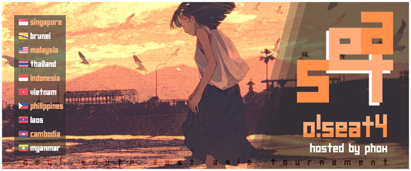

---
tags:
  - oSEAT
  - oSEAT4
---

# osu! South East Asia Tournament 4

The **osu! South East Asia Tournament 4** (***oSEAT4***) is a double-elimination 1v1 osu!standard tournament hosted by ![][flag_SG] [phox](https://osu.ppy.sh/users/772295). The tournament is open to all players from all ten [ASEAN member states](https://asean.org/asean/asean-member-states/) (![][flag_BN] Brunei Darussalam, ![][flag_KH] Cambodia, ![flag_ID] Indonesia, ![flag_LA] Laos, ![flag_MY] Malaysia, ![flag_MM] Myanmar, ![flag_PH] The Phillipines, ![flag_SG] Singapore, ![flag_TH] Thailand, and ![flag_VN] Vietnam) regardless of rank. It is the fourth iteration of the tournament series.

## Tournament schedule

| Event | Timestamp |
| --: | :-- |
| Registration phase | 2020-11-07/2020-11-22 |
| Screening phase | 2020-11-23/2020-11-29 |
| Qualifiers | 2020-11-30/2020-12-06 |
| Group stage (week 1) | 2020-12-07/2020-12-13 |
| Group stage (week 2) | 2020-12-14/2020-12-20 |
| Round of 32 | 2020-12-21/2020-12-27 |
| Round of 16 | 2020-12-28/2021-01-03 |
| Quarterfinals | 2021-01-04/2021-01-10 |
| Semifinals | 2021-01-11/2021-01-17 |
| Finals (week 1) | 2021-01-18/2021-01-23 |
| Finals (week 2) | 2021-01-24/2021-01-30 |

## Prizes

| Placing | Prize(s) |
| :-: | :-- |
|  | 12 months of osu!supporter tag, unique profile badge |
|  | 6 months of osu!supporter tag |
|  | 4 months of osu!supporter tag |
| 4th place | 2 months of osu!supporter tag |
| 5th place | 1 month of osu!supporter tag |

## Organization

oSEAT4 was run by various osu! community members predominantly hailing from South East Asian countries.

| Position | Members |
| :-- | :-- |
| Host | ![][flag_SG] [phox](https://osu.ppy.sh/users/772295) |
| Map selector | ![][flag_SG] [phox](https://osu.ppy.sh/users/772295), ![][flag_SG] [Fragmented](https://osu.ppy.sh/users/847434), ![][flag_TH] [Seaweed](https://osu.ppy.sh/users/5151214), ![][flag_SG] [Ayucchi](https://osu.ppy.sh/users/7823498), ![][flag_US] [Not A Function](https://osu.ppy.sh/users/4773094) |
| Playtester | ![][flag_ID] [F4UZ4N](https://osu.ppy.sh/users/11070577), ![][flag_GB] [timberwolf](https://osu.ppy.sh/users/11042418) |
| Streamer | ![][flag_SG] [Moltenfury](https://osu.ppy.sh/users/3395820), ![][flag_VN] [Hoaq](https://osu.ppy.sh/users/7696512), ![][flag_MY] [--Mirai--](https://osu.ppy.sh/users/8923407), ![][flag_SG] [k\_1tty](https://osu.ppy.sh/users/5407620), ![][flag_KR] [PostScr1pt](https://osu.ppy.sh/users/3410997)  |
| Commentator | ![][flag_SG] [Heresy](https://osu.ppy.sh/users/8876938), ![][flag_PH] [patsugoi](https://osu.ppy.sh/users/15748531), ![][flag_US] [Not A Function](https://osu.ppy.sh/users/4773094) |
| Referee | ![][flag_SG] [phox](https://osu.ppy.sh/users/772295), ![][flag_SG] [Fragmented](https://osu.ppy.sh/users/847434), ![][flag_ID] [F4UZ4N](https://osu.ppy.sh/users/11070577), ![][flag_SG] [Heresy](https://osu.ppy.sh/users/8876938), ![][flag_ID] [Arvalon](https://osu.ppy.sh/users/14667308), ![][flag_VN] [Vespulaz](https://osu.ppy.sh/users/10848857), ![][flag_KR] [PostScr1pt](https://osu.ppy.sh/users/3410997), ![][flag_TW] [SugiuraAyano](https://osu.ppy.sh/users/2529213), ![][flag_US] [Suicune3](https://osu.ppy.sh/users/6895187), ![][flag_PL] [Kondi](https://osu.ppy.sh/users/7382321) |
| Graphic designer | ![][flag_SG] [megumic](https://osu.ppy.sh/users/7537133) |
| Spreadsheet manager | ![][flag_SG] [phox](https://osu.ppy.sh/users/772295) |
| Wiki editor | ![][flag_ID] [Niva](https://osu.ppy.sh/users/197805) |

## Links

- **[Main spreadsheet](https://docs.google.com/spreadsheets/d/16LDQYYDwd7obzSgLijTV1hBD7QOZE_2Ibe9ZLqTWQNw/edit#gid=1373445856)**
- [Forum thread](https://osu.ppy.sh/community/forums/topics/1177376)
- [Discord server](https://discord.gg/sVHndPU)
- [Livestream channel](https://www.twitch.tv/oseatournament)

## Participants

Listed below are players who qualified into the group stage (along with their respective seeding and group placement) out of 179 registered players in total.

| Group | Player 1 (Seed A) | Player 2 (Seed B) | Player 3 (Seed C) | Player 4 (Seed D) | Player 5 (Seed E) | Player 6 (Seed F) |
| :-- | :-- | :-- | :-- | :-- | :-- | :-- |
| A | ![][flag_ID] [Skydiver](https://osu.ppy.sh/users/4750008) | ![][flag_PH] [zonelouise](https://osu.ppy.sh/users/1492995) | ![][flag_SG] [Moltenfury](https://osu.ppy.sh/users/3395820) | ![][flag_MY] [Chizu-Kun](https://osu.ppy.sh/users/10288461) | ![][flag_ID] [fnayR](https://osu.ppy.sh/users/2800253) | ![][flag_SG] [kirkirs](https://osu.ppy.sh/users/9902622) |
| B | ![][flag_ID] [Fuma](https://osu.ppy.sh/users/1501956) | ![][flag_SG] [moosepi](https://osu.ppy.sh/users/1868745) | ![][flag_MY] [vernonlim](https://osu.ppy.sh/users/10167542) | ![][flag_PH] [Senjuro](https://osu.ppy.sh/users/3003839) | ![][flag_ID] [Sonic-](https://osu.ppy.sh/users/8691555) | ![][flag_ID] [honeymint](https://osu.ppy.sh/users/4796773) |
| C | ![][flag_PH] [Rammu](https://osu.ppy.sh/users/10652837) | ![][flag_MY] [DuoX](https://osu.ppy.sh/users/9560694) | ![][flag_SG] [ExImperia](https://osu.ppy.sh/users/5200499) | ![][flag_MY] [CookieDASH](https://osu.ppy.sh/users/8249895) | ![][flag_ID] [Bunan-](https://osu.ppy.sh/users/2763354) | ![][flag_PH] [Oooodriiin](https://osu.ppy.sh/users/7223737) |
| D | ![][flag_SG] [megumic](https://osu.ppy.sh/users/7537133) | ![][flag_SG] [Eagle5324](https://osu.ppy.sh/users/11987104) | ![][flag_MY] [Auxuelus](https://osu.ppy.sh/users/5414124) | ![][flag_MY] [heyimcrunchy](https://osu.ppy.sh/users/13067221) | ![][flag_ID] [CubeixID200](https://osu.ppy.sh/users/10678919) | ![][flag_PH] [Aryuii](https://osu.ppy.sh/users/11272208) |
| E | ![][flag_SG] [\[-Lockon-\]](https://osu.ppy.sh/users/6726331) | ![][flag_MY] [not\_aweeb](https://osu.ppy.sh/users/9375317) | ![][flag_TH] [Chorus](https://osu.ppy.sh/users/3504692) | ![][flag_SG] [DVDthe1st](https://osu.ppy.sh/users/2138989) | ![][flag_SG] [yayatutu135](https://osu.ppy.sh/users/8420023) | ![][flag_TH] [Iambosszie](https://osu.ppy.sh/users/7286850) |
| F | ![][flag_ID] [Vinno](https://osu.ppy.sh/users/10717635) | ![][flag_PH] [KagenoKami](https://osu.ppy.sh/users/7246165) | ![][flag_PH] [Zyxus](https://osu.ppy.sh/users/8055861) | ![][flag_TH] [- Seen -](https://osu.ppy.sh/users/5082392) | ![][flag_MY] [Ayameru](https://osu.ppy.sh/users/7373182) | ![][flag_MY] [Rawn](https://osu.ppy.sh/users/2621067) |
| G | ![][flag_ID] [Rexeez](https://osu.ppy.sh/users/1987591) | ![][flag_ID] [Venta](https://osu.ppy.sh/users/11320627) | ![][flag_MY] [Heya](https://osu.ppy.sh/users/11379332)¹ | ![][flag_VN] [Hoaq](https://osu.ppy.sh/users/7696512) | ![][flag_SG] [Deze](https://osu.ppy.sh/users/7638335) | ![][flag_MY] [malaidan](https://osu.ppy.sh/users/14279913) |
| H | ![][flag_SG] [Rtyzen](https://osu.ppy.sh/users/2439822) | ![][flag_VN] [Tuon](https://osu.ppy.sh/users/6673790) | ![][flag_SG] [woahsia](https://osu.ppy.sh/users/195946) | ![][flag_MY] [Agagak](https://osu.ppy.sh/users/3645490) | ![][flag_PH] [tiny snek](https://osu.ppy.sh/users/10619389) | ![][flag_TH] [Faken](https://osu.ppy.sh/users/10249166) |
| I | ![][flag_SG] [k\_1tty](https://osu.ppy.sh/users/5407620) | ![][flag_ID] [Suikami](https://osu.ppy.sh/users/1929336) | ![][flag_TH] [Deppyforce](https://osu.ppy.sh/users/5286213) | ![][flag_MY] [verdas123](https://osu.ppy.sh/users/11148851) | ![][flag_MY] [alphaplay](https://osu.ppy.sh/users/9304966) | ![][flag_PH] [FrostIce](https://osu.ppy.sh/users/8238365) |
| J | ![][flag_PH] [xidorn](https://osu.ppy.sh/users/7904667) | ![][flag_SG] [oneplusone](https://osu.ppy.sh/users/1843447) | ![][flag_ID] [Fayn](https://osu.ppy.sh/users/5390495) | ![][flag_TH] [\[AmPhyze\]](https://osu.ppy.sh/users/9552188) | ![][flag_MY] [Flashback9](https://osu.ppy.sh/users/7714136) | ![][flag_VN] [Phoeni\_](https://osu.ppy.sh/users/14953642) |
| K | ![][flag_SG] [SeeL](https://osu.ppy.sh/users/5104320) | ![][flag_PH] [Revillica](https://osu.ppy.sh/users/9806095)² | ![][flag_US] (![][flag_US]) [\_Kolin](https://osu.ppy.sh/users/7249644)³ | ![][flag_SG] [Lunarsol](https://osu.ppy.sh/users/6622650) | ![][flag_SG] [RePeaTT](https://osu.ppy.sh/users/11132323) | ![][flag_SG] [\_gt](https://osu.ppy.sh/users/8301957) |
| L | ![][flag_PH] [MioMilo](https://osu.ppy.sh/users/2199427) | ![][flag_MY] [Tzero](https://osu.ppy.sh/users/6088976) | ![][flag_VN] [sindes19](https://osu.ppy.sh/users/11021073) | ![][flag_SG] [m0fum0fu](https://osu.ppy.sh/users/5143605) | ![][flag_PH] [MarvelWizardKH](https://osu.ppy.sh/users/5356586) | ![][flag_VN] [Llama\_The\_Goat](https://osu.ppy.sh/users/11232450) |
| M | ![][flag_MY] [Rampax](https://osu.ppy.sh/users/3995630) | ![][flag_ID] [Walfrid](https://osu.ppy.sh/users/6600809) | ![][flag_MY] [Chiyuu](https://osu.ppy.sh/users/8226107) | ![][flag_MY] [decaykets](https://osu.ppy.sh/users/3404543) | ![][flag_BN] [Daynem W](https://osu.ppy.sh/users/4699134) | ![][flag_SG] [Shleepy](https://osu.ppy.sh/users/8486823) |
| N | ![][flag_ID] [Lifeline](https://osu.ppy.sh/users/11367222) | ![][flag_SG] [Rtzero](https://osu.ppy.sh/users/9262462) | ![][flag_ID] [Firia](https://osu.ppy.sh/users/9730262) | ![][flag_LA] [Lessrtrer](https://osu.ppy.sh/users/11038623) | ![][flag_SG] [Hecatia](https://osu.ppy.sh/users/8244635) | ![][flag_PH] [fixedbyglue](https://osu.ppy.sh/users/8296269) |
| O | ![][flag_PH] [konawiki](https://osu.ppy.sh/users/4003979) | ![][flag_PH] [Milkteaism](https://osu.ppy.sh/users/9642774) | ![][flag_SG] [Milk Tee](https://osu.ppy.sh/users/6708955) | ![][flag_PH] [-Graigory-](https://osu.ppy.sh/users/14024170) | ![][flag_MY] [Yaro](https://osu.ppy.sh/users/9196013) | ![][flag_MY] [Computer Badger](https://osu.ppy.sh/users/6893361) |
| P | ![][flag_SG] [Demonical](https://osu.ppy.sh/users/5447609) | ![][flag_PH] [Xyloz](https://osu.ppy.sh/users/12040280) | ![][flag_ID] [Daffy](https://osu.ppy.sh/users/5968633) | ![][flag_PH] [ishokuP](https://osu.ppy.sh/users/7309033) | ![][flag_PH] [Kagitingan](https://osu.ppy.sh/users/7407323) | ![][flag_SG] [fausion](https://osu.ppy.sh/users/12261210) |

¹ *![][flag_ID] [ngonk](https://osu.ppy.sh/users/12030070) initially qualified for this Group stage berth, but they decided to forfeit from the tournament during the running of the Group stage. Under the discretion of staff members and all other affected players, ![][flag_MY] [Heya](https://osu.ppy.sh/users/11379332) was later admitted to the Group stage in their spot.*
¹ *![][flag_ID] [cfood](https://osu.ppy.sh/users/8626190) initially qualified for this Group stage berth, but they decided to forfeit from the tournament during the running of the Group stage. Under the discretion of staff members and all other affected players, ![][flag_PH] [Revillica](https://osu.ppy.sh/users/9806095) was later admitted to the Group stage in their spot.*
³ *a*

## Mappools

### Finals week 2

**[Download the mappack here! (193 MB)](https://drive.google.com/file/d/1aoZ8Nzl-GhFzPnOnMIAsdoMVbEt9BFej/view)**

- NoMod
  - [ELFENSJoN - Shiroki Yume wa Madara ni (Nao Tomori) \[Extreme\]](https://osu.ppy.sh/beatmapsets/1083468#osu/2266069)
  - [Sound Souler - Absent Color (Sonnyc) \[ExpertPlus\]](https://osu.ppy.sh/beatmapsets/1093465#osu/2285424)
  - [3R2 - Mischievous Masquerade (Settia) \[Casual\]](https://osu.ppy.sh/beatmapsets/601896#osu/1565720)
  - [Nekrogoblikon - The Skin Thief (LMT) \[SILENCE PLAYER & Hectic's Extra\]](https://osu.ppy.sh/beatmapsets/1061535#osu/2279004)
  - [Felicity of the Millennium - Sacred Renaissance (Sebu) \[Tomb of the Fallen Angel\]](https://osu.ppy.sh/beatmapsets/1116692#osu/2332798)
  - [RADWIMPS - Zen Zen Zense (movie ver.) (Realazy) \[Mir's Expert\]](https://osu.ppy.sh/beatmapsets/1094435#osu/2287358)
- Hidden
  - [REDALiCE feat. MONICO - Breakin' Chain (Yusomi) \[ak74's Extra\]](https://osu.ppy.sh/beatmapsets/943867#osu/2368235)
  - [hololive - Ochame Kinou (Liszt) \[OTAKU\]](https://osu.ppy.sh/beatmapsets/1164270#osu/2428685)
  - [graves & MYRNE - Tiger Blood (VINXIS) \[vintyui\]](https://osu.ppy.sh/beatmapsets/451850#osu/969314)
- HardRock
  - [PUP - Free At Last (Icekalt) \[Solo in the End\]](https://osu.ppy.sh/beatmapsets/1133317#osu/2366967)
  - [ETIA. - Nihonshiki Koukaku-OukaRanman- (Luscent) \[Extra\]](https://osu.ppy.sh/beatmapsets/1100842#osu/2299955)
  - [HyuN feat. LyuU - Cross Over (Down) \[Extra\]](https://osu.ppy.sh/beatmapsets/922249#osu/1925935)
- DoubleTime
  - [JUNNA - Vai! Ya! Vai! (Yohanes) \[Insane\]](https://osu.ppy.sh/beatmapsets/1088269#osu/2275555)
  - [Liz Triangle - Veda (eiri-) \[Ayyrohas' Insane\]](https://osu.ppy.sh/beatmapsets/979392#osu/2096828)
  - [RIOT - Overkill (Xen) \[Insane\]](https://osu.ppy.sh/beatmapsets/992847#osu/2356185)
  - [Reol - Gokusaishiki (Chaoslitz) \[HW's Another\]](https://osu.ppy.sh/beatmapsets/422369#osu/963412)
- FreeMod
  - [Roselia - R (Doormat) \[Rosenlied\]](https://osu.ppy.sh/beatmapsets/820180#osu/1719416)
  - [Camellia as "Reverse of Riot" - Completeness Under Incompleteness (Regou) \[EXHAUST\]](https://osu.ppy.sh/beatmapsets/514750#osu/1093434)
  - [bibuko - Sorairo Gahou (val0108) \[0108-Insane\]](https://osu.ppy.sh/beatmapsets/106010#osu/277983)
- Tiebreaker
  - **[Unlucky Morpheus - Angreifer (Scarsnic) \[Zeitlos\]](https://osu.ppy.sh/beatmapsets/581468#osu/1230741)**
  - **[Nhato - Ibuki (Alheak) \[Second Wind\]](https://osu.ppy.sh/beatmapsets/557579#osu/1179747)**
  - **[Camellia - KillerBeast (Mir) \[thzz' Blaster\]](https://osu.ppy.sh/beatmapsets/1019290#osu/2156070)**

### Finals week 1

**[Download the mappack here! (225 MB)](https://drive.google.com/file/d/1xUCTYbV3cSmAlKmkH-Lc9BRNVhNaIlmE/view)**

- NoMod
  - [AliA - joker (Nelliel) \[extreme\]](https://osu.ppy.sh/beatmapsets/1121435#osu/2417473)
  - [sak remixed by LeaF - WoRLd Tempest (Kroytz) \[mithew's MAXIMUM\]](https://osu.ppy.sh/beatmapsets/490916#osu/1415026)
  - [Co shu Nie - bullet (Gillstar) \[Expert\]](https://osu.ppy.sh/beatmapsets/1060156#osu/2219809)
  - [ZUTOMAYO - Seigi (Nathan) \[quack\]](https://osu.ppy.sh/beatmapsets/1011155#osu/2116466)
  - [bbn - Perpetual Trauma (LMT) \[Virtuoso\]](https://osu.ppy.sh/beatmapsets/1056233#osu/2207749)
  - [BlackY - Sthenno (Rtyzen) \[STAR\]](https://osu.ppy.sh/beatmapsets/991780#osu/2074136)
- Hidden
  - [Minamotoya feat. Kuroa\* - Hana Kagerou (404 AimNotFound) \[Yokes' Expert\]](https://osu.ppy.sh/beatmapsets/929130#osu/1945907)
  - [Ampzer - Lotus (-PC) \[Extra\]](https://osu.ppy.sh/beatmapsets/745475#osu/1571592)
  - [69 de 74 - Aratanaru Ketsui (Yooh) \[Renaissance\]](https://osu.ppy.sh/beatmapsets/754704#osu/1890973)
- HardRock
  - [The Ghost of 3.13 - Daydream (Pittigbaasje) \[Pittig\]](https://osu.ppy.sh/beatmapsets/411990#osu/893916)
  - [Brandy - Cross Time !! (Leader) \[captin's Extra\]](https://osu.ppy.sh/beatmapsets/973162#osu/2067296)
  - [Akatsuki Records - Trance Dance Anarchy (papapa213) \[Dancing!\]](https://osu.ppy.sh/beatmapsets/1056140#osu/2207263)
- DoubleTime
  - [EGOIST - Namae no Nai Kaibutsu (LunarSakuya) \[Insane\]](https://osu.ppy.sh/beatmapsets/69137#osu/425890)
  - [Crystal Fighters - Love Natural (Bonsai) \[sketch\]](https://osu.ppy.sh/beatmapsets/504712#osu/1073765)
  - [Amane - TWEEKER (TicClick) \[Mikii's Insane\]](https://osu.ppy.sh/beatmapsets/257165#osu/954703)
  - [Bronco (El Gigante de America) - Chocheman (Gens) \[Dificil\]](https://osu.ppy.sh/beatmapsets/9440#osu/37735)
- FreeMod
  - [goreshit - xenobeat (-Aqua) \[Hinsvar's Expert\]](https://osu.ppy.sh/beatmapsets/1090113#osu/2313561)
  - [MC Lynn - EkiBEN2000 (arken1015) \[Insane\]](https://osu.ppy.sh/beatmapsets/9782#osu/42793)
  - [B-ko (Cv:Touyama Nao) - Nisemono Chuuihou (Musty) \[BOUYAAA's Extra\]](https://osu.ppy.sh/beatmapsets/531751#osu/1167475)
- Tiebreaker
  - **[Camellia - GHOST (Arbane) \[AFTERLIFE\]](https://osu.ppy.sh/beatmapsets/577174#osu/1221687)**
  - **[wa. vs ETIA. - Akasagarbha -extended mix- (Ambient) \[Boundless\]](https://osu.ppy.sh/beatmapsets/712372#osu/1505901)**
  - **[DJ TOTTO - DORNWALD \~Der Junge im Kaefig\~ (Azer) \[†LEGGENDARIA\]](https://osu.ppy.sh/beatmapsets/857638#osu/2223893)**

### Semifinals

**[Download the mappack here! (159 MB)](https://drive.google.com/file/d/13Xppia1yVoqlAGvofXWWUrzHZ5jYIKVa/view)**

- NoMod
  - [BAND-MAID - DICE (Meg) \[X\]](https://osu.ppy.sh/beatmapsets/1092940#osu/2284524)
  - [Takenobu Mitsuyoshi - IKAZUCHI (BluOxy) \[MASTER\]](https://osu.ppy.sh/beatmapsets/489136#osu/1042623)
  - [Tsukikage - Spatto! Spy & Spyce (TV Size) (Petal) \[Ren's Extra\]](https://osu.ppy.sh/beatmapsets/968574#osu/2028583)
  - [forestpireo - Kanojo Ga Ichiban Shoujo Nanoka? (Teara) \[KIRBY Mix\]](https://osu.ppy.sh/beatmapsets/11773#osu/50845)
  - [Mameyudoufu - Citadel (captin1) \[Autonomy\]](https://osu.ppy.sh/beatmapsets/1024712#osu/2143344)
- Hidden
  - [(G)I-DLE - HANN (Alone) (cosmiccc) \[Whistle\]](https://osu.ppy.sh/beatmapsets/832324#osu/1743778)
  - [MY FIRST STORY - Fukagyaku Replace (HabiHolic) \[Insane\]](https://osu.ppy.sh/beatmapsets/319475#osu/711063)
  - [senya - Zetsubou no Fuchi (-Mo-) \[Abyssal\]](https://osu.ppy.sh/beatmapsets/605290#osu/1278874)
- HardRock
  - [culenasm - Helsinki no Yume (Lasse) \[Reverie\]](https://osu.ppy.sh/beatmapsets/1083875#osu/2266782)
  - [Nekomata Master - Following Flow (Beomsan) \[Special\]](https://osu.ppy.sh/beatmapsets/511699#osu/1087690)
  - [Kaneko Chiharu - WHITEOUT (Night Mare) \[MAXIMUM\]](https://osu.ppy.sh/beatmapsets/913022#osu/2286489)
- DoubleTime
  - [Goose house - Hikaru nara (ProfessionalBox) \[Mikii's Insane\]](https://osu.ppy.sh/beatmapsets/440169#osu/947708)
  - [Korplikaani - Vodka (Charles445) \[Insane\]](https://osu.ppy.sh/beatmapsets/26886#osu/90466)
  - [nanobii - rainbow road (Natsu) \[Insane\]](https://osu.ppy.sh/beatmapsets/375073#osu/823197)
- FreeMod
  - [Hatsune Miku - Atama no Taisou (val0108) \[AngelHoney\]](https://osu.ppy.sh/beatmapsets/40344#osu/136553)
  - [Faylan - Mind as Judgment (miccoliasms) \[Impossible\]](https://osu.ppy.sh/beatmapsets/10192#osu/43666)
  - [cosMo@BousouP - For UltraPlayers (rui) \[Chata's INFINITE\]](https://osu.ppy.sh/beatmapsets/137969#osu/344709)
- Tiebreaker
  - **[Akitsuki Fuuka (CV: Lynn) - Wings of light (HowRengar) \[Freedom\]](https://osu.ppy.sh/beatmapsets/945503#osu/1974409)**
  - **[Meramipop - Secret Desire - Dyes Remix - (Skystar) \[Irregular\]](https://osu.ppy.sh/beatmapsets/697895#osu/1478218)**
  - **[F9 - Kagaribito (Damnjelly) \[Repairers of the Deceptive World\]](https://osu.ppy.sh/beatmapsets/925536#osu/1974330)**

### Quarterfinals

**[Download the mappack here! (125 MB)](https://drive.google.com/file/d/1vXCH2VLIkluoO5iUQaE_92tR2lnOp0Ph/view)**

- NoMod
  - [UNDEAD CORPORATION - Sad Dream (Hinsvar) \[Expert\]](https://osu.ppy.sh/beatmapsets/1019827#osu/2133935)
  - [Awake - Supernova (wa\_) \[Extra\]](https://osu.ppy.sh/beatmapsets/253507#osu/581939)
  - [KOTONOHOUSE feat. Nanahira - Midnight, Starlight (KChronoZ) \[Every night\]](https://osu.ppy.sh/beatmapsets/1091170#osu/2281211)
  - [An - Artcore JINJA (Flower) \[Skystar\]](https://osu.ppy.sh/beatmapsets/114987#osu/297668)
  - [UVERworld - ROB THE FRONTIER (Crissa) \[Expert\]](https://osu.ppy.sh/beatmapsets/1067110#osu/2234164)
- Hidden
  - [Seiryu X Donald - Time to Donald (James) \[Another\]](https://osu.ppy.sh/beatmapsets/6950#osu/30613)
  - [suzumu - Shinzou Connect (Ryuusei Aika) \[coco's Extra\]](https://osu.ppy.sh/beatmapsets/964855#osu/2100202)
  - [sakuzyo - AXION (Star\* Remix 2016 Update) (Ryuusei Aika) \[Dynamix's Extra\]](https://osu.ppy.sh/beatmapsets/957007#osu/2003512)
- HardRock
  - [BTS - Boy In Luv (Lilyanna) \[Euny's Extra\]](https://osu.ppy.sh/beatmapsets/529064#osu/1289157)
  - [McDSG - McDonald's Shiok Shiok Satay (-LeeP-) \[handsome's Extra\]](https://osu.ppy.sh/beatmapsets/211825#osu/498060)
  - [BLANKFIELD - Retrospective City (Lasse) \[Extra\]](https://osu.ppy.sh/beatmapsets/1120645#osu/2341601)
- DoubleTime
  - [Demetori - Mukau no Sato \~ Deep Mountain (23KonG) \[Lunatic\]](https://osu.ppy.sh/beatmapsets/284881#osu/643607)
  - [sakuraburst - GLASS RIVER (Niva) \[confluence\]](https://osu.ppy.sh/beatmapsets/1061218#osu/2223721)
  - [EastNewSound - Black Lotus (S i R i R u) \[SG - Death\]](https://osu.ppy.sh/beatmapsets/12026#osu/45544)
- FreeMod
  - [SHIKI - Jade Star (Matrix) \[Insane\]](https://osu.ppy.sh/beatmapsets/1009328#osu/2226666)
  - [Dormir - Une mage blanche (Sulfur) \[Kalibe's Extra\]](https://osu.ppy.sh/beatmapsets/759524#osu/1652205)
  - [fhana - Wonder Stella (Crystal) \[yf & Vert's Extra\]](https://osu.ppy.sh/beatmapsets/380052#osu/1039330)
- Tiebreaker
  - **[taqumi - Pavimento dei Sospiri (neonat) \[Anima\]](https://osu.ppy.sh/beatmapsets/344998#osu/762025)**
  - **[Rusty K - All That We Lost (Mir) \[Daybreak\]](https://osu.ppy.sh/beatmapsets/655248#osu/1388622)**
  - **[kors k - Insane Techniques (Extended) (Nathan) \[Hi-Tech\]](https://osu.ppy.sh/beatmapsets/456691#osu/978628)**

### Group stage

**[Download the mappack here! (213 MB)](https://drive.google.com/file/d/1BOY3OpBsPNETwYZVUTM7OgB0wF2TkEzM/view)**

- NoMod
  - [OSTER project - Labradorite feat. Yu Tokiwa (thzz) \[Brilliance\]](https://osu.ppy.sh/beatmapsets/408776#osu/887556)
  - [Ino - Kokeshineko Medore (\[ -Scarlet- \]) \[Leminine's Extra\]](https://osu.ppy.sh/beatmapsets/672227#osu/1423240)
  - [DJ Noriken - Stargazer feat. YUC'e (PSYQUI Remix) (-Jordan-) \[Expert\]](https://osu.ppy.sh/beatmapsets/853867#osu/1784484)
  - [SO SUS + KONKA - ACORN (squirrelpascals) \[EXTRA\]](https://osu.ppy.sh/beatmapsets/412859#osu/902716)
- Hidden
  - [Forte Escape - Ya! Party! (Pasonia) \[Waiter!!!\]](https://osu.ppy.sh/beatmapsets/3463#osu/21878)
  - [Comedian Harmonists - Perpetuum Mobile (Bonsai) \[Expertum\]](https://osu.ppy.sh/beatmapsets/316390#osu/891079)
- HardRock
  - [BESTie - Excuse Me (Euny) \[ShadrEuny's Ex\]](https://osu.ppy.sh/beatmapsets/423925#osu/915925)
  - [Itou Kanako - Hacking to the Gate (TV Size) (ykcarrot) \[Insane\]](https://osu.ppy.sh/beatmapsets/45659#osu/142449)
- DoubleTime
  - [Train - 50 Ways to Say Goodbye (mancusojuanmattos) \[Insane\]](https://osu.ppy.sh/beatmapsets/92893#osu/250926)
  - [fripSide - fortuna on the Sixteenth night (Nichiyouki) \[Insane\]](https://osu.ppy.sh/beatmapsets/132601#osu/333375)
  - [Amatsuki - Hoshi no Komoriuta (Glaceon) \[Pleasant Lullaby\]](https://osu.ppy.sh/beatmapsets/919080#osu/1919109)
- FreeMod
  - [Yousei Teikoku - Zetsubou plantation (Saten) \[Insane\]](https://osu.ppy.sh/beatmapsets/86009#osu/235879)
  - [Nelly ft. Fergie - Party People (YGOKid8) \[KIRBY'S BIRTHDAY PARTY!\]](https://osu.ppy.sh/beatmapsets/12721#osu/53493)
- Tiebreaker
  - **[Halozy - Kanshou no Matenrou (sodarose) \[The Great Magician\]](https://osu.ppy.sh/beatmapsets/339400#osu/750846)**
  - **[yanaginagi - Muteki no Soldier (BinJip) \[Invincible\]](https://osu.ppy.sh/beatmapsets/52221#osu/182001)**
  - **[KikuoHana - Nobore! Susume! Takai Tou (Atalanta) \[Collapsed\]](https://osu.ppy.sh/beatmapsets/1022990#osu/2139992)**

### Qualifiers

**[Download the mappack here! (66 MB)](https://mega.nz/file/chh30AbT#6CM48SlQz6G--ilvXdgXZpW20Ayga-IcQbMeOZNJHXk)**

- NoMod
  - [Silent Siren - Hachigatsu no Yoru (Meg) \[August\]](https://osu.ppy.sh/beatmapsets/391703#osu/853167)
  - [Shounen Radio - neu (v2b) \[EX\]](https://osu.ppy.sh/beatmapsets/28121#osu/93893)
  - [Ryu* - Sakura Reflection (MYTK Remix) (Leader) \[Another\]](https://osu.ppy.sh/beatmapsets/288486#osu/650610)
  - [sasakure.UK x lasah - 2 HAL 9000 (cheesiest) \[Extra - cheesiest.UKyshiro\]](https://osu.ppy.sh/beatmapsets/109230#osu/309797)
- Hidden
  - [FIRST AID - BEE-U-TIFUL (yeahyeahyeahhh) \[MX\]](https://osu.ppy.sh/beatmapsets/35152#osu/114748)
  - [Hatsune Miku - Subarashii Sekai (val0108) \[S.S\]](https://osu.ppy.sh/beatmapsets/25825#osu/96351)
- HardRock
  - [zakuro - Inochi ni Kirawarete Iru. (Mirash) \[Sing's Another\]](https://osu.ppy.sh/beatmapsets/693727#osu/1598151)
  - [ginkiha, TEA - Haruka (Short Ver.) (Hinsvar) \[Niva's Insane\]](https://osu.ppy.sh/beatmapsets/1110461#osu/2320395)
- DoubleTime
  - [Sayuri - Sore wa Chiisana Hikari no Youna (FrostxE) \[Insane\]](https://osu.ppy.sh/beatmapsets/427725#osu/923319)
  - [Kamiyama Yoh - CUT (Ryuusei Aika) \[Irohas' Insane\]](https://osu.ppy.sh/beatmapsets/1053399#osu/2201286)

## Match results

### Finals week 2

Saturday, 16 May 2020:

| Bracket | Team 1 |  |  | Team 2 | Match link |
| :-: | --: | :-: | :-: | :-- | :-- |
| Lower | we will 操你妈 | 4 | **7** | **somaymalaycapcay** | [#1](https://osu.ppy.sh/community/matches/61736572) |

Sunday, 17 May 2020, Grand Final:

| Bracket | Team 1 |  |  | Team 2 | Match link |
| :-: | --: | :-: | :-: | :-- | :-- |
| Grand Final | adventure timers | 2 | **7** | **somaymalaycapcay** | [#1](https://osu.ppy.sh/community/matches/61774613) |
| Grand Final (Bracket Reset) | **somaymalaycapcay** | **7** | 6 | adventure timers | [#1](https://osu.ppy.sh/community/matches/62124107) |

### Finals week 1

Friday, 8 May 2020:

| Bracket | Team 1 |  |  | Team 2 | Match link |
| :-: | --: | :-: | :-: | :-- | :-- |
| Lower | **tasty watermelon** | **7** | 2 | 1miss | [#1](https://osu.ppy.sh/community/matches/61406714) |
| Lower | Where Love Lies | 2 | **7** | **somaymalaycapcay** | [#1](https://osu.ppy.sh/community/matches/61410358) |

Saturday, 9 May 2020:

| Bracket | Team 1 |  |  | Team 2 | Match link |
| :-: | --: | :-: | :-: | :-- | :-- |
| Lower | tasty watermelon | 2 | **7** | **somaymalaycapcay** | [#1](https://osu.ppy.sh/community/matches/61456259) |

Sunday, 10 May 2020:

| Bracket | Team 1 |  |  | Team 2 | Match link |
| :-: | --: | :-: | :-: | :-- | :-- |
| Upper | **adventure timers** | **7** | 4 | we will 操你妈 | [#1](https://osu.ppy.sh/community/matches/61489561) |

### Semifinals

Saturday, 2 May 2020:

| Bracket | Team 1 |  |  | Team 2 | Match link |
| :-: | --: | :-: | :-: | :-- | :-- |
| Lower | :watamesleep: | 3 | **6** | **1miss** | [#1](https://osu.ppy.sh/community/matches/61161386) |
| Lower | Nekopara Fanclub | 2 | **6** | **pussy goreng v3** | [#1](https://osu.ppy.sh/community/matches/61165635) |
| Lower | **somaymalaycapcay** | **6** | 1 | Happy Ending | [#1](https://osu.ppy.sh/community/matches/61168401) |
| Lower | asean NUTtersarus | 5 | **6** | **mofumofu lover** | [#1](https://osu.ppy.sh/community/matches/61167350) |
| Upper | Where Love Lies | 2 | **6** | **adventure timers** | [#1](https://osu.ppy.sh/community/matches/61169444) |

Sunday, 3 May 2020:

| Bracket | Team 1 |  |  | Team 2 | Match link |
| :-: | --: | :-: | :-: | :-- | :-- |
| Upper | **we will 操你妈** | **6** | 3 | tasty watermelon | [#1](https://osu.ppy.sh/community/matches/61208791) |
| Lower | **1miss** | **6** | 4 | pussy goreng v3 | [#1](https://osu.ppy.sh/community/matches/61207149) |
| Lower | **somaymalaycapcay** | **6** | 3 | mofumofu lover | [#1](https://osu.ppy.sh/community/matches/61208930) |

### Quarterfinals

Saturday, 25 April 2020:

| Bracket | Team 1 |  |  | Team 2 | Match link |
| :-: | --: | :-: | :-: | :-- | :-- |
| Lower | **Happy Ending** | **6** | 5 | pussy goreng | [#1](https://osu.ppy.sh/community/matches/60864862) |
| Upper | **adventure timers** | **6** | 2 | Nekopara Fanclub | [#1](https://osu.ppy.sh/community/matches/60869212) |
| Lower | **mofumofu lover** | **6** | 1 | emilia fanclub | [#1](https://osu.ppy.sh/community/matches/60870998) |
| Upper | :watamesleep: | 3 | **6** | **Where Love Lies** | [#1](https://osu.ppy.sh/community/matches/60871242) |
| Upper | **tasty watermelon** | **6** | 2 | asean NUTtersarus | [#1](https://osu.ppy.sh/community/matches/60873538) |

Sunday, 26 April 2020:

| Bracket | Team 1 |  |  | Team 2 | Match link |
| :-: | --: | :-: | :-: | :-- | :-- |
| Lower | pussy fly | 0 | **6** | **1miss** | [#1](https://osu.ppy.sh/community/matches/60907296) |
| Lower | ff15 | 0 | **6** | **pussy goreng v3** | [#1](https://osu.ppy.sh/community/matches/60913158) |
| Upper | somaymalaycapcay | 3 | **6** | **we will 操你妈** | [#1](https://osu.ppy.sh/community/matches/60914894) |

### Group stage

Saturday, 11 April 2020:

| Group | Team 1 |  |  | Team 2 | Match link |
| :-: | --: | :-: | :-: | :-- | :-- |
| A | **:watamesleep:** | **5** | 0 | mofumofu lover | [#1](https://osu.ppy.sh/community/matches/60264526) |
| B | gebratene Muschi | 2 | **5** | **pussy fly** | [#1](https://osu.ppy.sh/community/matches/60265762) |
| C | 1miss | 4 | **5** | **asean NUTtersarus** | [#1](https://osu.ppy.sh/community/matches/60265738) |
| B | **adventure timers** | **5** | 1 | Happy Ending | [#1](https://osu.ppy.sh/community/matches/60268611) |
| D | emilia fanclub | 4 | **5** | **we will 操你妈** | [#1](https://osu.ppy.sh/community/matches/60270545) |
| C | pussy goreng | 3 | **5** | **1miss** | [#1](https://osu.ppy.sh/community/matches/60270420) |
| B | tasty watermelon | 3 | **5** | **adventure timers** | [#1](https://osu.ppy.sh/community/matches/60270486) |
| C | **asean NUTtersarus** | **5** | 3 | sijori folks | [#1](https://osu.ppy.sh/community/matches/60270448) |
| D | **we will 操你妈** | **5** | 2 | Where Love Lies | [#1](https://osu.ppy.sh/community/matches/60272510) |
| C | **pussy goreng** | **5** | 3 | asean NUTtersarus | [#1](https://osu.ppy.sh/community/matches/60274919) |
| A | **mofumofu lover** | **5** | 1 | DaFaK | [#1](https://osu.ppy.sh/community/matches/60274841) |

Sunday, 12 April 2020:

| Group | Team 1 |  |  | Team 2 | Match link |
| :-: | --: | :-: | :-: | :-- | :-- |
| C | **Nekopara Fanclub** | **5** | 2 | pussy goreng | [#1](https://osu.ppy.sh/community/matches/60308164) |
| B | **Happy Ending** | **5** | 1 | gebratene Muschi | [#1](https://osu.ppy.sh/community/matches/60309267) |
| D | fryed pussy | 0 | **5** | **we will 操你妈** | [#1](https://osu.ppy.sh/community/matches/60315447) |
| A | DaFaK | 4 | **5** | **ff15** | [#1](https://osu.ppy.sh/community/matches/60315455) |
| C | sijori folks | 4 | **5** | **Nekopara Fanclub** | [#1](https://osu.ppy.sh/community/matches/60315692) |
| D | **Where Love Lies** | **5** | 0 | emilia fanclub | [#1](https://osu.ppy.sh/community/matches/60317782) |
| B | pussy fly | 0 | **5** | **tasty watermelon** | [#1](https://osu.ppy.sh/community/matches/60317771) |
| A | ff15 | 2 | **5** | **somaymalaycapcay** | [#1](https://osu.ppy.sh/community/matches/60320074) |

Friday, 17 April 2020:

| Group | Team 1 |  |  | Team 2 | Match link |
| :-: | --: | :-: | :-: | :-- | :-- |
| D | pussy goreng v3 | 2 | **5** | **Where Love Lies** | [#1](https://osu.ppy.sh/community/matches/60529340) |

Saturday, 18 April 2020:

| Group | Team 1 |  |  | Team 2 | Match link |
| :-: | --: | :-: | :-: | :-- | :-- |
| D | fryed pussy | 2 | **5** | **pussy goreng v3** | [#1](https://osu.ppy.sh/community/matches/60561104) |
| B | **tasty watermelon** | **5** | 3 | Happy Ending | [#1](https://osu.ppy.sh/community/matches/60563610) |
| B | pussy fly | 0 | **5** | **adventure timers** | [#1](https://osu.ppy.sh/community/matches/60564975) |
| A | DaFaK | 1 | **5** | **somaymalaycapcay** | [#1](https://osu.ppy.sh/community/matches/60564982) |
| D | **emilia fanclub** | **5** | 2 | fryed pussy | [#1](https://osu.ppy.sh/community/matches/60567874) |
| A | **mofumofu lover** | **5** | 1 | ff15 | [#1](https://osu.ppy.sh/community/matches/60568210) |
| B | gebratene Muschi | 0 | **5** | **tasty watermelon** | [#1](https://osu.ppy.sh/community/matches/60570028) |
| C | **Nekopara Fanclub** | **5** | 2 | 1miss | [#1](https://osu.ppy.sh/community/matches/60570282) |
| D | **we will 操你妈** | **5** | 2 | pussy goreng v3 | [#1](https://osu.ppy.sh/community/matches/60571447) |
| D | **pussy goreng v3** | **5** | 2 | emilia fanclub | [#1](https://osu.ppy.sh/community/matches/60573490) |
| D | **Where Love Lies** | **5** | 1 | fryed pussy | [#1](https://osu.ppy.sh/community/matches/60572728) |
| C | sijori folks | 3 | **5** | **pussy goreng** | [#1](https://osu.ppy.sh/community/matches/60572856) |

Sunday, 19 April 2020:

| Group | Team 1 |  |  | Team 2 | Match link |
| :-: | --: | :-: | :-: | :-- | :-- |
| A | ff15 | 0 | **5** | **:watamesleep:** | [#1](https://osu.ppy.sh/community/matches/60606144), [#2](https://osu.ppy.sh/community/matches/60606838) |
| B | **adventure timers** | **5** | 1 | gebratene Muschi | [#1](https://osu.ppy.sh/community/matches/60608704) |
| B | **Happy Ending** | **5** | 2 | pussy fly | [#1](https://osu.ppy.sh/community/matches/60608782) |
| A | **somaymalaycapcay** | **5** | 2 | mofumofu lover | [#1](https://osu.ppy.sh/community/matches/60611928) |
| C | **asean NUTtersarus** | **5** | 2 | Nekopara Fanclub | [#1](https://osu.ppy.sh/community/matches/60611923) |
| A | **:watamesleep:** | **5** | 0 | DaFaK | [#1](https://osu.ppy.sh/community/matches/60616002) |
| C | **1miss** | **5** | 0 | sijori folks | [#1](https://osu.ppy.sh/community/matches/60615753) |
| A | somaymalaycapcay | 4 | **5** | **:watamesleep:** | [#1](https://osu.ppy.sh/community/matches/60618229) |

## Ruleset

### General rules

1. Map scoring is based on **Score V2.**
2. The mapsets for each round will be announced by the Tournament Management in advance before the actual matches take place.
3. Match schedules will be predetermined by the Tournament Management. Had there been any teams who were unable to attend the current schedule for any reason, affected teams may apply and settle for a reschedule at the #reschedule channel in the tournament's Discord server.
4. A referee will create a multiplayer room 10 minutes in advance and will start to send out invites.
5. If a team does not show up within **10 minutes** of the start time, their opponent wins by default.
6. If no staff or referee is available, the match will be postponed.
7. **NoFail will be enforced in all maps.** This is to ensure that the points are to be awarded more fairly towards players who perform better in general during the course of the map regardless of their remaining health at the end.
8. If a player disconnects, it will be treated as if they failed the map.
   - Disconnects that occur within a few seconds after map is started by the referee can be rematched.
9. If a player disconnects between the beatmaps, the match can be delayed up to 15 minutes max.
   - In case the disconnected player failed to report back or to be replaced with another player after the maximum allowance of 15 minutes has passed, the opposing team may be declared to be winning the match by default.
10. Lag is not a valid reason to nullify a map.
11. If there are any problems during the match occurence, the Tournament Management will make a decision based on referee's report.
12. It is expected to be polite and respectful to each other. Penalties will be given if participants violates.
    - If participants try to provoke other participants, participants who start the provocation will be reported to the OSIM staff and may be blacklisted in the future installments of OSIM.
    - Usage of any illegal programs will be reported to the osu!staff and will be blacklisted in the next installment of OSIM.
    - If there is anyone try to play as the participants, their account will be blacklisted in the next installment of OSIM for both participant and the helper.

### Tournament registration

1. All interested participants are required to register into the tournament individually.
   - In order to be eligible to play in the tournament, a participant must have either the Singaporean, Indonesian, or Malaysian flag displayed on their profile.
2. To ensure valid and serious registrations, every registered participant will be checked by the Tournament Management and screened by osu!'s Tournament Staff.
3. The list of participants who have passed the screening and are able to compete in the tournament will be published after the Registration Phase has ended.
4. Referees and map selectors may not participate as players in this tournament.

### Qualifier rules

1. Each participant will have to sign up to one of the Qualifier lobbies that has been scheduled and prepared by the Tournament Management in advance.
2. In the lobby, participants will have to consecutively play all of the ten Qualifier maps in the order of NM1 -> NM2 -> NM3 -> NM4 -> HD1 -> HD2 -> HR1 -> HR2 -> DT1 -> DT2.
3. Participants **are not allowed** to ban any maps in the Qualifiers.
4. Participants **are not allowed** to join in (or register for) more than one Qualifier lobbies.
5. 60 participants with the **highest amount of Qualifier points in total** will advance to the knock-out stages.
   - The Qualifier points are calculated by the following formula: `Σ(your achieved score/best score on the map from all lobbies)`.
   - Players who are placed #1 - #20 will be designated as Seed A players. These players have the power to pick out in turns one player from Seed B and one player from Seed C that they'll be teaming up with in the team drafting phase.
   - Players who are placed #21 - #40 will be designated as Seed B players.
   - Players who are placed #41 - #60 will be designated as Seed C players.
   - Players who are placed outside the top 60 will be immediately eliminated from the tournament.
6. Failure to attend in any of the predetermined Qualifier lobbies will result in an instant elimination from the tournament.

### Group stage rules

1. In the Group Stage, the 20 previously formed teams will be divided into 4 groups consisting of 5 different teams.
2. All the teams from each group will face each other.
3. Rankings of each group are determined by sorting the results of each team's performance in the following priority:
   - Most matches won.
   - Have higher `{(the number of beatmaps won) - (the number of beatmaps defeated)}`.
   - Most beatmaps won.
   - Winner of the match played previously between the tied teams.
   - In the event of a triple tie:
     - Have higher `∑{(total score difference) / (maximum score)}`.
     - Winner of the rematch.

### Knock-out stage rules

1. The 16 teams who managed to get through from the Group stage will be matched to each other based on their Group stage placement.
   - Teams who were placed 1st or 2nd on their corresponding group will start the knock-out stage in the Upper Bracket.
   - Teams who were placed 3rd or 4th on their corresponding group will start the knock-out stage in the Lower Bracket.
2. Team will compete against each other using the Double Elimination system.
3. The Double Elimination System works as following:
   - Teams who lose in the Upper Bracket can still play again on the Lower Bracket.
   - Teams who lose in the Lower Bracket will be eliminated from the tournament.
   - In the Grand Finals, the winner of the the Upper Bracket only needs to win a single match against their opponent in order to claim the championship title. The winner of the Lower Bracket, however, needs to win two matches and enforce a Bracket Reset against their opponent in order to claim the championship title.
4. Teams who can compete in the next round are determined by:
   - In the Quarterfinals and the Semifinals, each team needs to win 6 points in order to win a match. (Best-of-11)
   - In both of the Finals Weeks, each team needs to win 7 points in order to to win a match. (Best-of-13)
   - Teams who Win By Default.
   - If there are teams who experience disqualification during the match.

### Match regulations

1. A representative from each team must use the `!roll` command once in #multiplayer in order to determine the banning and picking order.
   - The winner of the `!roll` gets to decide which team bans first.
   - The loser of the `!roll` gets to decide which team picks first.
   - This rule does not apply in the Qualifier lobbies.
2. Each team has to ban **one beatmap** (on Group Stage) and **two beatmaps** (on the knock-out stages) from the mappool. These beatmaps are not allowed to be picked by any team during the entire match.
   - Each team may ban multiple maps from the same mod pool. Either team, however, may *not* ban out a mod pool completely -- for example, in a match with 3 possible HardRock picks in where two HardRock picks have been banned prior, the team that bans next may not ban the remaining HardRock pick as it'll shut down the HardRock mod pool completely for the corresponding match.
   - Banning does not apply in the Qualifier lobbies.
3. Each team is free to select one warm-up beatmap. Using beatmaps with questionable content is prohibited.
   - Warm-ups do not apply in the Qualifier lobbies.
4. In a FreeMod pick, each player has to apply at least one mod to play the map with. Allowed mods are EZ, HR, HD, or any possible combinations of the three mods.
   - Playing a FreeMod pick without any mods applied is not allowed.
   - Players in the same team may not put out the same mod combination with each other in a FreeMod pick.
   - Players who opt to play with EZ in a FreeMod pick will have their scores multiplied by an amount ranging from `x1.5` to `x3` based off certain weighting values that have been predetermined by the mappool selectors for each map. For more details on how much each map is valued, please refer to the [main spreadsheet](https://docs.google.com/spreadsheets/d/1wO13e1fNw1H0n7OYKyXpG6lyMCDCkbhj6fki4KEMf5I/edit#gid=950811958).
5. In case of a tiebreaker, each captain will ban 1 of the 3 available tiebreakers. This is done by sending an in-game PM with your ban to the match referee. The remaining map will be played.
   - If both captains ban the same map, the referee will run the `!roll 2` command in the lobby to determine which of the 2 remaining tiebreakers will be played.
6. The Seed C player from each team **has to play at least one map** in every match. If a match reaches a match point and either team's Seed C player has yet to play a map, the referee will not start the next map until the Seed C player from the said team participates.
7. The results of each match and any other relevant information regarding the match will be posted on the Discord server after the match has concluded by the responsible referees.

[flag_MM]: /wiki/shared/flag/MM.gif "Myanmar"
[flag_TH]: /wiki/shared/flag/TH.gif "Thailand"
[flag_ID]: /wiki/shared/flag/ID.gif "Indonesia"
[flag_MY]: /wiki/shared/flag/MY.gif "Malaysia"
[flag_SG]: /wiki/shared/flag/SG.gif "Singapore"
[flag_BN]: /wiki/shared/flag/BN.gif "Brunei Darussalam"
[flag_KH]: /wiki/shared/flag/KH.gif "Cambodia"
[flag_VN]: /wiki/shared/flag/VN.gif "Vietnam"
[flag_LA]: /wiki/shared/flag/LA.gif "Laos"
[flag_PH]: /wiki/shared/flag/PH.gif "The Philippines"
[flag_TW]: /wiki/shared/flag/TW.gif "Taiwan"
[flag_KR]: /wiki/shared/flag/KR.gif "South Korea"
[flag_GB]: /wiki/shared/flag/GB.gif "United Kingdom"
[flag_US]: /wiki/shared/flag/US.gif "United States"
[flag_PL]: /wiki/shared/flag/PL.gif "Poland"
