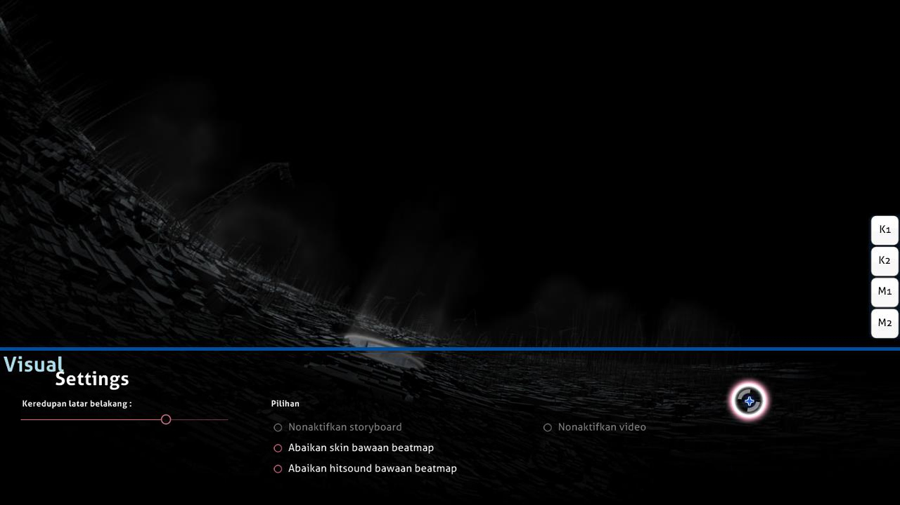

# Visual Settings

**Visual Settings** merupakan menu tersembunyi yang dapat diakses dengan mengarahkan kursor ke bawah layar permainan sebelum memulai beatmap atau ketika permainan sedang dihentikan. Pada saat menu Visual Settings muncul di layar, beatmap tidak akan berjalan hingga kursor diarahkan keluar dari menu Visual Settings.

*Catatan: osu! menyimpan nilai-nilai pengaturan Visual Settings secara terpisah untuk masing-masing beatmap. Untuk mengatur nilai-nilai pengaturan Visual Settings secara global, gunakan opsi pengaturan yang tersedia pada menu [Options](/wiki/Options).*

Pada pertandingan [multiplayer](/wiki/Multi), terdapat pengecualian di mana menu Visual Settings hanya dapat diakses selama beberapa detik sebelum beatmap dimulai. Hal ini dikarenakan sekalinya suatu beatmap telah mulai berjalan di dalam ruang pertandingan, beatmap yang bersangkutan tidak dapat dihentikan hingga seluruh pemain selesai bermain.

## Opsi-opsi pengaturan yang tersedia

| Nama | Efek | Catatan |
| :-- | :-- | :-- |
| Keredupan Latar Belakang | Meredupkan latar belakang dan elemen-elemen visual lainnya pada layar permainan (termasuk storyboard dan/atau video). | Selama istirahat, nilai redup adalah 30% dari nilai yang ditetapkan atau 0%. Tidak ada pengaruh khusus jika keredupan disetel menjadi 100%. Fungsi ini juga membuat elemen storyboard lebih gelap jika keredupan disetel 100%. |
| Nonaktifkan storyboard | Menonaktifkan seluruh elemen storyboard. Opsi ini tidak menonaktifkan [Kiai Time](/wiki/Kiai_time) dan video. | Dalam maps yang memiliki peringatan epilepsi, fungsi ini direkomendasikan untuk pemain yang memiliki masalah dengan epilepsi. Opsi ini dinonaktifkan jika tidak ada storyboard untuk dimainkan. |
| Abaikan skin bawaan beatmap | Tidak akan menggunakan skin kustom dari beatmap, jika ada. Tetapi akan menggunakan skin yang dipilih pemain sebagai gantinya. | Perlu memulai ulang untuk menerapkannya. |
| Abaikan hitsound bawaan beatmap | Tidak akan menggunakan hitsounds dari beatmap, jika ada. Tetapi akan menggunakan hitsounds dari skin yang dipilih pemain sebagai gantinya. | Perlu memulai ulang untuk menerapkannya. |
| Nonaktifkan video | Menonaktifkan video. Opsi ini tidak menonaktifkan storyboard. | Perlu memulai ulang jika pilihan diaktifkan setelah lagu dimulai. Opsi ini dinonaktifkan jika tidak ada video untuk dimainkan. |
